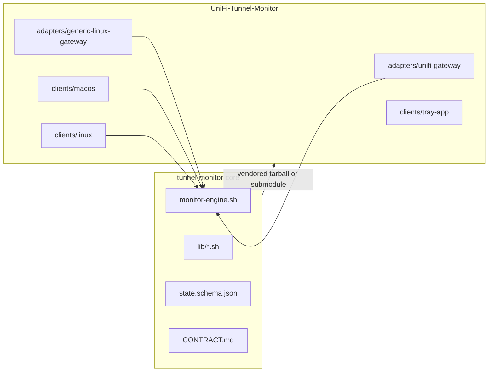
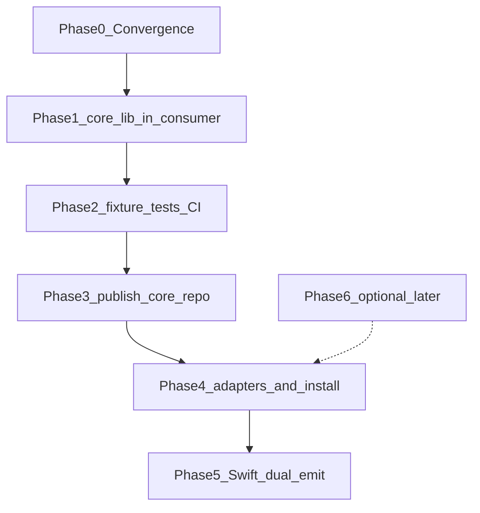
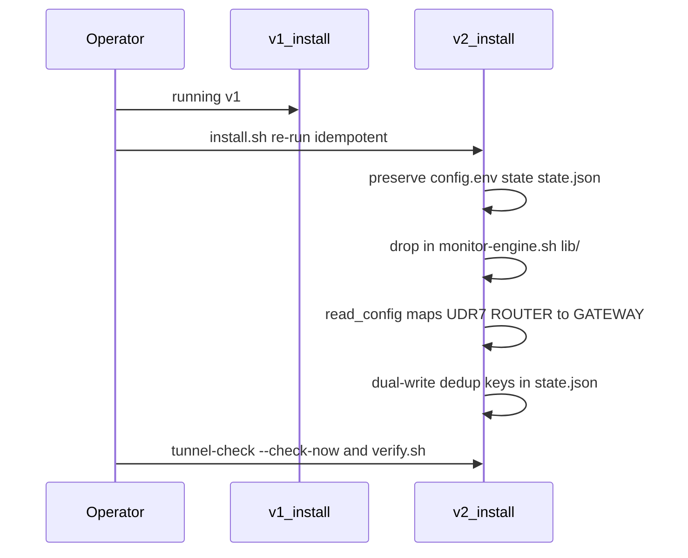

# Tunnel Monitor v2 — Core repo + adapter interface

## Goal

Extract the **portable monitoring engine** into a new repository (`tunnel-monitor-core`). This repo ([Tunnel-Monitor](Public/README.md)) becomes a **distribution bundle**: UniFi gateway adapter + generic-linux gateway adapter + macOS app + Linux LAN client, all pinned to a core SemVer.

MVP adapters (per your choices):

- **generic-linux-router** — `/opt/tunnel-monitor`, SSH dedup, ping/DDNS only (no `ipsec` diagnostics)
- **unifi-gateway** — wraps core with `/data/` paths, strongSwan diagnostics, optional `openvpn-recover` + `wan-guard` modules

**Solo-developer constraint:** Plan assumes one experienced bash/test author. Scope creep magnets (full manifest schema, simultaneous renames, pfSense stub) are explicitly deferred.

---

## Pre-flight checklist (before line one of code)

Ask and answer these before committing to the split:

1. **Which `monitor.sh` is canonical?** Three implementations exist (~616 lines Mac, ~604 Linux, ~180 UniFi gateway)—similar intent, not copy-paste siblings. Linux uses `ROUTER_UNREACHABLE`; Mac production uses `UDR7_UNREACHABLE`. Swift only maps the latter (`[StatusPresentation.swift](app/TunnelMonitor/Sources/TunnelMonitor/StatusPresentation.swift)`).
2. **Can diagnosis parity be proven with fixtures today?** Run same inputs through Mac `compute_diagnosis()` vs Linux `diagnose()` and diff outputs before extraction.
3. **What is deployed in production?** Paths under `opt/`, `payload/`, and `Public/mac/` coexist—confirm which tree `install.sh` on Mac Studio actually installs.
4. **Is a new repo required for MVP?** A **monorepo `vendor/core/`** delivers ~80% of benefit with less release friction; extract to GitHub only after fixtures pass in-consumer.
5. **What is minimum “done” for v2?** UniFi gateway + Mac LAN client unchanged behavior. Tray app, spoke deploy, WAN Guard wiring during extraction = scope creep.

---

## Go / no-go criterion

**Proceed to create `tunnel-monitor-core` on GitHub only when:**

Same fixture inputs → same diagnosis, same `alert_state` transition, same dedup email-suppress decision on Mac and Linux LAN clients, with gateway `N:UP` line format unchanged—all enforced in CI **before** the repo split.

Core v2.0 should change **structure** (lib modules) more than **behavior**. Behavior renames belong in v2.1+ after production soak.

---

## Feasibility assessment

### Sound design choices

- **Gateway state line (`N:UP` / `N:DOWN`)** — stable API; validated in `[ssh-router-state.sh:85](Public/linux/payload/opt/tunnel-monitor/ssh-router-state.sh)`. Gateway needs almost no migration.
- **Diagnosis tree as portable logic** — ordered first-match-wins; good core candidate.
- `**diagnostics.sh` hook** — UniFi `ipsec`/`journalctl` correctly belongs in adapter, not core.
- **LAN client reads `state.json`** — Swift already decodes both `udr7_dedup` and `router_dedup` (`[MonitorState.swift:58-64](app/TunnelMonitor/Sources/TunnelMonitor/MonitorState.swift)`).
- **Bash-only core CI** — realistic for solo dev with bats/shellspec.

### Hidden coupling and extraction traps


| Trap                                            | Why it matters                                                                                                                                                                                           |
| ----------------------------------------------- | -------------------------------------------------------------------------------------------------------------------------------------------------------------------------------------------------------- |
| **Three divergent LAN/gateway implementations** | Mac/Linux ~600 lines each with different function names, logging, email invocation; UniFi gateway is a different shape (line state, inline main, no JSON). Extraction = **merge + reconcile**, not move. |
| **Diagnosis enum already inconsistent**         | `UDR7_UNREACHABLE` (Mac) vs `ROUTER_UNREACHABLE` (Linux). v2 `GATEWAY_UNREACHABLE` adds a third unless dual-emit during transition.                                                                      |
| **Dedup suppress in main loop**                 | References diagnosis names and `UDR7_ALERT == DOWN` (`[monitor.sh:507-511](Public/mac/payload/opt/tunnel-monitor/monitor.sh)`). Breaks easily on rename.                                                 |
| **Site-specific strings**                       | “Gam-and-Bee”, “No-IP”, hardcoded subjects in Mac monitor—must not land in core.                                                                                                                         |
| **GNU vs BSD ping**                             | Linux GNU `ping -W` vs macOS milliseconds; core `checks.sh` needs platform branch or adapter hook.                                                                                                       |
| **Repo self-duplication**                       | `opt/`, `payload/`, `Public/` mirrors multiply fix surface.                                                                                                                                              |
| `**send-email.sh` contract**                    | Header says `<subject> <body-file>`; Mac monitor may pipe body on stdin—standardize before core owns it.                                                                                                 |
| **verify.sh diagnosis lists differ**            | `[verify.sh](verify.sh)` vs `[Public/linux/verify.sh](Public/linux/verify.sh)` allow different diagnosis enums.                                                                                          |


### Assumptions to verify first

- Production Mac runs `Public/mac/payload` (or equivalent), not stale `opt/` copy.
- Gateway SSH dedup path matches `ssh-udr7-state.sh` / `ssh-router-state.sh` expectations.
- `FAILURE_THRESHOLD × interval` behavior identical across Mac/Linux/UniFi after merge.
- `OUR_INTERNET_DOWN` does not advance failure counter on Mac—confirm Linux matches.

### Scope creep magnets (highest risk for solo dev)

1. Full adapter manifest schema before one adapter works end-to-end
2. Renaming config + diagnosis + JSON keys in the same release as repo split
3. pfSense stub / HTTP dedup / gateway `state.json` export (Phase 6+ only)
4. Refactoring install.sh for three roles simultaneously
5. Swift UI + wizard + branding while bash engine still moving

---

## Repository split




| Repo                                 | Owns                                                                                                                                | Does not own                                                 |
| ------------------------------------ | ----------------------------------------------------------------------------------------------------------------------------------- | ------------------------------------------------------------ |
| **tunnel-monitor-core**              | Ping/DDNS checks, diagnosis tree, alert state machine, `state.json` writer, SMTP helper, dedup reader interface, JSON schema, tests | LaunchDaemon/systemd units, UniFi paths, Swift UI, WAN Guard |
| **UniFi-Tunnel-Monitor** (this repo) | Adapter manifests, install/uninstall, macOS app, SwiftBar, spoke templates, UniFi docs                                              | Duplicated monitor logic (imports core)                      |


**Versioning:** Core ships its own SemVer. Consumer pins `coreVersion` in `[bundle-manifest.json](Public/build/releases/02-v1.1.0/bundle-manifest.json)` and bumps artifact SemVer when embedded core or adapter data changes.

---

## Core integration: submodule vs vendoring


| Approach                                          | Solo-dev friction                                                                          |
| ------------------------------------------------- | ------------------------------------------------------------------------------------------ |
| **Git submodule**                                 | Easy to forget update; clone friction; `install.sh` must fail clearly if empty             |
| **Vendored release tarball**                      | `scripts/vendor-core.sh` + `gh release download`; reproducible; **lowest mental overhead** |
| **Monorepo `vendor/core/` daily, publish on tag** | **Recommended workflow**                                                                   |


**Recommendation:** Develop in consumer `vendor/core/` daily; publish to `tunnel-monitor-core` on tagged releases. Pin exact `coreVersion` in manifest—not semver ranges in manifest until a third consumer exists.

**Release pain points:** Forgetting to bump core tag before pkg build; drift between `Public/mac/payload` and `opt/`; document “bump consumer patch when vendored core changes.”

---

## Revised implementation phases

Original Phase 1–4 front-loaded repo split too early. Revised order:




### Phase 0 — Convergence spike (2–3 days max)

- Diff `[Public/mac/payload/opt/tunnel-monitor/monitor.sh](Public/mac/payload/opt/tunnel-monitor/monitor.sh)` vs `[Public/linux/payload/opt/tunnel-monitor/monitor.sh](Public/linux/payload/opt/tunnel-monitor/monitor.sh)`.
- Pick merge base (Linux already has `ROUTER_*` and generic naming; Mac has production-hardened dedup/notify).
- Document intentional differences; fix parity bugs only.
- Confirm production deploy path.

### Phase 1 — Core lib in consumer (no new GitHub repo yet)

- Create `vendor/core/lib/*.sh` in this repo.
- Extract diagnosis, state machine, checks, dedup from chosen merge base.
- Mac payload calls `monitor-engine.sh --role lan_client` while keeping v1 `state.json` shape initially.

**Earliest end-to-end gate (milestone 1):** On Mac Studio after Phase 1:

```bash
sudo tunnel-check --check-now
tunnel-check
# Compare state.json + diagnosis to pre-refactor snapshot
```

Validates engine + LAN client **without** new repo, Swift changes, or UniFi gateway move.

### Phase 2 — Fixture tests (blocks repo split)


| Test                       | Covers                                                                    |
| -------------------------- | ------------------------------------------------------------------------- |
| `test_diagnosis.bats`      | All branches including DISAGREEMENT (`0:UP` vs `3:DOWN`)                  |
| `test_dedup_suppress.bats` | Email skip when gateway `N:DOWN`; never skip for UNREACHABLE/DISAGREEMENT |
| `test_state_line.bats`     | Regex from ssh-router-state                                               |
| `test_state_json.bats`     | Required keys; jq golden fixtures                                         |


Use Linux as CI reference; Mac notify stays untested in CI.

### Phase 3 — Publish `tunnel-monitor-core` repo

- Copy validated `vendor/core/` to new GitHub repo.
- Add `scripts/vendor-core.sh` in consumer; pin in `bundle-manifest.json`.
- **Do not split until Phase 2 green.**

### Phase 4 — Adapters + install wiring

- Move `Public/unifi/` → `adapters/unifi-gateway/` (thin wrapper; 180-line gateway can stay wrapper longer than plan originally assumed).
- Thin Linux payload to engine.
- **Defer generic-linux gateway** if not deploying immediately.
- **Do not touch WAN Guard / openvpn-recover** during extraction.

### Phase 5 — Swift + schema v2 + release

- Dual-write `udr7_dedup` + `gateway_dedup` (and optionally `router_dedup`).
- Map `UDR7_UNREACHABLE` / `ROUTER_UNREACHABLE` / `GATEWAY_UNREACHABLE` in `humanDiagnosis`.
- Swift fixture decode tests on developer machine before release.
- Optional: one `macos-latest` CI job for `swift test` on consumer repo only.

### Phase 6 — Optional later (explicitly out of MVP)

- pfSense/OPNsense adapter stub
- HTTP dedup transport (`lib/dedup/http-json.sh`)
- Gateway rich `state.json` export
- Full manifest schema with scheduler metadata

---

## What can be cut without losing architecture

- Start with `source lib/*.sh` instead of full `monitor-engine.sh` CLI framework initially
- Minimal manifest: `ADAPTER_ID` + `role` + `hooks_dir` + `install_root` only
- Defer generic-linux gateway until UniFi path uses core
- Keep UniFi `monitor.sh` as thin wrapper longer (already only ~180 lines)
- No `--migrate` flag—read-time compat only
- `CONTRACT.md` = diagnosis list + two JSON examples, not a long spec

---

## Proposed `tunnel-monitor-core` layout

```
tunnel-monitor-core/
├── README.md
├── LICENSE
├── CHANGELOG.md
├── CONTRACT.md                 # diagnoses, state formats, dedup rules (keep concise)
├── schemas/
│   ├── state-lan-client.schema.json
│   └── state-gateway.schema.json   # future
├── lib/
│   ├── common.sh               # logging, atomic_write, read_config (+ legacy aliases)
│   ├── checks.sh               # check_ping (platform branches), resolve_ddns
│   ├── diagnosis.sh            # compute_diagnosis — canonical GATEWAY_UNREACHABLE
│   ├── state-machine.sh
│   ├── state-json.sh           # dual-write gateway_dedup + legacy keys during transition
│   ├── state-line.sh
│   ├── send-email.sh           # standardized invocation contract
│   └── dedup/
│       ├── ssh-file.sh
│       └── none.sh
├── bin/
│   ├── monitor-engine.sh
│   └── tunnel-check-core
├── adapters/
│   ├── _template/
│   ├── generic-linux-gateway/
│   └── unifi-gateway/          # may live only in consumer repo
├── tests/
│   ├── test_diagnosis.bats
│   ├── test_dedup_suppress.bats
│   ├── test_state_line.bats
│   ├── test_state_json.bats
│   └── fixtures/
└── .github/workflows/ci.yml    # shellcheck + bats on ubuntu-latest
```

**Entry point:** `monitor-engine.sh --role gateway|lan_client --adapter-dir <path>`; exits 0 always for schedulers.

---

## Adapter manifest (`adapter.manifest.json`)

Full schema as designed; **MVP may start minimal** (`adapter_id`, `role`, `install_root`, `hooks.diagnostics`, `hooks.notify`).

See original manifest examples for `generic-linux-gateway`, `unifi-gateway`, and `lan-client-macos` in prior design—the JSON shapes remain valid target state.

### Adapter contract gaps to address


| Gap                           | Mitigation                                                                                                                 |
| ----------------------------- | -------------------------------------------------------------------------------------------------------------------------- |
| **Subject/email builder**     | Core owns generic subjects; adapter hook `email_subject_suffix.sh` optional for site branding—or env `SITE_NAME` in config |
| `**ping_probe` / platform**   | `checks.sh` detects `uname` or manifest `platform: macos|linux`                                                            |
| `**dedup_transport`**         | Core understands `ssh_file` and `none`; HTTP deferred to Phase 6                                                           |
| `**notify` vs deduped alert** | Document: `notify.sh` fires on alert **event** (threshold crossed), including when email suppressed                        |
| **Install/layout**            | Stays in adapter `install.sh`; engine never hardcodes `/data` vs `/opt`                                                    |
| **Scheduler in manifest**     | Optional metadata; install scripts own systemd/launchd for MVP                                                             |


**Scenarios correctly kept out of core:** OpenVPN recover, WAN Guard (separate timer + shared config.env modules).

---

## Hook interface (bash)


| Hook             | When called                  | Notes                          |
| ---------------- | ---------------------------- | ------------------------------ |
| `pre_check.sh`   | Before pings                 | optional                       |
| `diagnostics.sh` | Alert/recovery email body    | required for gateway; no-op OK |
| `post_alert.sh`  | After DOWN alert event       | optional recovery              |
| `notify.sh`      | Threshold crossed / recovery | macOS osascript; Linux stub    |


All hooks: `set -euo pipefail`, `--help`, stdout = diagnostic text.

**Dedup plug-in** returns: `GATEWAY_REACHABLE`, `GATEWAY_STATE_STR`, `GATEWAY_COUNT`, `GATEWAY_ALERT`.

---

## Canonical contracts (`CONTRACT.md`)

### 1. Gateway state line (unchanged)

- Format: `^[0-9]+:(UP|DOWN)$` — validated in `[ssh-router-state.sh:85](Public/linux/payload/opt/tunnel-monitor/ssh-router-state.sh)`

### 2. LAN client `state.json` v2


| v1 (today)                                | v2 target                           | Transition                                                                     |
| ----------------------------------------- | ----------------------------------- | ------------------------------------------------------------------------------ |
| `udr7_dedup` or `router_dedup`            | `gateway_dedup` canonical           | **Dual-write all three** for ≥2 consumer releases or ~6 months production soak |
| `UDR7_UNREACHABLE` / `ROUTER_UNREACHABLE` | `GATEWAY_UNREACHABLE` in new writes | Swift/`humanDiagnosis` maps all three forever in 2.x                           |
| no `schema_version`                       | `schema_version: 2`                 | Reader defaults to 1; writer adds on next cycle                                |


```json
{
  "schema_version": 2,
  "timestamp": "ISO-8601",
  "alert_state": "UP|DOWN",
  "failure_count": 0,
  "diagnosis": "HEALTHY|TUNNEL_DOWN|...",
  "checks": { "tunnel", "remote_wan", "our_internet", "dns" },
  "gateway_dedup": { "reachable": true, "state": "0:UP", "checked_at": "..." },
  "last_alert_sent_at": null,
  "last_recovery_sent_at": null,
  "down_since": null
}
```

Swift: decode `gateway_dedup` with fallback to `udr7_dedup`/`router_dedup` (`[MonitorState.swift](app/TunnelMonitor/Sources/TunnelMonitor/MonitorState.swift)`).

### 3. Diagnosis enum

```
OUR_INTERNET_DOWN → HEALTHY → GATEWAY_UNREACHABLE → DISAGREEMENT →
DDNS_DRIFT → REMOTE_INTERNET_DOWN → TUNNEL_DOWN
```

Dedup email suppress: gateway reachable + `N:DOWN` + not `GATEWAY_UNREACHABLE`/`DISAGREEMENT` → suppress email, still notify/banner.

---

## State migration — edge cases


| Scenario                                     | Risk                           | Mitigation                                                                            |
| -------------------------------------------- | ------------------------------ | ------------------------------------------------------------------------------------- |
| Legacy `state.json` without `schema_version` | Reader confusion               | Default `schema_version=1`; writer adds field on next cycle                           |
| Partial upgrade (new engine, old SwiftBar)   | Missing `gateway_dedup`        | Dual-write legacy keys                                                                |
| Partial upgrade (new Swift, old engine)      | App expects v2 keys            | Swift fallback already exists                                                         |
| Skip release (v1 → v2.2)                     | Alias removal breaks           | Tie alias removal to core **3.0** only                                                |
| Rollback engine, keep v2 `state.json`        | v1 may wipe unknown keys       | **Verify** v1 `write_state_json` does not strip extra fields on next run              |
| Rollback after operator edited `GATEWAY_`*   | Old engine reads only `UDR7_*` | `read_config` populates canonical from any alias; never delete legacy keys on upgrade |
| Corrupt `state.json`                         | Counter reset                  | Preserve Linux behavior (log warn, reset in-memory)—document acceptable               |
| Mixed fleet (Mac v2, gateway v1)             | OK                             | Line format unchanged                                                                 |
| Diagnosis rename in operator runbooks        | grep misses                    | Keep email subjects stable in 2.0; or dual-emit diagnosis codes                       |


**Rollback policy:** Engine rollback is common; schema rollback is rare. Do not bump `schema_version` until dual-write has baked one production cycle.

**Migration mechanism:** Idempotent install + read-time aliases + dual-write JSON. `**--migrate` flag optional**, not required.




---

## Config normalization

Core `read_config` accepts legacy keys for **entire core 2.x lifetime** (silent alias → canonical; never reject):


| Canonical (v2)       | Legacy aliases                         |
| -------------------- | -------------------------------------- |
| `GATEWAY_HOST`       | `ROUTER_HOST`, `UDR7_HOST`             |
| `GATEWAY_USER`       | `ROUTER_USER`, `UDR7_USER`             |
| `GATEWAY_KEY`        | `ROUTER_KEY`, `UDR7_KEY`               |
| `GATEWAY_STATE_PATH` | `ROUTER_STATE_PATH`, `UDR7_STATE_PATH` |


Optional: rewrite `config.env` on disk to canonical keys; never required. Wizard may show `GATEWAY_`* while preserving legacy keys during transition.

Reject old keys only in core **3.0** if ever.

---

## Testing strategy

### Core CI (bash-only, required)

- bats + shellcheck on `ubuntu-latest`
- Golden JSON fixtures committed in `tests/fixtures/`
- Diagnosis, dedup suppress, state line, state.json writer

### Swift / macOS (consumer repo)


| Approach                               | When                                                                                      |
| -------------------------------------- | ----------------------------------------------------------------------------------------- |
| Swift unit tests decoding fixture JSON | Local + optional macos-latest job before release                                          |
| JSON Schema validation on fixtures     | Consumer CI with ajv/python jsonschema                                                    |
| LaunchDaemon E2E                       | Manual only—do not automate                                                               |
| Production smoke                       | **Required once per release:** `--check-now`, `--test-email`, `--ssh-test`, menu bar poll |


**Minimum bar:** Core bats green + Swift fixture decode on dev machine + one Mac Studio smoke test.

---

## This repo after split (`UniFi-Tunnel-Monitor`)

```
UniFi-Tunnel-Monitor/
├── vendor/core/                # daily dev; synced from tunnel-monitor-core releases
├── scripts/vendor-core.sh
├── adapters/
│   ├── unifi-gateway/
│   └── generic-linux-gateway/
├── clients/
│   ├── macos/                  # Public/mac/
│   ├── linux/
│   └── tray-app/
├── spoke/
├── docs/
├── PLACEHOLDERS.md
└── bundle-manifest.json        # coreVersion + dataRevision
```

Install flow:

1. `vendor-core.sh` fetches pinned core release (or verify submodule/tag).
2. Copies core `lib/` + `bin/monitor-engine.sh` into `${INSTALL_ROOT}`.
3. Copies adapter manifest + hooks + scheduler unit.
4. `read_config` maps legacy keys at runtime.

---

## What stays UniFi-only (by design)

- `[wan-guard/](Public/unifi/wan-guard/)` — optional module in unifi-gateway only
- `[openvpn-recover.sh](Public/unifi/openvpn-recover.sh)` — UniFi OpenVPN reload semantics
- Private ops docs — this repo only
- macOS Tunnel Monitor.app — consumer repo; depends on core schema

---

## Success criteria

- Fixture tests: same inputs → same diagnosis, alert transition, dedup suppress on Mac and Linux LAN clients.
- Gateway `N:UP` line unchanged; mixed v1 gateway + v2 Mac fleet works.
- UniFi gateway retains ipsec email diagnostics and `/data/` persistence.
- Dual-write `state.json` keys during transition; Swift shows gateway dedup with legacy fallback.
- Core CI passes without macOS runner.
- Production Mac Studio completes one full tunnel-down/recovery cycle on v2 before diagnosis/subject renames in alerts.

---

## Conservative vs aggressive choices


| Topic             | Conservative (recommended)                   | Aggressive (defer)               |
| ----------------- | -------------------------------------------- | -------------------------------- |
| Repo split timing | After fixtures pass in-consumer              | Create core repo in Phase 1      |
| Config keys       | Alias forever in 2.x                         | Rewrite config.env on install    |
| JSON dedup keys   | Dual-write ≥2 releases                       | `gateway_dedup` only immediately |
| Diagnosis codes   | Map all three in UI; canonical in new writes | Rename emails/subjects in 2.0    |
| UniFi gateway     | Thin wrapper over core                       | Full rewrite in Phase 1          |
| Manifest          | Minimal fields first                         | Full JSON schema day one         |


