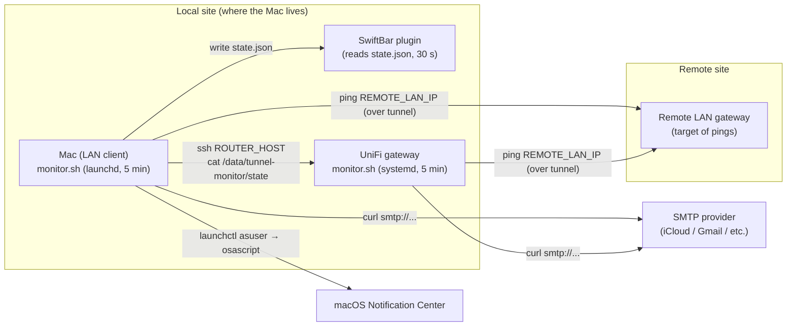

# Tunnel Monitor — Two-Sided Site-to-Site VPN Health Watcher

A pair of lightweight, dependency-light monitors for a **site-to-site IPsec VPN**
between two UniFi sites. One side runs on a **UniFi gateway** (UDM / UDR / UDR7
Linux+systemd), the other runs on a **Mac on the local LAN** (macOS launchd +
SwiftBar). Together they give you:

- **Two independent vantage points** — router-side detects "is the SA up?";
  LAN-side detects "can a real client reach the other site over the tunnel?"
- **Email alerts** via authenticated SMTP submission (works with any provider
  that supports STARTTLS on 587; tested with iCloud).
- **Native macOS banner alerts** in addition to email (Mac side only).
- **Tunnel Monitor.app** — native macOS menu bar GUI (reads `state.json`, setup
  wizard, operator actions). See [`docs/tunnel-monitor/`](docs/tunnel-monitor/README.md).
- **A SwiftBar menu-bar status indicator** (optional) that reads the same state file
  (Mac side only).
- **De-duplicated alerting** — when the router has already alerted, the Mac
  suppresses its email but still updates the menu bar (and vice-versa is not
  needed, because the router is the primary).

> ⚠️ **This is a sanitized public release.** Every IP, hostname, email
> address, and identifier in the configs and scripts has been replaced with
> a clearly-labeled placeholder. See [`PLACEHOLDERS.md`](PLACEHOLDERS.md) for
> the full list of values you must supply before deploying.

---

## Repository layout

```
├── README.md                # this file
├── PLACEHOLDERS.md          # every placeholder + what to set it to
├── LICENSE                  # MIT
├── docs/
│   ├── README.md            # documentation index
│   ├── tunnel-monitor/      # Tunnel Monitor.app — full GUI guide + screenshots
│   ├── getting-started.md   # overview + prerequisites
│   ├── implementation-guide.md  # end-to-end replication
│   ├── troubleshooting.md   # beginner + advanced runbooks
│   ├── network-overview.md  # generic topology diagrams
│   ├── architecture.md      # monitors, dedup, state machine
│   ├── spoke-monitoring.md  # optional remote gateway + LAN monitors
│   ├── openvpn-site-to-site-migration.md
│   └── wan-guard-openvpn-failover.md
├── mac/                     # macOS side (launchd + SwiftBar + Tunnel Monitor.app)
│   ├── README.md
│   ├── app/TunnelMonitor/   # SwiftUI menu bar app source (SPM)
│   ├── install.sh
│   └── payload/ ...
├── unifi/                   # UniFi gateway side (Linux + systemd)
│   ├── README.md
│   ├── install.sh
│   └── wan-guard/           # optional dual-WAN DDNS guard (hub only)
├── spoke/                   # optional remote-site templates + deploy scripts
│   ├── udm/
│   └── remote-mac/
├── linux/                   # LAN-client systemd port
├── windows/                 # LAN-client PowerShell port
└── tray-app/                # cross-platform .NET tray reader
```

If you only want one side, copy the appropriate subfolder into its own repo —
each side is fully self-contained.

---

## Quick architecture



See [`docs/architecture.md`](docs/architecture.md) for the full set of
diagrams (data flow, state machine, dedup decision tree, topology).

**Additional guides:**

- [Getting started](docs/getting-started.md)
- [Implementation guide](docs/implementation-guide.md)
- [Troubleshooting](docs/troubleshooting.md)
- [OpenVPN migration](docs/openvpn-site-to-site-migration.md) (when IPsec is blocked)
- [WAN Guard + dual WAN](docs/wan-guard-openvpn-failover.md)

---

## Which side does what

| Concern                                  | UniFi gateway side | Mac side |
|------------------------------------------|:------------------:|:--------:|
| Ping the remote LAN gateway over tunnel  | ✅                  | ✅        |
| Ping the remote public IP                | ✅                  | ✅        |
| DDNS drift detection                     | ✅                  | ✅        |
| IPsec SA status check (`ipsec statusall`)| ✅                  | ❌        |
| strongSwan log capture in email          | ✅                  | ❌        |
| LAN-client perspective (catches "router OK but client can't route") | ❌ | ✅ |
| macOS banner notifications               | ❌                  | ✅        |
| SwiftBar menu-bar status                 | ❌                  | ✅        |
| SSH-based dedup of router-side alerts    | n/a                | ✅        |

The two sides are **complementary**, not redundant.

---

## Prerequisites

### UniFi gateway side (`unifi/`)

- A UniFi gateway running Linux + systemd (UDM / UDM-Pro / UDM-SE / UDR / UDR7
  — anything in that family). The script writes to `/data/tunnel-monitor/`,
  which is the persistent partition that survives firmware updates.
- A site-to-site IPsec VPN already configured and (normally) up.
- Root SSH access to the gateway (UniFi's default).
- An SMTP account capable of authenticated submission on port 587.
- `bash`, `curl`, `dig`, `ping`, `ipsec`, `systemctl`, `journalctl`, `logger`
  — all standard on UniFi firmware.

### Mac side (`mac/`)

- macOS 12 (Monterey) or later. The scripts use BSD `ping`/`stat`/`date`
  semantics; later macOS versions add GNU compatibility but the scripts
  don't rely on it. Verified on Sonoma/Sequoia.
- [Homebrew](https://brew.sh) for the single non-stdlib dependency: `jq`.
- [SwiftBar](https://github.com/swiftbar/SwiftBar) (optional — the menu-bar
  plugin is independent of the alerting logic and can be skipped).
- A passwordless SSH key authorized on the UniFi gateway (the installer
  generates one and walks you through pushing it).
- An SMTP account (same provider as the router side, ideally, so dedup
  cosmetics line up).

---

## Install summary

> Always read the per-side README before running the installer — both
> installers are interactive and need root.

```bash
# UniFi side (run on the gateway as root)
scp -r unifi/ root@YOUR_ROUTER_LAN_IP:/root/tunnel-monitor-src
ssh root@YOUR_ROUTER_LAN_IP
cd /root/tunnel-monitor-src
bash install.sh

# Mac side (run on the Mac)
cd mac/
sudo bash install.sh
sudo bash verify.sh
```

Detailed instructions:
- [`docs/README.md`](docs/README.md) — documentation index
- [`docs/getting-started.md`](docs/getting-started.md) — overview
- [`docs/implementation-guide.md`](docs/implementation-guide.md) — full replication checklist
- [`docs/troubleshooting.md`](docs/troubleshooting.md) — runbooks
- [`mac/README.md`](mac/README.md) — macOS install + tuning
- [`unifi/README.md`](unifi/README.md) — UniFi gateway install + tuning

---

## License

[MIT](LICENSE). No warranty. Don't run this in a production environment
without reading the code first.

---

## Acknowledgements

Originally built for a specific home-to-home VPN deployment. The sanitized
version published here strips all environment-specific values; nothing in
this repo identifies a specific real network. See
[`PLACEHOLDERS.md`](PLACEHOLDERS.md) for the full surface area you must
configure to make this work in your environment.
