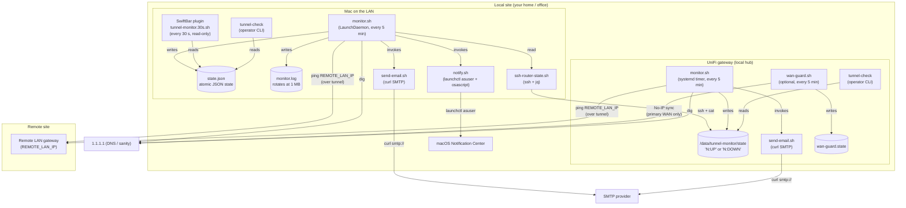
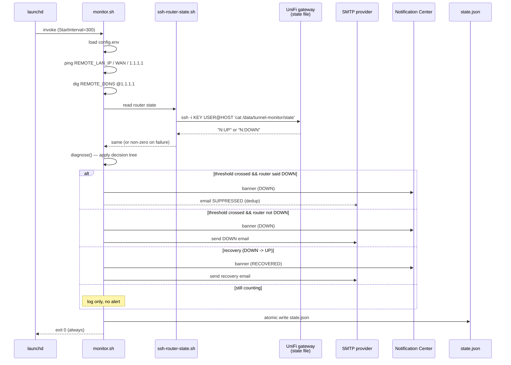
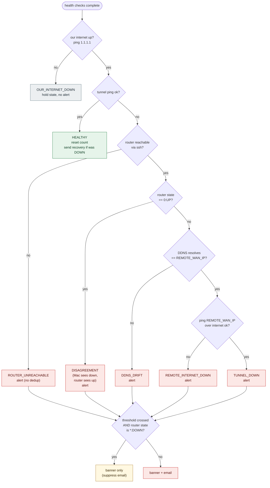
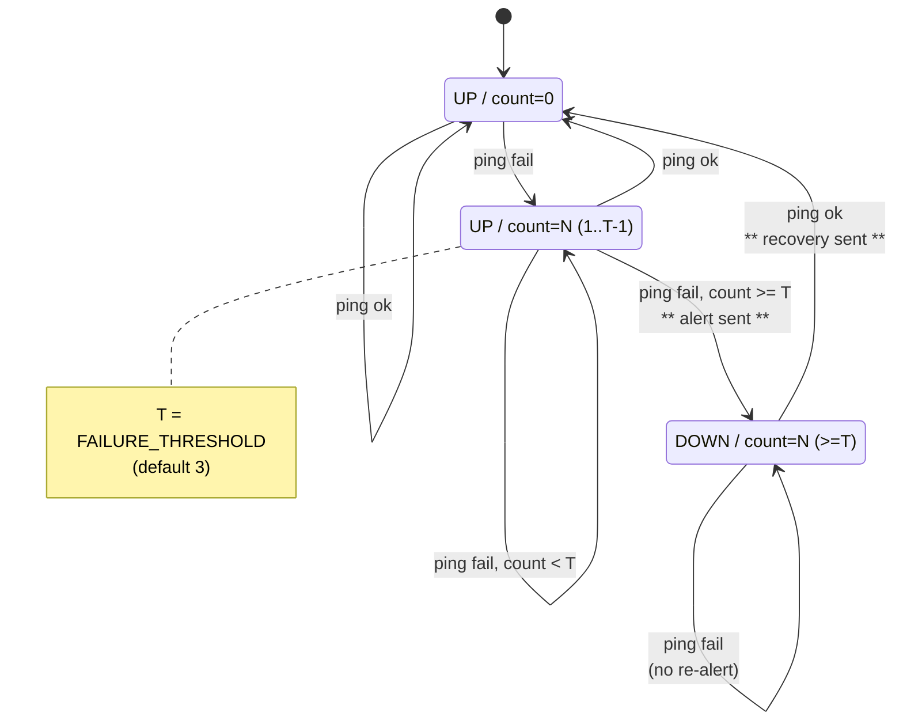
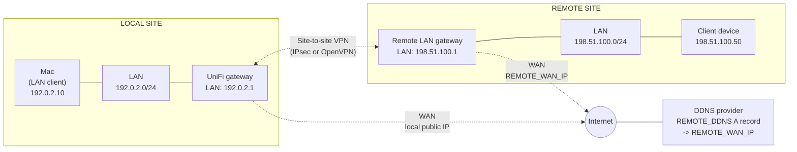
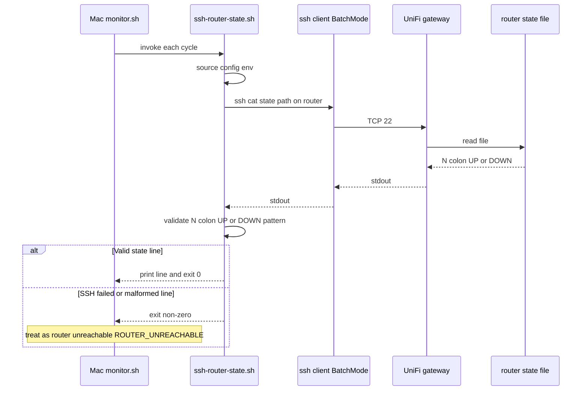
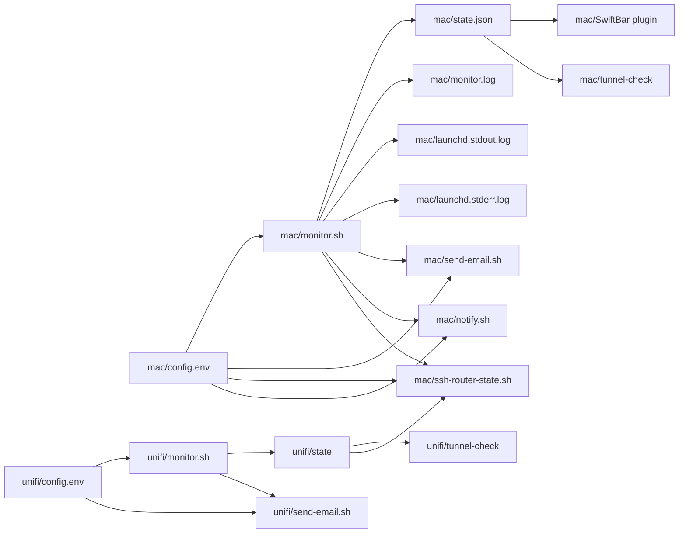

# Architecture

This document explains how the monitoring stack fits together:

- **UniFi gateway monitor** (systemd on local hub)
- **Mac LAN client monitor** (launchd + optional SwiftBar)
- **WAN Guard** (optional, dual-WAN DDNS on local hub)
- **Site-to-site VPN** (IPsec or OpenVPN — transport is independent of monitors)

Diagrams use Mermaid. See also [network-overview.md](network-overview.md) and
[getting-started.md](getting-started.md).

---

## 1. Component diagram

Key takeaways:

- The **gateway side** is self-contained — it monitors, decides, and emails
  on its own. The state file is its only "API" to anyone else.
- The **Mac side** does its own pings *and* reads the gateway's state file
  over SSH to decide whether to suppress its email (dedup).
- `state.json` on the Mac is the single source of truth for **Tunnel Monitor.app**,
  the SwiftBar plugin, and `tunnel-check` — none of them run their own checks.
- **GUI architecture** (menu bar app, Configuration window, alert flow):
  [tunnel-monitor/02-architecture.md](tunnel-monitor/02-architecture.md).
- Both sides use `curl`'s built-in SMTP client to authenticate and submit
  via STARTTLS on port 587.
- **WAN Guard** (optional) shares SMTP config with the gateway monitor and
  only protects **hub DDNS** when dual WAN + remote dial-in VPN — see
  [wan-guard-openvpn-failover.md](wan-guard-openvpn-failover.md).

---

## 1b. VPN transport vs monitoring

Monitors ping **`REMOTE_LAN_IP`** over whatever VPN UniFi routes — IPsec or
OpenVPN. They do **not** restart VPN daemons.

| Layer | Checked by | Not checked by |
|-------|------------|----------------|
| OpenVPN / IPsec SA | Gateway `ipsec` logs (IPsec) or UniFi UI | Mac (unless tunnel ping fails) |
| End-to-end reachability | Both monitors (ping) | WAN Guard |
| Hub DDNS correctness | WAN Guard | tunnel-monitor (uses **remote** DDNS) |

---

## 2. Data flow (Mac side, one full check cycle)

---

## 3. Dedup decision tree

This is the order applied by `diagnose()` in `mac/payload/opt/tunnel-monitor/monitor.sh`.
First match wins.

The router-side decision tree is simpler: it doesn't talk to anyone, it just
classifies the failure (REMOTE INTERNET DOWN / DDNS DRIFT / TUNNEL DOWN) and
emails after `FAILURE_THRESHOLD` consecutive failures.

---

## 4. State machine (shared between both sides)

The state file format encodes both fields in a single string:

| Format       | Meaning                                                              |
|--------------|----------------------------------------------------------------------|
| `0:UP`       | Healthy, no failures recorded                                        |
| `2:UP`       | 2 consecutive failures, threshold not crossed, no alert yet          |
| `3:DOWN`     | Threshold crossed, alert sent, currently in DOWN                     |
| `7:DOWN`     | Still down after several more failed checks; no re-alert             |

On the Mac side, this state lives inside `state.json` as the `alert_state`
and `failure_count` fields; the SSH-dedup script reads the router's
plaintext file and translates it back into the same fields for its own
decision making.

---

## 5. Network topology (illustrative — uses RFC 5737 docs IPs)

In a real deployment, replace the doc-net IPs with your actual values from
the config templates:

| Diagram label                  | Config var                 |
|--------------------------------|----------------------------|
| `LAN: 192.0.2.1`               | `ROUTER_HOST` (Mac side)   |
| `LAN: 198.51.100.1`            | `REMOTE_LAN_IP`            |
| `WAN: REMOTE_WAN_IP`           | `REMOTE_WAN_IP`            |
| `DDNS provider`                | `REMOTE_DDNS`              |

---

## 6. Why two monitors?

Either side alone has a blind spot:

- **Router-only monitor.** The router sees its own IPsec SA state. If the
  SA is `ESTABLISHED` but the routing or firewall rules for clients are
  broken, the monitor still says "UP" because its own pings work (the
  router's IP is on every relevant interface). A real LAN client wouldn't
  be able to reach the remote site, but the alert never fires.
- **Mac-only monitor.** The Mac sees what a real client experiences but
  has no insight into IPsec internals, can't read strongSwan logs, and
  can't restart the tunnel. When pings fail, the diagnosis is limited.

The two-monitor design covers both blind spots and also catches the case
where the router itself is unreachable (the Mac side flags
`ROUTER_UNREACHABLE` and takes over alerting).

### Optional spoke-side monitors

The same hub pattern can be mirrored at the **remote site**: gateway monitor
on the remote UniFi device plus optional LAN Mac, with **inverted**
`REMOTE_LAN_IP`, `REMOTE_WAN_IP`, and `REMOTE_DDNS`. WAN Guard remains
hub-only.

Generic guide: [spoke-monitoring.md](spoke-monitoring.md).

---

## 7. SSH-based dedup mechanic

The SSH session uses a dedicated ed25519 key at `/opt/tunnel-monitor/.ssh/id_ed25519`
created by the Mac installer. The corresponding public key is appended to
the router's `~/.ssh/authorized_keys` during install (you'll be prompted for
the router root password once).

Both sides survive the other being unreachable:

- Router unreachable → Mac alerts on its own with `ROUTER_UNREACHABLE`.
- Mac unreachable / not running → router alerts as it always did.
- Both running, both see DOWN → router alerts first (it's checked over the
  tunnel directly); Mac suppresses its email but still posts a banner so
  the operator sees the alert without opening their inbox.

---

## 8. File-level data dependencies

If you ever wonder "what reads this file?" or "what writes this file?", this
diagram is the answer.
