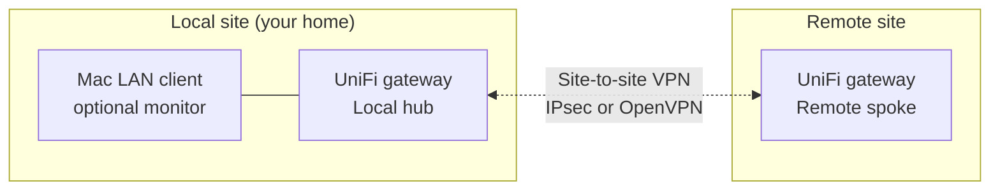
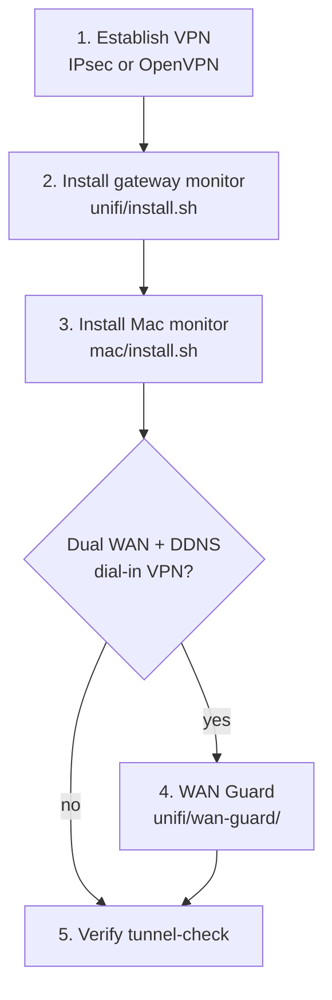

# Getting started

Overview for UniFi operators who want **redundant VPN health monitoring** between two sites, with optional **OpenVPN** and **dual-WAN DDNS protection**.

---

## What this project provides

1. **Gateway monitor** — runs on your **local UniFi gateway** (UDM / UDR / UDR7). Pings the remote LAN over the VPN, emails you when the tunnel fails (~15 minutes after 3 consecutive failures).

2. **LAN client monitor** — runs on a **Mac on the local LAN** (Linux/Windows ports included). Same pings from a real client perspective, plus macOS banners and menu-bar status. **Dedupes** email when the gateway already alerted.

3. **WAN Guard** (optional) — runs on the **local hub** when you have **dual WAN** and site-to-site VPN dialed via **DDNS**. Prevents a backup CGNAT WAN from poisoning your public hostname.

4. **OpenVPN migration guide** — when an upstream ISP modem blocks **IPsec UDP 500/4500** but UDP still works elsewhere.

---

## Local vs remote

| Role | Typical device | This repo |
|------|----------------|-----------|
| **Local hub** | UDR7, UDM-Pro, UDM | `unifi/` + optional `wan-guard/` |
| **Remote spoke** | UDM, UDM-SE | UniFi VPN config only (no extra scripts required) |
| **LAN client** | Mac on local LAN | `mac/` |

Replace **Local hub** / **Remote spoke** with your site names in UniFi and in your notes.

---

## Prerequisites

### Both sites

- Site-to-site VPN configured (IPsec or OpenVPN).
- You know the **remote LAN gateway IP** (ping target over tunnel).
- You know the **remote public IP** or maintain **DDNS** for drift detection.

### Gateway monitor

- UniFi gateway with SSH (root) and `/data/` persistent partition.
- SMTP account with app-specific password (iCloud, Gmail, etc.) on port **587**.

### Mac monitor

- macOS 12+, Homebrew (`jq`), optional SwiftBar.
- SSH key from Mac → local gateway for dedup.

### WAN Guard (optional)

- Dual WAN on **local hub** with a **public primary** and **CGNAT backup**.
- Remote VPN dials your **DDNS hostname** (not a static IP you won't update).
- No-IP (or compatible) credentials.

---

## Recommended deployment order

Detail: [implementation-guide.md](implementation-guide.md).

---

## What you configure

Every real IP, hostname, and email is a placeholder in this repo. Before install:

1. Read [`PLACEHOLDERS.md`](../PLACEHOLDERS.md).
2. Copy templates to `config.env` (installers do this).
3. Fill `REPLACE_WITH_*` values.

**Never commit** populated `config.env` or VPN static keys.

---

## Next steps

| Goal | Document |
|------|----------|
| Full install checklist | [implementation-guide.md](implementation-guide.md) |
| IPsec blocked by modem | [openvpn-site-to-site-migration.md](openvpn-site-to-site-migration.md) |
| Dual WAN failover | [wan-guard-openvpn-failover.md](wan-guard-openvpn-failover.md) |
| How monitors interact | [architecture.md](architecture.md) |
| Fix an alert | [troubleshooting.md](troubleshooting.md) |
