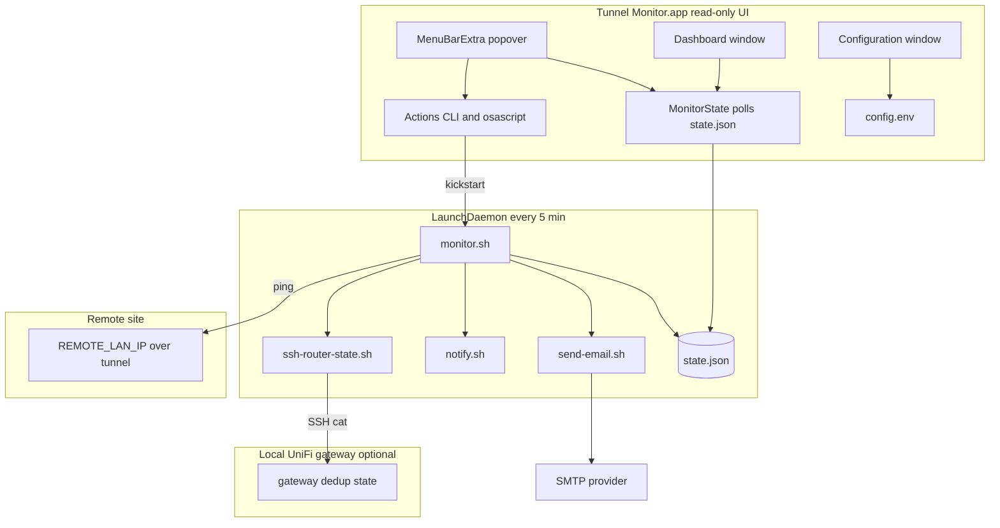
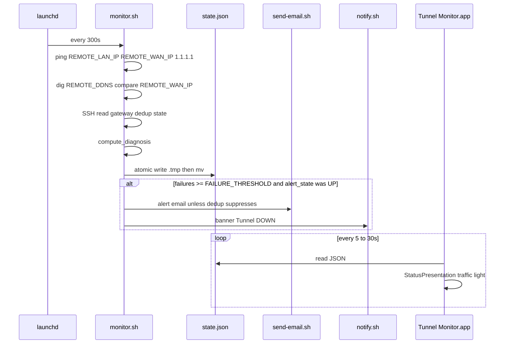
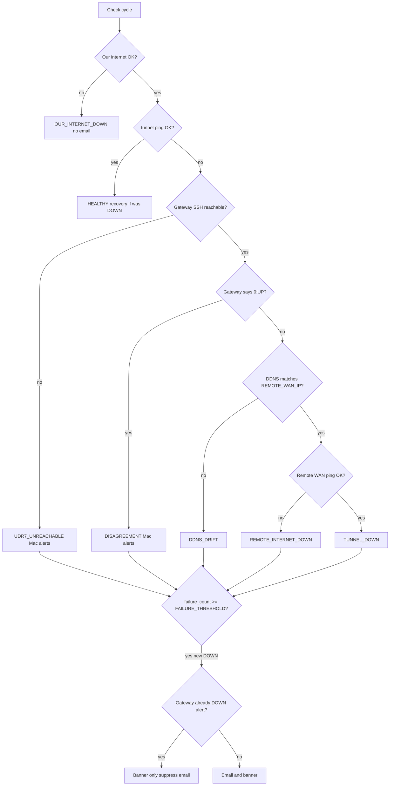
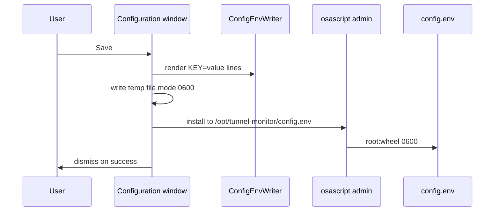
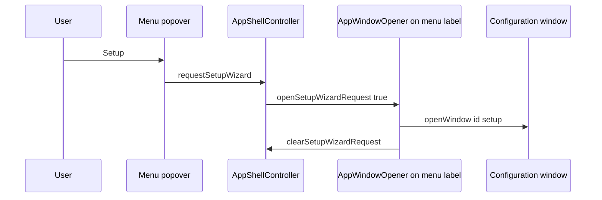

# Architecture & system diagrams

[← Hub](README.md)

This page describes the **Mac Studio / LAN-client** stack centered on Tunnel Monitor.app and `/opt/tunnel-monitor/`. For gateway-side monitors, WAN Guard, and multi-site topology, see [../architecture.md](../architecture.md).

---

## System component diagram

---

## Data flow (one check cycle)

---

## Alert decision flow (simplified)

Adapted from the operator README dedup contract. First matching diagnosis wins in `compute_diagnosis` (see `monitor.sh`).

**Dedup email suppress:** When the gateway monitor is reachable and already in a DOWN alert state (`N:DOWN`), the Mac suppresses duplicate email but still shows a banner (except for `UDR7_UNREACHABLE` and `DISAGREEMENT` paths).

---

## Configuration save path (GUI)

---

## Setup window open flow (GUI)

Replaces the legacy “sheet inside menu bar” pattern.

`AppWindowOpener` is attached to the **menu bar label** (always loaded), not only inside the dashboard, so Setup works before any dashboard window exists.

---

## `state.json` fields (GUI-relevant)

| Field | Meaning |
|-------|---------|
| `alert_state` | `UP` or `DOWN` (alert latch) |
| `diagnosis` | Machine code: `HEALTHY`, `TUNNEL_DOWN`, `DDNS_DRIFT`, … |
| `failure_count` | Consecutive failing cycles while not healthy |
| `down_since` | ISO timestamp when down streak started (shown in UI when red) |
| `checks.tunnel` / `remote_wan` / `our_internet` | Per-check `ok`, `target`, `latency_ms` |
| `checks.dns` | `host`, `resolved`, `expected`, `match` |
| `udr7_dedup` or `router_dedup` | `reachable`, `state` (e.g. `0:UP`), `checked_at` |

The app decoder accepts either `udr7_dedup` or `router_dedup` for sanitized vs private deployments.

---

## Traffic light mapping (app)

| UI | Condition (simplified) |
|----|-------------------------|
| Green | `diagnosis` HEALTHY and `failure_count` 0 |
| Yellow | Unhealthy diagnosis or failures while `alert_state` still UP |
| Red | `alert_state` DOWN |

Poll interval is **not** the daemon interval. Settings only control how often the app re-reads `state.json` (5, 15, or 30 seconds).

---

## Changes from legacy monitor-only UX

| Before | Now |
|--------|-----|
| SwiftBar-only status | Native menu bar app + optional SwiftBar |
| First-run sheet in popover | Dedicated **Configuration** window |
| `StatusView` in popover only | `MenuBarPopoverView`; no sheets/alerts in popover |
| Dashboard via WindowGroup at launch | Dashboard suppressed until opened; Setup uses `id: setup` |

---

## Building from source

Release signing and notarization are documented only in the wiki: [Build and Release](https://github.com/roto31/UniFi-Tunnel-Monitor/wiki/Build-and-Release). Local builds: `bash build/build-app.sh` → `build/dist/Tunnel Monitor.app` (adhoc-signed when no Developer ID is set).
