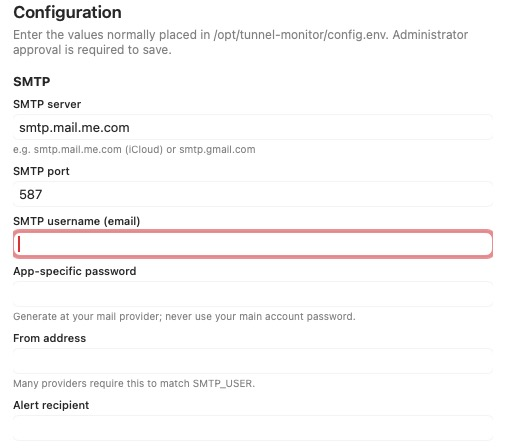
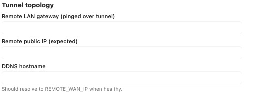
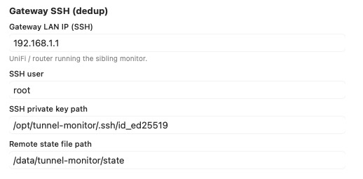
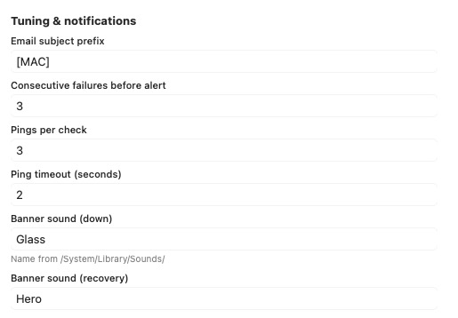

# Setup & installation

[← Hub](README.md)

## Prerequisites

- macOS 14 (Sonoma) or later for the menu bar app (dashboard + optional widget).
- macOS 12+ for the LaunchDaemon scripts.
- Homebrew `jq` (installer can install it).
- SMTP account with submission on port 587 (iCloud, Gmail app password, etc.).
- Optional: sibling gateway monitor for email dedup ([../architecture.md](../architecture.md)).

Replace placeholders below with values from [../../PLACEHOLDERS.md](../../PLACEHOLDERS.md).

---

## Installation paths

### Path A — Recommended (signed `.pkg`)

1. Download `Tunnel-Monitor-<version>.pkg` from [Releases](https://github.com/roto31/UniFi-Tunnel-Monitor/releases).
2. Run the installer (admin password).
3. Open `/Applications/Tunnel Monitor.app`.
4. On first launch (or **Setup…** later), complete the **Configuration** window.
5. In the menu bar popover: **Copy SSH Auth Cmd**, **SSH Test**, **Test Email**, **Test Notify**, **Force Check**.

Installed artifacts:

| Path | Purpose |
|------|---------|
| `/Applications/Tunnel Monitor.app` | Menu bar GUI |
| `/opt/tunnel-monitor/` | Daemon scripts, `config.env`, `state.json` |
| `/Library/LaunchDaemons/com.example.tunnel-monitor.plist` | 5-minute interval (label may vary in your build) |
| `/usr/local/bin/tunnel-check` | Operator CLI |

Re-running the pkg is safe; `config.env` and `state.json` are preserved.

### Path B — Developer (`install.sh`)

```bash
git clone https://github.com/roto31/UniFi-Tunnel-Monitor.git
cd UniFi-Tunnel-Monitor/mac   # or repo root per your layout
sudo bash install.sh
sudo vi /opt/tunnel-monitor/config.env
tunnel-check --test-email
sudo bash verify.sh
```

Build the GUI: `bash build/build-app.sh` then copy `build/dist/Tunnel Monitor.app` to `/Applications/`.

---

## Configuration window

Open via **Setup…** in the menu bar popover, or automatically on first launch if setup was not completed. Saving requires an **administrator password** (writes `config.env` as `root:wheel` mode `0600`). **Configure later** dismisses without marking complete.

### SMTP



*Configuration window — SMTP section. Empty required fields show a red border until filled.*

| Key | Label | Notes |
|-----|-------|-------|
| `SMTP_SERVER` | SMTP server | e.g. `smtp.mail.me.com` |
| `SMTP_PORT` | SMTP port | Default `587` |
| `SMTP_USER` | SMTP username | Often your email address |
| `SMTP_PASSWORD` | App-specific password | Not your account login password |
| `ALERT_FROM` | From address | Many providers require match to `SMTP_USER` |
| `ALERT_TO` | Alert recipient | Where down/recovery emails go |

### Tunnel topology



| Key | Label | Notes |
|-----|-------|-------|
| `REMOTE_LAN_IP` | Remote LAN gateway | Pinged **over the tunnel** |
| `REMOTE_WAN_IP` | Remote public IP (expected) | Pinged on the internet |
| `REMOTE_DDNS` | DDNS hostname | Must resolve to `REMOTE_WAN_IP` when healthy |

### Gateway SSH (dedup)



| Key | Label | Default | Notes |
|-----|-------|---------|-------|
| `UDR7_HOST` | Gateway LAN IP (SSH) | `192.168.1.1` | UniFi hub running sibling monitor |
| `UDR7_USER` | SSH user | `root` | |
| `UDR7_KEY` | SSH private key path | `/opt/tunnel-monitor/.ssh/id_ed25519` | Created on install if missing |
| `UDR7_STATE_PATH` | Remote state file path | `/data/tunnel-monitor/state` | Format `N:UP` / `N:DOWN` |

Sanitized public builds may label this section **Router dedup** in the UI via `Info.plist`; keys remain `UDR7_*` or `ROUTER_*` in `config.env`.

### Tuning & notifications



| Key | Label | Default | Notes |
|-----|-------|---------|-------|
| `SUBJECT_PREFIX` | Email subject prefix | `[MAC]` | |
| `FAILURE_THRESHOLD` | Consecutive failures before alert | `3` | × 5 min cycle ≈ 15 minutes |
| `PING_COUNT` | Pings per check | `3` | |
| `PING_TIMEOUT` | Ping timeout (seconds) | `2` | |
| `NOTIFY_SOUND_DOWN` | Banner sound (down) | `Glass` | Name under `/System/Library/Sounds/` |
| `NOTIFY_SOUND_RECOVERY` | Banner sound (recovery) | `Hero` | |

---

## Example configurations

### iCloud SMTP + OpenVPN site

```bash
SMTP_SERVER="smtp.mail.me.com"
SMTP_PORT="587"
SMTP_USER="you@icloud.com"
SMTP_PASSWORD="<app-specific-password>"
ALERT_FROM="you@icloud.com"
ALERT_TO="alerts@example.com"
REMOTE_LAN_IP="192.168.0.1"
REMOTE_WAN_IP="203.0.113.50"
REMOTE_DDNS="remote.example.ddns.net"
```

### Minimal (no gateway dedup)

Leave gateway SSH defaults only if the hub has no sibling monitor. The Mac will email on its own for every outage (no suppress when gateway already alerted).

---

## Manual `config.env` editing

**Edit Config** in the app opens Terminal with `sudo -e /opt/tunnel-monitor/config.env`. Alternatively:

```bash
sudo vi /opt/tunnel-monitor/config.env
sudo launchctl kickstart -k system/com.example.tunnel-monitor
```

---

## Notifications permission

The daemon uses `osascript` for banners. Grant notifications for **Script Editor** or the entry macOS shows under **System Settings → Notifications** after the first test.

---

## Next step

[04-usage-guide.md](04-usage-guide.md) — screens and daily operations.
