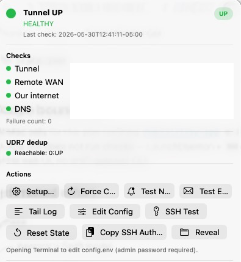

# How-to & usage guide

[← Hub](README.md)

## Finding the app

Tunnel Monitor is a **menu bar app** (`LSUIElement`): no Dock icon by default. Look for a small **colored circle** on the right side of the menu bar.

Enable **Show Dock icon** in Settings if you prefer a Dock presence.

---

## Menu bar popover

Click the menu bar dot to open the status window.



*Example: tunnel UP, HEALTHY diagnosis, checks green, gateway dedup reachable.*

### Header

| Element | Meaning |
|---------|---------|
| Colored dot + title | **Tunnel UP**, **Issues detected**, or **Tunnel DOWN** |
| Reason line | Human-readable diagnosis (e.g. HEALTHY, DDNS DRIFT) |
| Down duration | Shown when red; from `down_since` or alert timestamp |
| Last check | `timestamp` from `state.json` |
| Schema | `schema_version` (v2 when written by core ≥2.0) |
| UP / DOWN badge | `alert_state` |

### Checks

| Row | Source |
|-----|--------|
| Tunnel | `checks.tunnel` → `REMOTE_LAN_IP` |
| Remote WAN | `checks.remote_wan` |
| Our internet | `checks.our_internet` (1.1.1.1) |
| DNS | `checks.dns` match vs expected |
| Failure count | Increments each unhealthy cycle until recovery |

### Stale state banner

If `timestamp` is older than **~12 minutes**, an orange banner appears:
*state.json may be stale — try Force Check or verify launchd.*

### Technical detail

Expand **Technical detail** for operator runbook text and numbered **Suggested steps**
(same content as `tunnel-check --explain`).

### Dedup section

Shows whether the gateway SSH read succeeded and the remote state string (e.g. `0:UP`).
Title comes from app branding (`Router dedup` / `UDR7 dedup`). Reads `gateway_dedup`
with legacy fallback.

### Actions

| Button | Behavior |
|--------|----------|
| **Setup…** | Opens **Configuration** window |
| **Force Check** | `launchctl kickstart` system daemon (admin) |
| **Test Notify** | Runs `tunnel-check --test-notify` |
| **Test Email** | Runs `tunnel-check --test-email` |
| **Tail Log** | Opens Terminal `tail -f` on `monitor.log` |
| **Edit Config** | Terminal `sudo -e config.env` (async; status line in popover) |
| **SSH Test** | `tunnel-check --ssh-test` |
| **Explain** | Terminal `tunnel-check --explain` (diagnosis runbook) |
| **Preflight** | Terminal `tunnel-check --preflight` (deps + config checks) |
| **Reset State** | Admin reset alert latch to UP |
| **Copy SSH Auth Cmd** | Builds `authorized_keys` one-liner to clipboard |
| **Reveal** | Finder reveals `state.json` |

Action results in the popover appear as **inline caption text** (not modal alerts). The dashboard window can show alert dialogs for some actions.

### Footer

- **Launch at login** — `SMAppService` toggle.
- **Quit** — exits the app (daemon keeps running).

---

## Configuration window

| How to open | |
|-------------|--|
| **Setup…** from popover | |
| First launch if setup not completed | |
| Dashboard auto-prompt (once) if wizard not completed | |

Sections match [03-setup-installation.md](03-setup-installation.md). **Save** prompts for admin password. **Configure later** closes without saving.

---

## Dashboard window

| How to open | |
|-------------|--|
| **Settings → Open Dashboard Now** | |
| Enable **Open dashboard at launch** | |
| Re-open app from Finder when no windows visible | |

Same content as the popover with a navigation title (**Tunnel Monitor** or branded title from `Info.plist`). Use when you want a resizable window.

*Screenshot: optional; content matches the menu popover layout.*

---

## Settings

Open via the app menu when the Dock icon is enabled, or standard **Settings…** entry when available.

| Control | Effect |
|---------|--------|
| Show menu bar icon | Hides/shows menu bar extra |
| Show Dock icon | Accessory vs regular activation policy |
| Open dashboard at launch | Opens dashboard on startup |
| Poll state.json every | 5 / 15 / 30 seconds (UI only) |
| Sync status to App Group | Widget snapshot (Xcode build with widget) |
| Open Dashboard Now | Requests dashboard window |

| About | Shows `state.json` path and LaunchDaemon label |

*Screenshot: capture from **Tunnel Monitor → Settings** on your Mac if documenting locally.*

---

## Operator CLI (advanced)

```bash
tunnel-check
tunnel-check --test-email
tunnel-check --test-notify
sudo tunnel-check --check-now
sudo tunnel-check --reset
tunnel-check --ssh-test
```

See [../../mac/README.md](../../mac/README.md).

---

## Common tasks

### Confirm monitoring is running

```bash
sudo launchctl print system/com.example.tunnel-monitor | grep state
cat /opt/tunnel-monitor/state.json | jq .
tail -20 /opt/tunnel-monitor/monitor.log
```

### After changing No-IP or remote WAN IP

1. Update `REMOTE_WAN_IP` and `REMOTE_DDNS` in Configuration or `config.env`.
2. **Force Check** from the app.
3. Verify DNS row green in popover.

### Silence duplicate emails

Ensure gateway monitor is deployed and **SSH Test** passes; dedup suppresses Mac email when gateway already reports DOWN.

---

## Next step

[05-troubleshooting.md](05-troubleshooting.md)
