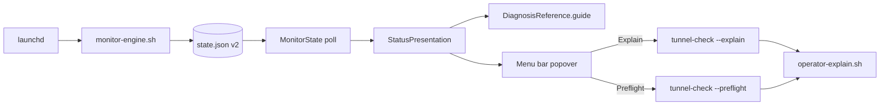
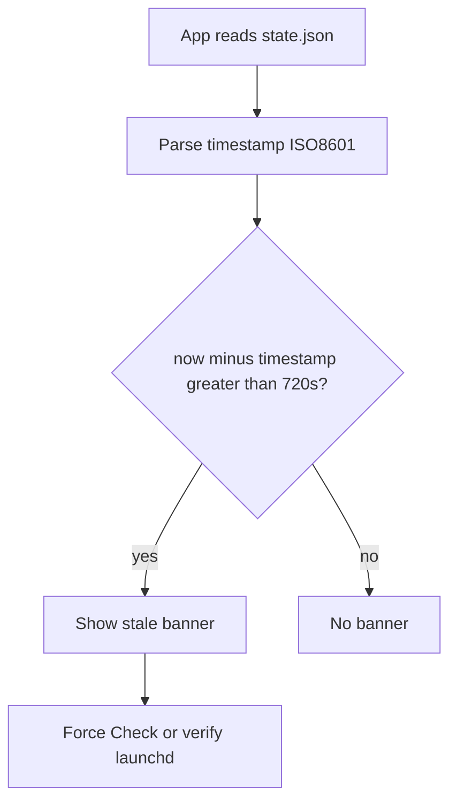
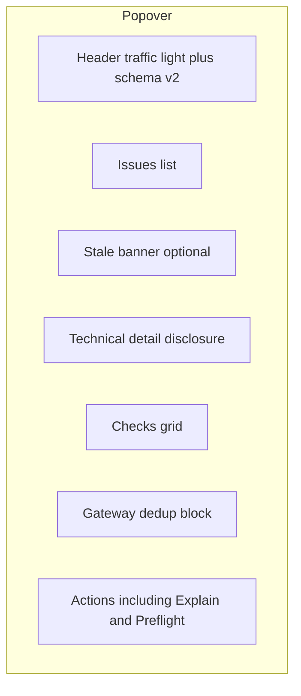

# GUI operator features (v2.0.1+)

Tunnel Monitor.app **reads** `/opt/tunnel-monitor/state.json` only. New in v2.0.1:

| Feature | Source | Operator action |
|---------|--------|-----------------|
| **Technical detail** | `DiagnosisReference.swift` | Popover → *Technical detail* disclosure |
| **Suggested steps** | Same runbook as CLI `--explain` | Listed under technical detail |
| **Stale state banner** | `MonitorState.isStale` (>12 min) | Orange banner in popover |
| **Schema version** | `state.json` `schema_version` | Header shows `Schema v2` |
| **Explain** | Opens Terminal | `tunnel-check --explain` |
| **Preflight** | Opens Terminal | `tunnel-check --preflight` |

Runbooks align with `vendor/core/lib/operator-explain.sh` and core diagnosis enum
(`GATEWAY_UNREACHABLE`, not legacy `UDR7_*` emit paths).

---

## GUI data flow

---

## Stale detection

Default threshold: **720 seconds** (2× 5-minute check interval).

---

## Popover layout (v2.0.1)

---

## Related

- [tunnel-monitor usage](../tunnel-monitor/04-usage-guide.md)
- [Signal flow](signal-flow-and-architecture.md)
- [RELEASES.md](../../RELEASES.md)
