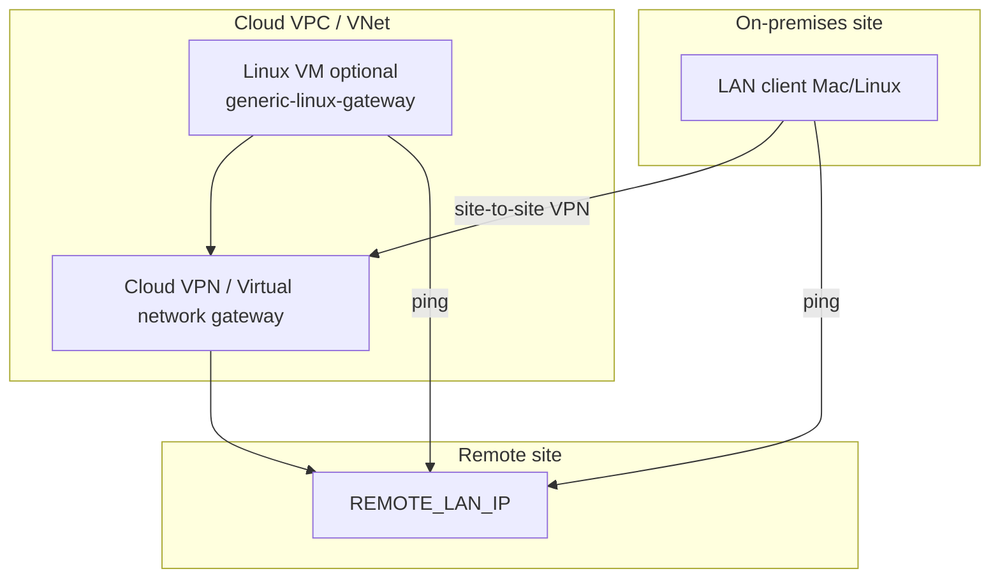

# Cloud VPN setup (AWS, Azure, GCP)

**Status:** No cloud-provider adapter or API integration exists in this repository.
Monitoring is **host-based** (ping/DNS/SSH) on a VM or on-prem LAN client that
can reach remote networks over the VPN.

---

## Conceptual topology

**Source:** Core checks only require IP reachability (`vendor/core/lib/checks.sh`).

---

## Pattern 1 — On-prem LAN client over hybrid VPN

Most hybrid deployments: VPN terminates on-prem; use **macOS/Linux LAN client**
exactly as documented in [implemented-adapters.md](implemented-adapters.md).

No cloud-specific configuration keys exist.

---

## Pattern 2 — LAN client on cloud VM

Use when the **monitoring host must live in the cloud VPC** (e.g. only cloud
subnets route to remote LAN).

### AWS (illustrative)

1. Launch Amazon Linux or Ubuntu in the VPC with routes to remote CIDR via **Site-to-Site VPN** or **Transit Gateway**.
2. Security group: allow **outbound** ICMP to `REMOTE_LAN_IP` and `REMOTE_WAN_IP`; outbound TCP 587 for SMTP.
3. Install `Public/linux/install.sh` or `generic-linux-gateway` if this VM should be the dedup gateway.
4. Configure `config.env` with remote targets reachable from **this** VPC routing table.

### Azure / GCP

Same steps: Linux VM in VNet/VPC, verify `ping REMOTE_LAN_IP` from VM before enabling timer.

**Partial support:** Works when routing and ICMP allow; **not** when only the managed VPN gateway can see tunnel state and VMs cannot ping remote LAN.

---

## Pattern 3 — What does not work

| Approach | Why |
|----------|-----|
| Monitor inside AWS VPN Gateway control plane | No code for AWS API; gateway is managed service |
| Lambda-only monitor without ICMP path | Core engine requires `ping` and `dig` on bash host |
| CloudWatch-only integration | Not implemented |

---

## Configuration requirements

Same as on-prem (`REMOTE_LAN_IP`, `REMOTE_WAN_IP`, `REMOTE_DDNS`, SMTP).

Additional cloud operator checks:

1. **Route tables** — VM subnet must use VPN/TGW for remote CIDR.
2. **NACLs / firewall policies** — ICMP not blocked to remote LAN.
3. **Egress SMTP** — port 587 open to your provider.
4. **SSH dedup** — if used, security group must allow LAN client → VM:22.

---

## Capabilities and limitations

| Capability | Cloud VM LAN client | Cloud VM generic gateway | Managed VPN gateway alone |
|------------|--------------------|-------------------------|---------------------------|
| Ping tunnel health | Partial (routing dep.) | Partial | No |
| Diagnosis enum | Yes | N/A (gateway role) | No |
| Dedup | If SSH to gateway VM | Provides state file | No |
| Vendor tunnel metrics | No | No | No (not integrated) |

---

## Troubleshooting

| Symptom | Check |
|---------|--------|
| Always `TUNNEL_DOWN` from cloud VM | VPC route table, VPN tunnel status in cloud console (manual), SG/NACL |
| `OUR_INTERNET_DOWN` | VM lost default route / NAT |
| Works from on-prem Mac but not cloud VM | Asymmetric routing or missing VPC route to remote CIDR |

Cloud console VPN "UP" does **not** automatically update this monitor — only ping results do.

---

## Information needed from you

1. Cloud provider and **which resource** runs the monitor (on-prem vs VM SKU).
2. Remote CIDR and chosen `REMOTE_LAN_IP`.
3. Whether ICMP is allowed end-to-end in cloud firewall policy.
4. Whether you need **dedup** between cloud gateway VM and on-prem LAN client.

See [INFORMATION-GAPS.md](../INFORMATION-GAPS.md).

---

## Sources

- `Public/linux/install.sh`, `adapters/generic-linux-gateway/install.sh`
- `Public/docs/v2/vpn-platform-compatibility.md` §6
