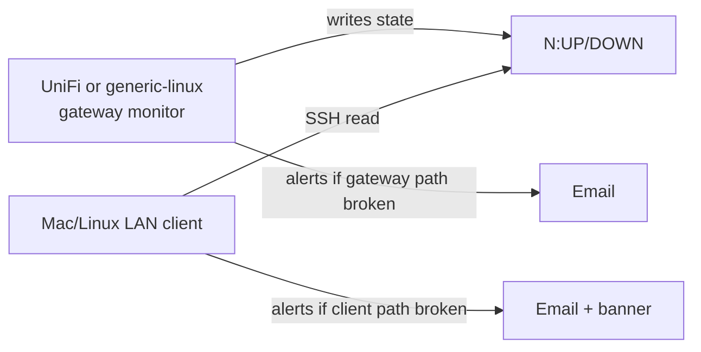

# Implemented adapters — setup

These paths are **documented and maintained in the repository**.

---

## 1. UniFi gateway (UDM / UXG / UniFi OS)

**Adapter:** `adapters/unifi-gateway/`  
**Role:** gateway  
**Install root:** `/data/tunnel-monitor`

### Steps

1. Copy adapter tree to the gateway (or run `adapters/unifi-gateway/install.sh` per README).
2. Edit `/data/tunnel-monitor/config.env` from `config.env.template`:
   - `REMOTE_LAN_IP` — remote LAN gateway reachable over tunnel
   - `REMOTE_WAN_IP` — remote public IP
   - `REMOTE_DDNS` — hostname that should resolve to `REMOTE_WAN_IP`
   - SMTP_* and `SUBJECT_PREFIX` (e.g. `[ROUTER]`)
3. Enable systemd units: `tunnel-monitor.timer` (and optional `openvpn-recover.timer`, WAN Guard).
4. Confirm state file: `cat /data/tunnel-monitor/state` → `0:UP` when healthy.
5. On LAN Mac/Linux, set `GATEWAY_HOST` (or legacy `UDR7_HOST`) to gateway LAN IP; deploy SSH key for dedup.

### Capabilities

| Feature | Available |
|---------|-----------|
| Ping-based tunnel detection | Yes |
| IPsec/strongSwan diagnostics in email | Yes (`hooks/diagnostics-ipsec.sh`) |
| OpenVPN transport | Yes (ping); optional `openvpn-recover.sh` |
| LAN diagnosis enum | N/A (gateway role) |
| WAN Guard | Optional (`modules/wan-guard/`) |

### Limitations

- Does not configure UniFi VPN — VPN must exist in UniFi Network UI first.
- Does not restart IPsec SAs (OpenVPN recover is separate, optional module).
- No UniFi Cloud API polling.

**Source:** `adapters/unifi-gateway/README.md`, `Public/docs/architecture.md` §1b.

---

## 2. Generic Linux gateway

**Adapter:** `adapters/generic-linux-gateway/`  
**Role:** gateway  
**Use when:** Any Linux router/gateway with bash, systemd, ping, dig — **not** UniFi-specific.

### Steps

1. Run `adapters/generic-linux-gateway/install.sh` (requires root).
2. Configure `/opt/tunnel-monitor/config.env` (or adapter install root).
3. Enable `tunnel-monitor.timer`.
4. Expose SSH for LAN clients: same `state` line format (`N:UP` / `N:DOWN`).
5. Install LAN client on Mac/Linux with `GATEWAY_HOST` pointing at this host.

### Capabilities

| Feature | Available |
|---------|-----------|
| Ping-based detection | Yes |
| State line for dedup | Yes |
| IPsec CLI diagnostics | No (generic reachability hook only) |
| OpenVPN recover / WAN Guard | No |

**Source:** `adapters/generic-linux-gateway/adapter.manifest.json`, `hooks/diagnostics.sh`.

---

## 3. macOS LAN client

**Path:** `Public/mac/install.sh` → `/opt/tunnel-monitor/`  
**Engine:** `monitor-engine.sh --role lan_client`

### Steps

1. Customize placeholders in `Public/mac/payload/` (LaunchDaemon label, bundle IDs) per `PLACEHOLDERS.md`.
2. Run `Public/mac/install.sh` with sudo.
3. Fill `/opt/tunnel-monitor/config.env`:
   - `REMOTE_*` targets
   - `GATEWAY_HOST`, `GATEWAY_SSH_USER`, SSH key in `.ssh/id_ed25519`
4. Load LaunchDaemon: `launchctl bootstrap system /Library/LaunchDaemons/...plist`
5. Optional: Tunnel Monitor.app / SwiftBar plugin reads `state.json`.

### Capabilities

| Feature | Available |
|---------|-----------|
| Full diagnosis enum | Yes |
| SSH dedup | Yes |
| macOS banner notifications | Yes (`notify.sh`) |
| Adapter diagnostics hook | If installed under `hooks/` |

**Source:** `Public/mac/payload/opt/tunnel-monitor/monitor.sh` (thin wrapper).

---

## 4. Linux LAN client

**Path:** `Public/linux/install.sh`  
**Engine:** `monitor-engine.sh --role lan_client`

Same config pattern as macOS; systemd timer instead of launchd; notify stub instead of osascript.

---

## 5. Windows LAN client

**Path:** `Public/windows/Install.ps1`  
**Note:** PowerShell implementation — **not** wired to `monitor-engine.sh` (v2 core).

### Steps

1. Run `Install.ps1` as Administrator.
2. Configure `config.env` beside scripts (same `REMOTE_*` / `ROUTER_*` keys).
3. Scheduled Task runs `monitor.ps1 check`.
4. Use `tunnel-check.ps1` or documented subcommands for tests.

### Limitations

- No desktop toast from SYSTEM account (`Notify-Stub.ps1`).
- No SwiftBar / native app in this tree.
- Diagnosis parity maintained in PowerShell — verify against `vendor/core/CONTRACT.md` when upgrading.

**Source:** `Public/windows/payload/monitor.ps1` header.

---

## Dual vantage (recommended production)

Dedup prevents duplicate emails when both see the same failure **and** gateway already reported DOWN.

---

## Troubleshooting (all adapters)

| Symptom | Check |
|---------|--------|
| Always HEALTHY but remote is down | Wrong `REMOTE_LAN_IP` or split tunnel bypass |
| GATEWAY_UNREACHABLE | SSH key, firewall, `GATEWAY_HOST` |
| DISAGREEMENT | Client routing issue — gateway ping works, LAN does not |
| DDNS_DRIFT | Update DDNS provider; compare `dig` to `REMOTE_WAN_IP` |
| No email | SMTP credentials; `OUR_INTERNET_DOWN` suppresses nothing but check logs |

See wiki **Diagnoses-and-Alerts** and **Troubleshooting**.
