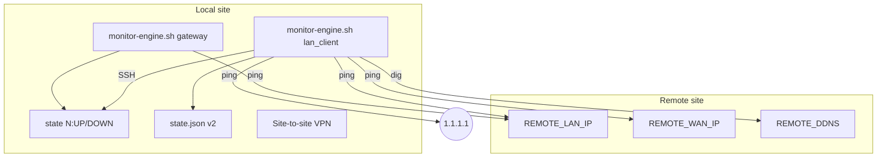
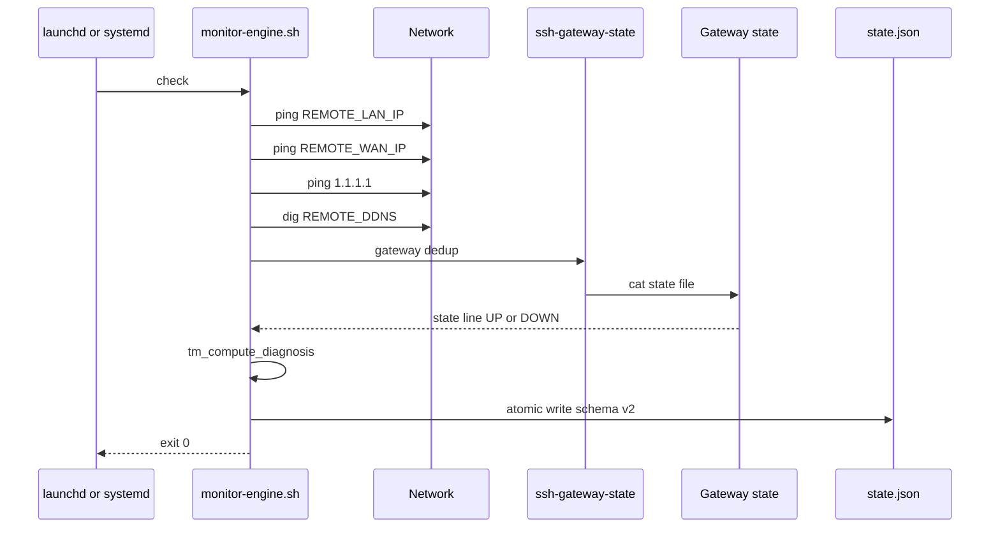
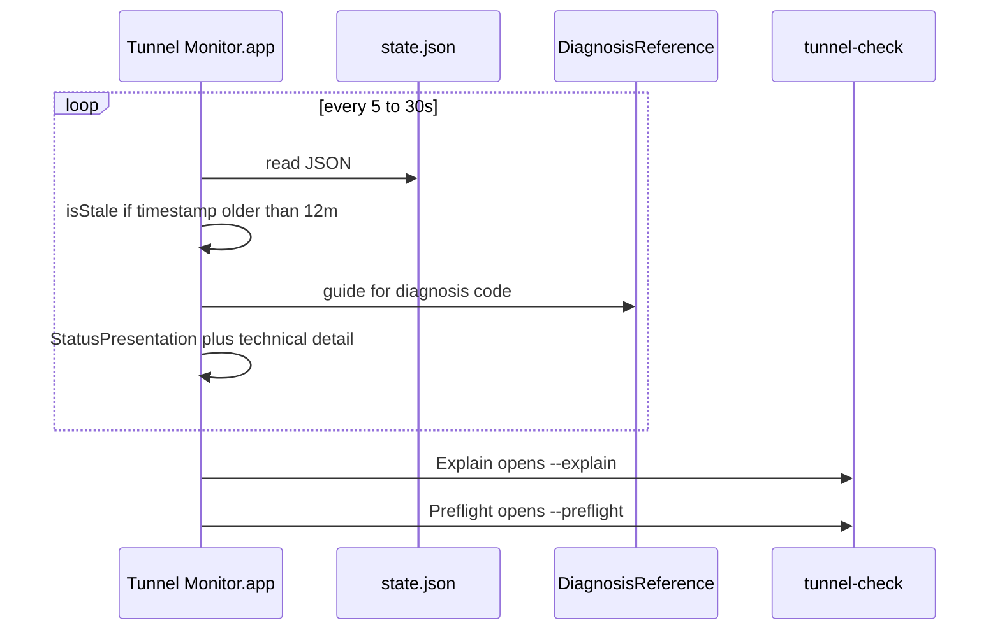
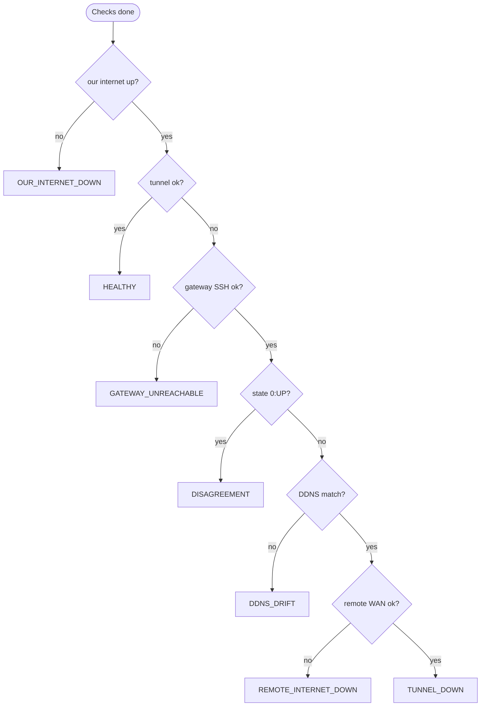
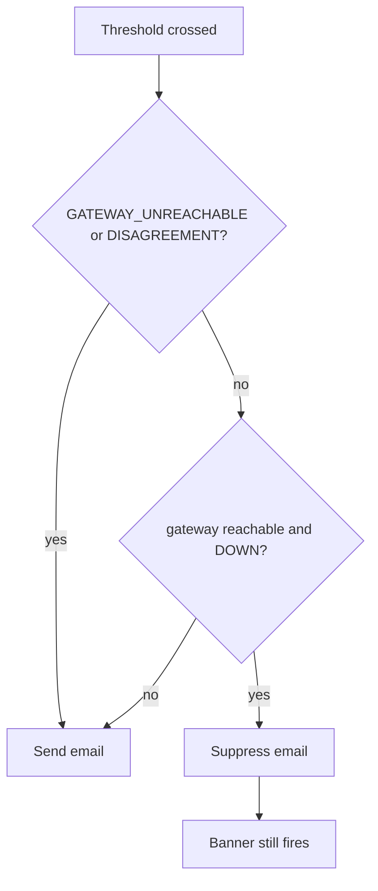

# Signal flow and architecture (v2)

Sources: `vendor/core/bin/monitor-engine.sh`, `vendor/core/lib/diagnosis.sh`,
`Public/mac/app/TunnelMonitor/Sources/TunnelMonitor/DiagnosisReference.swift`.

---

## 1. System context

---

## 2. LAN client check cycle

---

## 3. GUI read path (v2.0.1)

---

## 4. Diagnosis tree (LAN client)

First match wins — `tm_compute_diagnosis`.

GUI maps legacy `UDR7_UNREACHABLE` / `ROUTER_UNREACHABLE` when reading old state.

---

## 5. Email dedup

See also [gui-operator-features.md](gui-operator-features.md).
