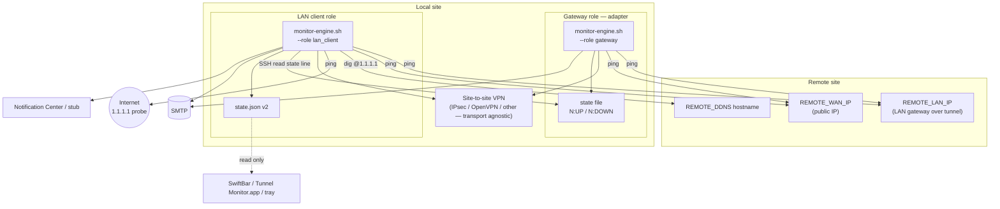
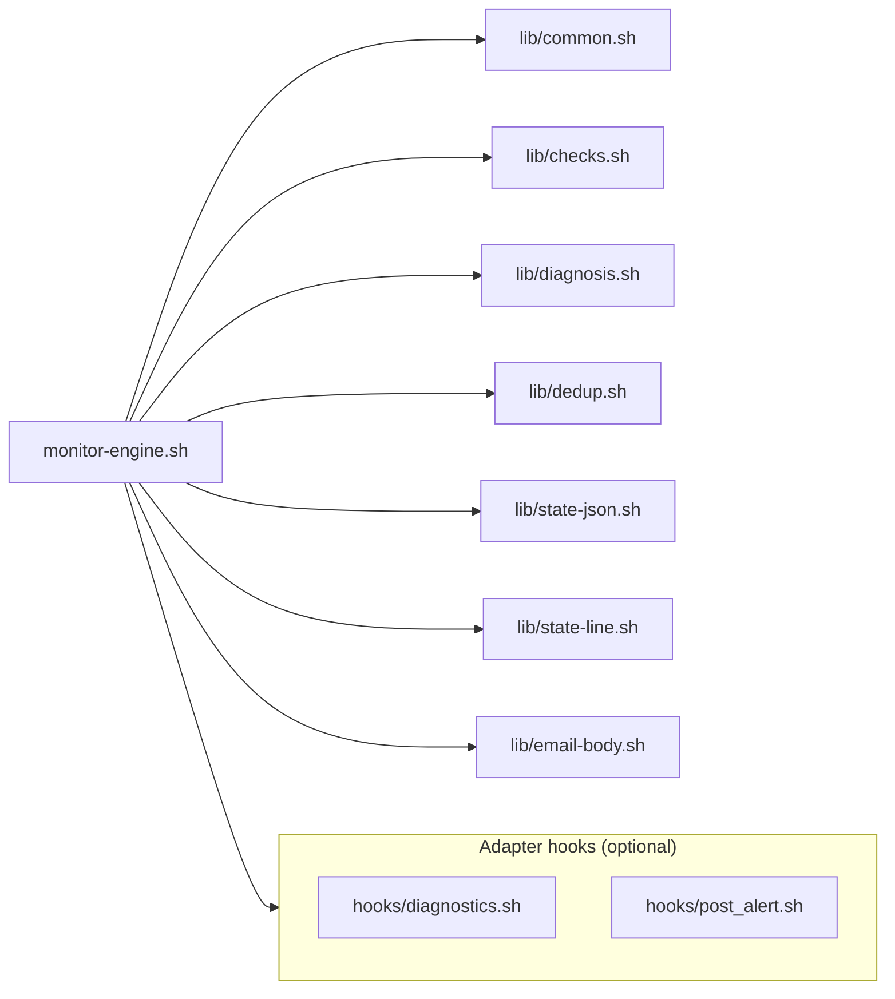
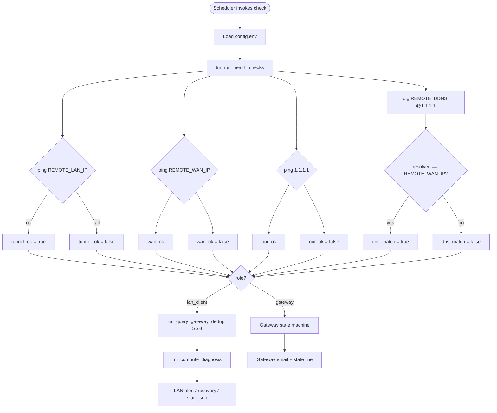
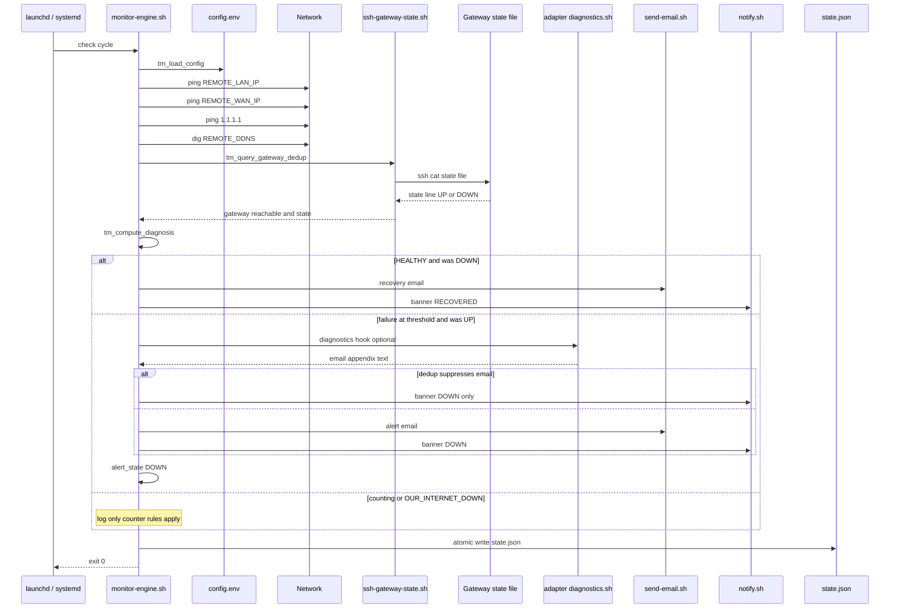
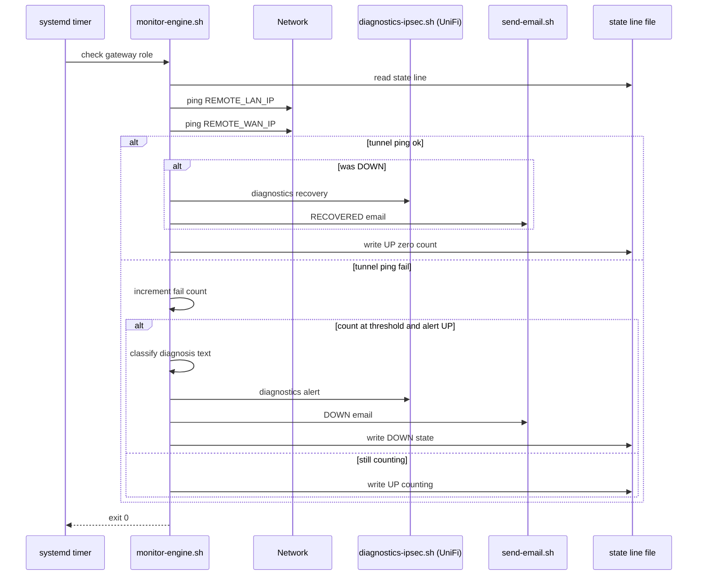
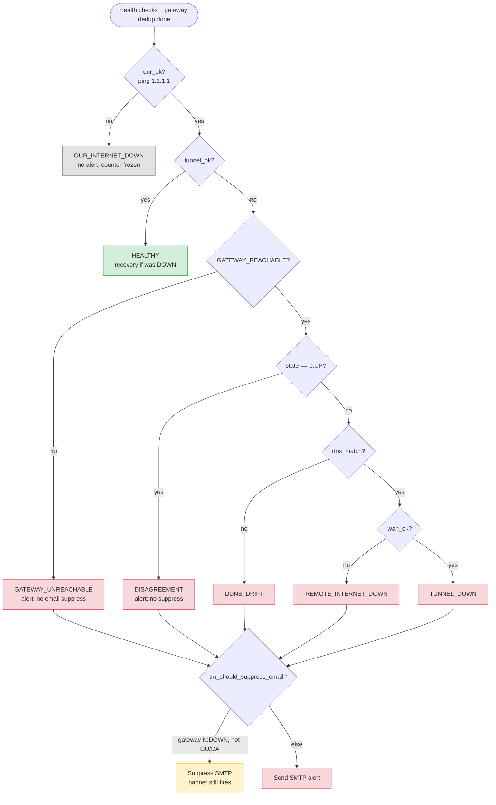
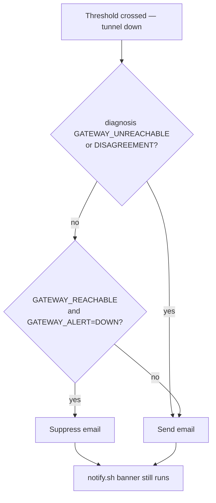
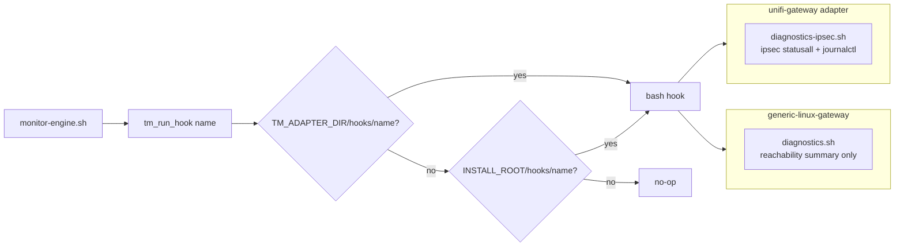
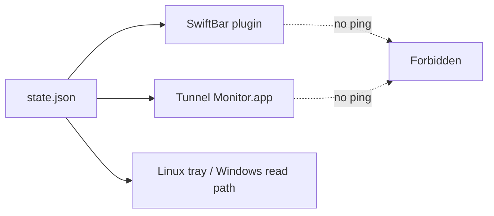
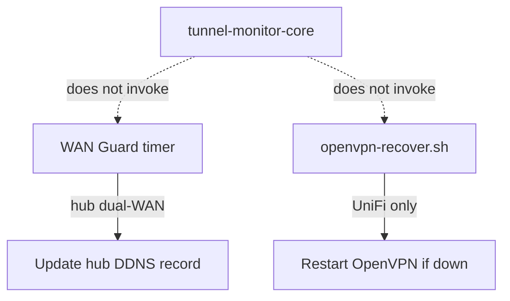

# Signal flow and architecture (v2)

Production-ready Mermaid diagrams for wiki and technical docs. All flows match
`vendor/core/bin/monitor-engine.sh`, `vendor/core/lib/*.sh`, and shipped adapters
as of core **2.0.0**.

**Sources:** [`vendor/core/CONTRACT.md`](../../../vendor/core/CONTRACT.md),
[`vendor/core/lib/diagnosis.sh`](../../../vendor/core/lib/diagnosis.sh),
[`vendor/core/lib/checks.sh`](../../../vendor/core/lib/checks.sh),
[`Public/docs/architecture.md`](../architecture.md).

---

## 1. System context (two vantage points)

**Note:** The engine does not call vendor VPN APIs. Reachability is inferred from
ICMP and DNS only. VPN daemon health on the gateway is optional via adapter
`hooks/diagnostics.sh` (email appendix only).

---

## 2. Core engine module graph

| Module | Responsibility |
|--------|----------------|
| `checks.sh` | `tm_run_health_checks` — ping `REMOTE_LAN_IP`, `REMOTE_WAN_IP`, `1.1.1.1`; resolve `REMOTE_DDNS` |
| `diagnosis.sh` | `tm_compute_diagnosis` — canonical decision tree |
| `dedup.sh` | `tm_query_gateway_dedup` — SSH → gateway `state` line |
| `state-line.sh` | Gateway `N:UP` / `N:DOWN` read/write |
| `state-json.sh` | LAN `state.json` atomic write (schema v2) |

---

## 3. Health check signal path (every cycle)

**Platform note:** macOS uses `ping -W` in milliseconds; Linux uses seconds
(`vendor/core/lib/checks.sh`).

---

## 4. LAN client — full check cycle (sequence)

---

## 5. Gateway role — check cycle (sequence)

Gateway logic is **simpler** than LAN: no full diagnosis enum; inline text for
DDNS drift and remote WAN down (`tm_gateway_check` in `monitor-engine.sh`).

---

## 6. LAN client diagnosis decision tree

First match wins (`tm_compute_diagnosis`).

---

## 7. Email dedup branching (LAN client only)

---

## 8. Adapter hook propagation

Installed via `--adapter-dir` on the thin `monitor.sh` wrapper.

---

## 9. UI read path (no active probing)

---

## 10. Optional modules (outside core engine)

See [`adapters/unifi-gateway/modules/wan-guard/README.md`](../../../adapters/unifi-gateway/modules/wan-guard/README.md).

---

## Related pages

- [VPN platform compatibility](vpn-platform-compatibility.md)
- [Setup guides](setup/README.md)
- [Information gaps](INFORMATION-GAPS.md)
