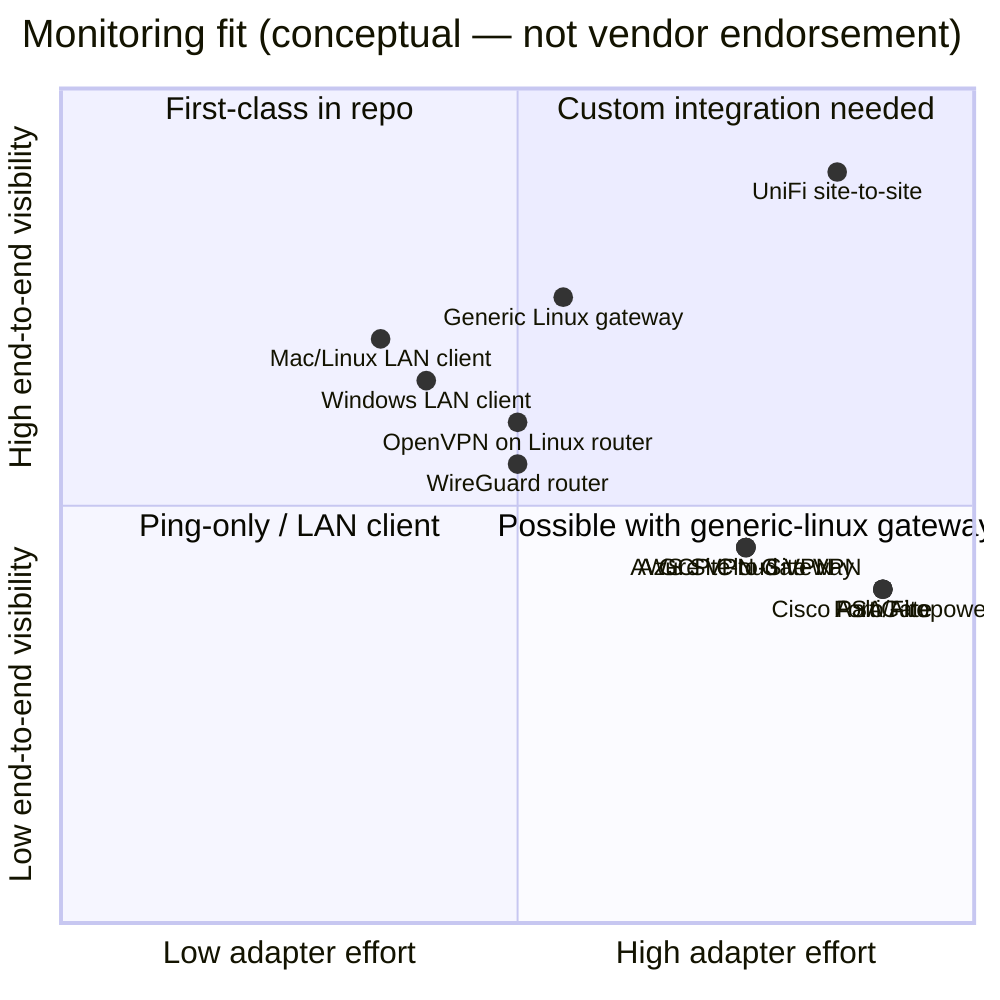

# VPN platform compatibility

This matrix describes **what this repository actually ships** versus what may work
**without a dedicated adapter** if you provide Linux/bash, SSH, and routing.

**Do not infer vendor API integration** — the monitor uses **ICMP, DNS, SMTP, and
optional SSH** only ([`vendor/core/lib/checks.sh`](../../vendor/core/lib/checks.sh)).

**Legend**

| Symbol | Meaning |
|--------|---------|
| **Yes** | Supported in repo with documented install path |
| **Partial** | Core checks work if topology/config met; no vendor-specific hooks |
| **No** | Not supported / not applicable in current design |
| **N/A** | Module does not apply to that deployment pattern |

---

## 1. Shipped adapters (first-class)

| Adapter ID | Role | Install root | Scheduler | Source |
|------------|------|--------------|-----------|--------|
| `unifi-gateway` | gateway | `/data/tunnel-monitor` | systemd | `adapters/unifi-gateway/` |
| `generic-linux-gateway` | gateway | configurable | systemd | `adapters/generic-linux-gateway/` |
| `lan-client-macos` | lan_client | `/opt/tunnel-monitor` | launchd | `Public/mac/payload/` |
| `lan-client-linux` | lan_client | `/opt/tunnel-monitor` | systemd | `Public/linux/payload/` |
| Windows LAN (PowerShell) | lan_client | script dir | Task Scheduler | `Public/windows/` — **not** on `monitor-engine.sh` |

---

## 2. Category overview chart

---

## 3. Feature / capability matrix

Rows are **monitoring capabilities**. Columns are **deployment patterns**, not
exhaustive vendor lists.

| Capability | UniFi gateway adapter | Generic Linux gateway | LAN client (macOS/Linux) | Windows LAN PS1 | Enterprise appliance (Cisco/Fortinet/Palo) | Cloud VPN (AWS/Azure/GCP) | OpenVPN / WireGuard on Linux |
|------------|----------------------|----------------------|--------------------------|-----------------|------------------------------------------|---------------------------|------------------------------|
| End-to-end ping `REMOTE_LAN_IP` | Yes | Yes | Yes | Yes | Partial — needs routable remote LAN IP over tunnel | Partial — run LAN client on VM in VPC with routes | Partial — if tunnel routes LAN IP |
| Ping `REMOTE_WAN_IP` | Yes | Yes | Yes | Yes | Partial | Partial | Partial |
| DDNS drift (`REMOTE_DDNS`) | Yes (gateway email text) | Yes | Yes | Yes | Partial — if DDNS used | Partial | Partial |
| Our internet probe `1.1.1.1` | N/A on gateway | N/A | Yes | Yes | N/A on appliance | Yes on LAN client | Yes on LAN client |
| Full LAN diagnosis enum | N/A | N/A | Yes | Yes (parity script) | Partial — LAN client only | Partial — LAN client in VPC | Partial |
| Gateway `N:UP`/`N:DOWN` state file | Yes | Yes | Reads via SSH | Reads via SSH | No — unless generic-linux on sidecar | No — unless Linux sidecar | Partial — generic-linux |
| SSH dedup LAN↔gateway | N/A | N/A | Yes | Yes | No — unless SSH + state file on Linux sidecar | No — unless sidecar | Partial |
| IPsec CLI diagnostics in email | Yes (`ipsec`/`charon`) | No | Via hook if gateway UniFi | No | No | No | No |
| OpenVPN auto-recover | Optional module | No | No | No | No | No | No |
| WAN Guard (hub DDNS) | Optional module | No | No | No | No | No | No |
| macOS banners | N/A | N/A | Yes | No (stub) | N/A | N/A | N/A |
| SwiftBar / native app UI | N/A | N/A | Yes (macOS) | No | N/A | N/A | N/A |
| REST/SNMP VPN API polling | No | No | No | No | No | No | No |

---

## 4. Config variables vs platform

All roles share core variables from `config.env.template` (see
[`Public/PLACEHOLDERS.md`](../../PLACEHOLDERS.md)).

| Variable / group | LAN client | Gateway | UniFi-only | Generic Linux | Enterprise appliance | Cloud VPN service |
|------------------|------------|---------|------------|---------------|---------------------|-------------------|
| `REMOTE_LAN_IP` | Yes | Yes | Yes | Yes | Partial | Partial (VM-based) |
| `REMOTE_WAN_IP` | Yes | Yes | Yes | Yes | Partial | Partial |
| `REMOTE_DDNS` | Yes | Yes | Yes | Yes | Partial | Partial |
| `GATEWAY_HOST` / `ROUTER_HOST` / `UDR7_HOST` | Yes (alias) | N/A | Yes | N/A | No | No |
| `GATEWAY_SSH_*` | Yes | N/A | Yes | N/A | No | No |
| `FAILURE_THRESHOLD`, `CHECK_INTERVAL_MIN` | Yes | Yes | Yes | Yes | Yes if deployed | Yes if deployed |
| `WAN_GUARD_*` | No | No | Optional module | No | No | No |
| SMTP_* | Yes | Yes | Yes | Yes | Yes if deployed | Yes if deployed |

---

## 5. Enterprise VPN platforms (Cisco, Fortinet, Palo Alto, similar)

| Aspect | Status | Evidence |
|--------|--------|----------|
| Shipped adapter | **No** | No `adapters/cisco-*` in repository |
| Site-to-site reachability monitoring | **Partial** | Ping-based LAN client if `REMOTE_LAN_IP` is routed through tunnel |
| Gateway-side monitor on appliance OS | **No** | Appliances do not run this project's install scripts natively |
| IPsec log appendix in alerts | **No** | Hook is UniFi `diagnostics-ipsec.sh` only |
| VPN API / SNMP status | **No** | Not implemented in core |

**Typical pattern:** Run **LAN client** on a always-on Mac/Linux/Windows host on the
local LAN, point `REMOTE_*` at remote site targets, SSH dedup only if a **generic
Linux gateway** (or UniFi) also runs the gateway role and exposes `state` over SSH.

---

## 6. Cloud VPN (AWS, Azure, GCP)

| Aspect | Status | Evidence |
|--------|--------|----------|
| Managed VPN Gateway API integration | **No** | No cloud SDK code in `vendor/core/` |
| Monitor inside cloud control plane | **No** | Product is host-installed scripts |
| LAN client on cloud VM | **Partial** | `Public/linux/` + core engine if VM has bash, ping, dig, jq, route to `REMOTE_LAN_IP` |
| Gateway role on cloud | **Partial** | `generic-linux-gateway` on a Linux instance with site-to-site tunnel terminated on that instance or routed through it |

Cloud **Site-to-Site VPN** tunnels are compatible at the **network layer** only when
the same ping targets used in `config.env` are reachable from the host running the
monitor.

---

## 7. Open-source / self-hosted (OpenVPN, WireGuard, strongSwan)

| Transport | Monitoring layer | Extra repo features |
|-----------|------------------|---------------------|
| **IPsec (strongSwan)** on UniFi | Ping + UniFi `ipsec` diagnostics hook | `adapters/unifi-gateway/hooks/diagnostics-ipsec.sh` |
| **IPsec** on generic Linux | Ping + generic reachability hook | `adapters/generic-linux-gateway/hooks/diagnostics.sh` |
| **OpenVPN** on UniFi | Ping (transport agnostic per `Public/docs/architecture.md` §1b) | Optional `openvpn-recover.sh` — does **not** replace tunnel-monitor checks |
| **WireGuard** | Ping only if routes present | No WireGuard-specific hook |
| **OpenVPN on non-UniFi Linux** | Partial via generic-linux or LAN client | No openvpn-recover outside UniFi adapter |

---

## 8. Dependencies and hard limits

| Requirement | Applies to |
|-------------|------------|
| `bash`, `ping`, `dig`, `jq` | Core engine paths |
| `curl` + SMTP credentials | Email |
| SSH key + gateway `state` file | LAN dedup |
| Poll interval ≥ 30s (project rule) | All schedulers |
| `monitor.sh` / engine **always exit 0** on check path (LAN) | launchd/systemd happiness |
| No plaintext SMTP password outside `config.env` | All roles |

---

## 9. Information we need from you (per-site accuracy)

To mark a specific enterprise or cloud deployment **Yes** instead of **Partial**,
provide:

1. VPN vendor, model, and **site-to-site topology** (hub-spoke vs mesh).
2. Whether `REMOTE_LAN_IP` is pingable from the Mac/Linux host you will use.
3. Whether a **Linux sidecar** can run `generic-linux-gateway` and expose SSH.
4. Whether you use **DDNS** and the hostname that must match `REMOTE_WAN_IP`.
5. Desired vantage points: gateway only, LAN only, or both.

See [INFORMATION-GAPS.md](INFORMATION-GAPS.md).

---

## Sources

| Claim | Source in repo |
|-------|----------------|
| Diagnosis order | `vendor/core/lib/diagnosis.sh` |
| Health probes | `vendor/core/lib/checks.sh` |
| Transport vs monitoring | `Public/docs/architecture.md` §1b |
| Adapter hooks | `adapters/*/adapter.manifest.json`, `hooks/` |
| Windows separate stack | `Public/windows/payload/monitor.ps1` header |
| Contract / state formats | `vendor/core/CONTRACT.md` |
