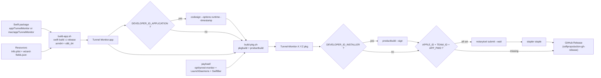
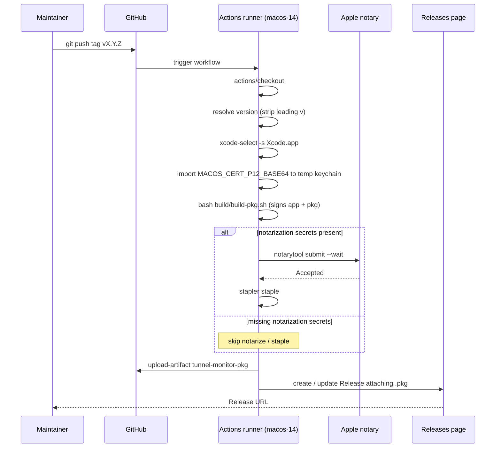
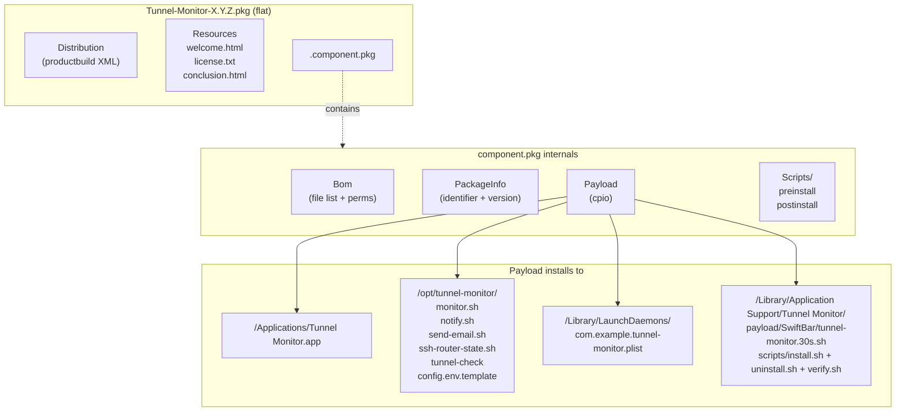
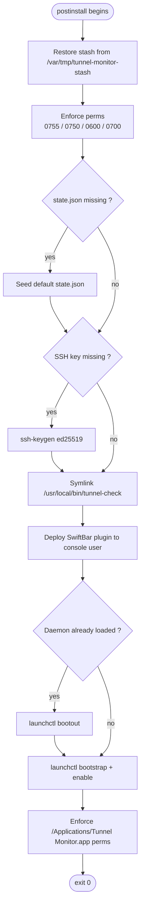

# Build & Release

This page documents how the macOS menu-bar app and the installable
`.pkg` are built, signed, notarized, and distributed via GitHub Releases.
The same build scripts run locally and inside the GitHub Actions workflow.

The build pipeline lives under [`build/`](https://github.com/roto31/UniFi-Tunnel-Monitor/tree/main/build)
in the source repository (private side); the sanitized public copy of the
Swift app lives under [`mac/app/`](https://github.com/roto31/UniFi-Tunnel-Monitor/tree/main/mac/app)
and uses the same packager via wrapper scripts.

---

## Pipeline overview



---

## Scripts

| Script                                  | Purpose                                                                    |
|-----------------------------------------|----------------------------------------------------------------------------|
| `build/build-app.sh`                    | Compile Swift package, assemble `.app`, optionally codesign.               |
| `build/build-pkg.sh`                    | Stage payload + app, run `pkgbuild` + `productbuild`, optionally notarize. |
| `build/scripts/preinstall`              | pkg preinstall — bootout daemon, stash `config.env` / `state.json` / `.ssh/`. |
| `build/scripts/postinstall`             | pkg postinstall — restore stash, enforce perms, generate SSH key, deploy SwiftBar plugin, bootstrap daemon. |
| `build/distribution.xml`                | productbuild distribution template; rendered with `__VERSION__`.           |
| `build/Resources/welcome.html`          | Installer welcome screen.                                                  |
| `build/Resources/conclusion.html`       | Installer conclusion screen.                                               |
| `build/Resources/license.txt`           | License shown by the installer.                                            |
| `mac/app/build-app.sh`                  | Public wrapper — sets `APP_SRC` + `DIST_DIR` and invokes the root packager. |
| `mac/sync-app-from-root.sh`             | Sync Swift sources from the private app into `mac/app/` without overwriting sanitized `Resources/`. |

---

## Building locally

### Just the `.app`

```bash
# Private build
bash build/build-app.sh

# Sanitized public build
bash mac/app/build-app.sh
```

Outputs:

```
build/dist/Tunnel Monitor.app          # private (com.tunnel.monitor)
build/dist-public/Tunnel Monitor.app   # sanitized (com.example.tunnel.monitor)
```

### Full `.pkg`

```bash
VERSION=1.0.0 bash build/build-pkg.sh
```

Output: `build/dist/Tunnel-Monitor-1.0.0.pkg`.

`build-pkg.sh` calls `build-app.sh` automatically if the bundle is missing.

---

## Signing & notarization

All four environment variables are picked up by `build-pkg.sh` and the
GitHub Actions workflow. Any subset works — missing variables degrade
gracefully:

| Env var                          | Required for                | Format example                                              |
|----------------------------------|-----------------------------|-------------------------------------------------------------|
| `DEVELOPER_ID_APPLICATION`       | codesigning the `.app`      | `Developer ID Application: Jane Doe (ABCDE12345)`           |
| `DEVELOPER_ID_INSTALLER`         | productsigning the `.pkg`   | `Developer ID Installer: Jane Doe (ABCDE12345)`             |
| `APPLE_ID`                       | notarization submission     | `you@example.com`                                           |
| `APPLE_TEAM_ID`                  | notarization submission     | `ABCDE12345`                                                |
| `APPLE_APP_SPECIFIC_PASSWORD`    | notarization submission     | `xxxx-xxxx-xxxx-xxxx`                                       |

When the four notarization variables (plus `DEVELOPER_ID_INSTALLER`) are
all present, `build-pkg.sh` runs `xcrun notarytool submit --wait` and
`xcrun stapler staple` so the resulting `.pkg` is offline-trustable on
Gatekeeper.

---

## GitHub Actions release workflow

The release workflow lives at
[`.github/workflows/release.yml`](https://github.com/roto31/UniFi-Tunnel-Monitor/blob/main/.github/workflows/release.yml).



### Required repository secrets

| Secret                          | Purpose                                                          |
|---------------------------------|------------------------------------------------------------------|
| `DEVELOPER_ID_APPLICATION`      | App codesigning identity name                                   |
| `DEVELOPER_ID_INSTALLER`        | Installer signing identity name                                 |
| `APPLE_ID`                      | Apple ID for notarization                                       |
| `APPLE_TEAM_ID`                 | 10-character team ID                                            |
| `APPLE_APP_SPECIFIC_PASSWORD`   | App-specific password (notary auth)                             |
| `MACOS_CERT_P12_BASE64`         | base64-encoded `.p12` containing both Developer ID identities + private keys |
| `MACOS_CERT_P12_PASSWORD`       | Password for the `.p12`                                         |

If you push a tag without these secrets configured, the workflow still
builds an **unsigned** `.pkg` and attaches it to the release — useful for
quick test cuts, but recipients have to right-click → Open in Finder the
first time.

### Triggers

- **Tag push** (`v*`) → produces a GitHub Release with the `.pkg`
  attached and auto-generated release notes.
- **Manual `workflow_dispatch`** — useful for dry-runs; takes an optional
  `version` input (defaults to `0.0.0-dev`).

---

## Pkg internals



Inspect any built pkg with `pkgutil --expand` and `lsbom Bom`:

```bash
pkgutil --expand build/dist/Tunnel-Monitor-1.0.0.pkg /tmp/x
lsbom /tmp/x/.component.pkg/Bom | head -30
```

---

## Postinstall responsibilities



The preinstall script handles the inverse — stashing `config.env`,
`state.json`, `monitor.log`, and `.ssh/` into `/var/tmp/tunnel-monitor-stash`
**before** the new payload is laid down. Re-running the `.pkg` is safe.

---

## Release checklist

Before tagging a release, work through this list:

1. Bump version in source if you keep one (none currently — version is
   purely tag-driven).
2. `bash build/build-app.sh` and `bash mac/app/build-app.sh` succeed cleanly.
3. `VERSION=X.Y.Z bash build/build-pkg.sh` succeeds and produces a pkg.
4. `pkgutil --expand build/dist/Tunnel-Monitor-X.Y.Z.pkg /tmp/x` shows
   the expected layout (no `._*` resource forks).
5. Smoke-install on a clean VM or spare Mac.
6. `git push origin vX.Y.Z` and confirm the Actions workflow succeeds.
7. Edit the GitHub Release description if the auto-notes need tweaks.

---

## Troubleshooting

| Symptom                                                | Likely cause                                                     | Fix                                                                          |
|--------------------------------------------------------|------------------------------------------------------------------|------------------------------------------------------------------------------|
| `build-app.sh` fails — `no swift in PATH`              | Xcode Command Line Tools not installed                            | `xcode-select --install`                                                     |
| `build-pkg.sh` fails — `pkgbuild not found`            | Same                                                              | Same                                                                          |
| `.pkg` install fails — "package is not signed"          | Strict Gatekeeper without notarization                            | Right-click pkg → Open, or install signing/notarization secrets and rebuild  |
| Pre-install fails with "Permission denied" rm errors    | Previous build artifacts owned by a different user/root           | `osascript -e 'do shell script "rm -rf ..." with administrator privileges'`  |
| Sanitized build fails — `SDKStatCache permission denied` | `.build/` left over from a prior root-owned attempt              | Same — remove `.build/` with admin rights, rebuild                            |
| `productbuild` succeeds, but `pkgutil --check-signature` says `no signature` | `DEVELOPER_ID_INSTALLER` was not exported     | Re-run with the env var set                                                  |
| Notarization stuck                                      | Wrong app-specific password or team ID                            | Verify `xcrun notarytool history --apple-id ...` shows the submission        |

---

## See also

- [[Menu-Bar-App]] — what the `.app` actually does once installed.
- [[macOS-Monitor]] — the underlying daemon shipped inside the pkg.
- [[UniFi-Gateway-Monitor]] — the gateway side (not packaged in this pkg).
