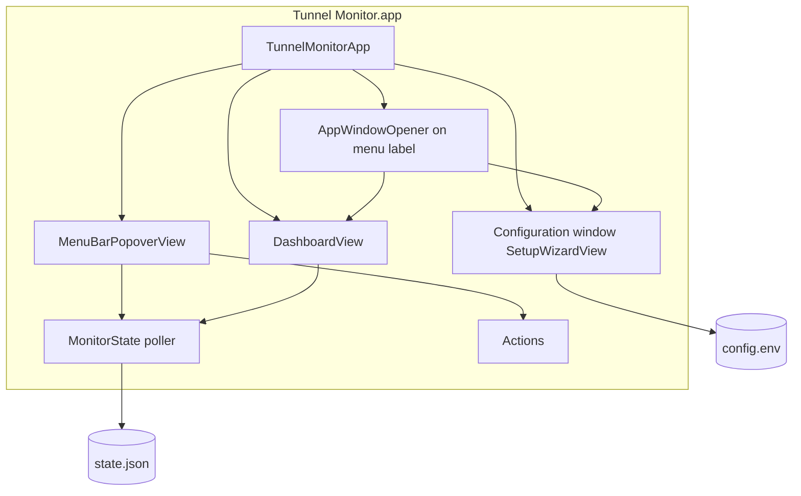
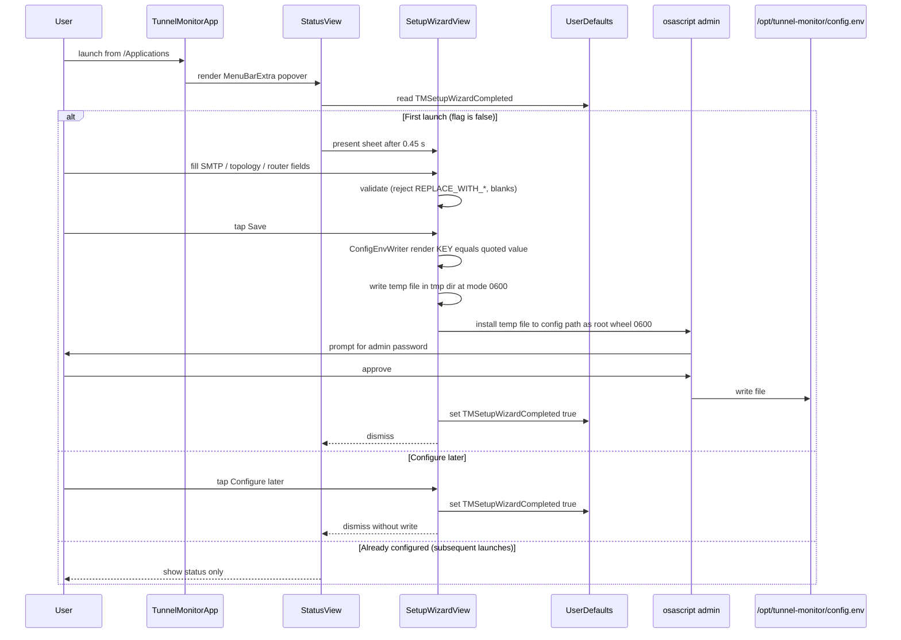
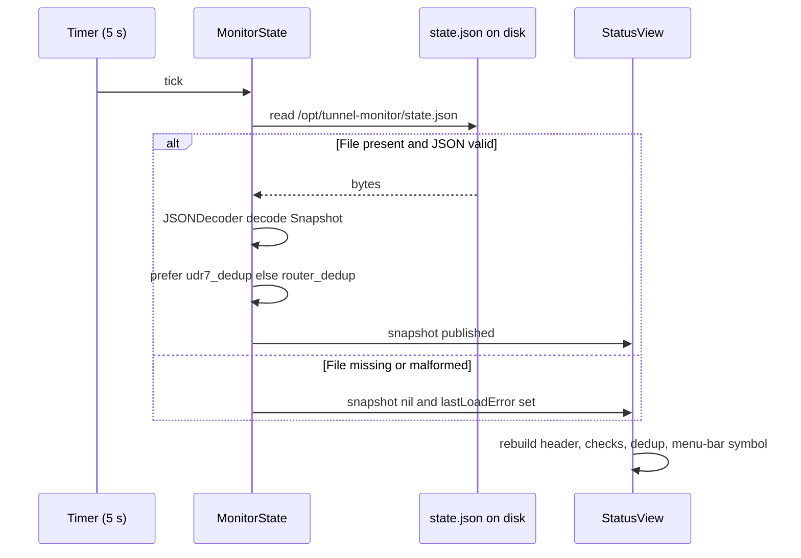
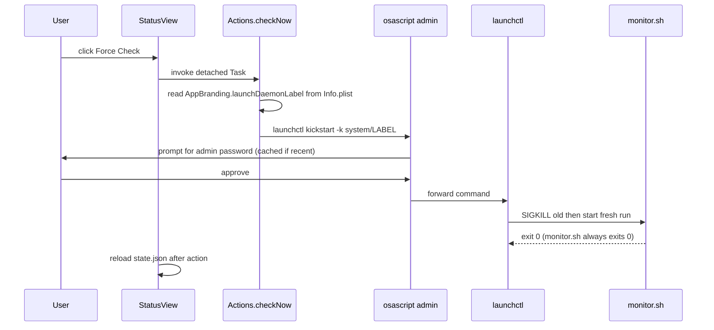
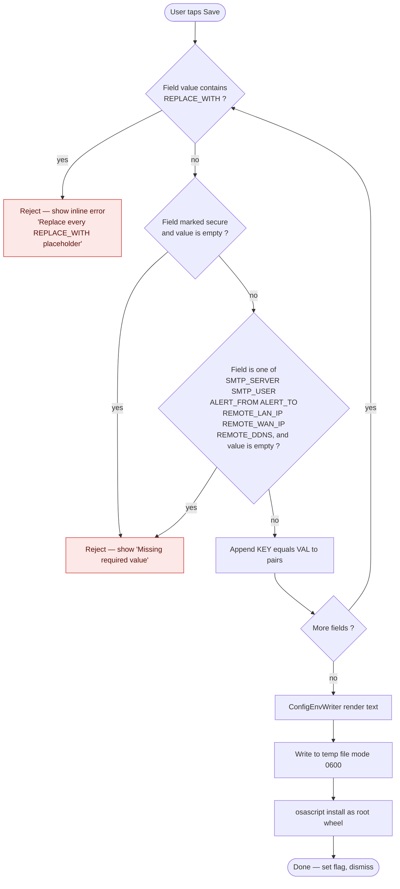

# Menu Bar App — Tunnel Monitor.app (legacy short page)

> **Use the full wiki section:** [[Tunnel-Monitor-App]] (hub with screenshots, Mermaid diagrams, and a subsection per GUI surface).

**Repo docs:** [docs/tunnel-monitor/](https://github.com/roto31/UniFi-Tunnel-Monitor/tree/main/docs/tunnel-monitor) · **Source:** [`mac/app/`](https://github.com/roto31/UniFi-Tunnel-Monitor/tree/main/mac/app)

---

## Quick map to new pages

| Topic | Wiki |
|-------|------|
| Overview | [[Tunnel-Monitor-App-Overview]] |
| Diagrams | [[Tunnel-Monitor-App-Architecture]] |
| Install | [[Tunnel-Monitor-App-Setup]] |
| SMTP / topology / SSH / tuning | [[Tunnel-Monitor-App-Configuration-SMTP]] … |
| Popover | [[Tunnel-Monitor-App-Menu-Bar]] |
| Dashboard / Settings | [[Tunnel-Monitor-App-Dashboard]], [[Tunnel-Monitor-App-Settings]] |
| Fixes | [[Tunnel-Monitor-App-Troubleshooting]] |

---

## Summary (unchanged behavior)

A native SwiftUI menu-bar application with `MenuBarExtra` popover, **Configuration**
window, and operator actions. The app **does not** run health checks — it reads
`state.json` and shells out to `tunnel-check` / `launchctl`.

---

## Highlights

- **Traffic-light status.** Green = healthy, yellow = issues before alert threshold, red = tunnel down with downtime (`down_since` in `state.json`).
- **Issue list.** Popover and Dashboard aggregate failed checks + diagnosis (DDNS drift, remote WAN, dedup, etc.).
- **Customizable surfaces.** Settings toggles for menu bar dot, Dock icon, dashboard at launch, poll interval (5/15/30 s).
- **Desktop widget (optional).** Build with XcodeGen + `app/TunnelMonitorXcode/` embeds WidgetKit extension; reads App Group snapshot synced by the app.
- **Single source of truth.** Polls `/opt/tunnel-monitor/state.json` (default every 5 s). The bash daemon remains responsible for ping / dig / ssh.
- **Configuration window** (`openWindow` id `setup`). Opened from **Setup…**,
  first launch, or `AppWindowOpener` on the menu bar label. Writes
  `config.env` as `root:wheel 0600` via admin `osascript` (not a popover sheet).
- **Reads either dedup shape.** The same binary parses `udr7_dedup` or
  `router_dedup` from `state.json`, so private and sanitized deployments
  share the source tree.
- **Bundle-driven branding.** `Info.plist` carries the LaunchDaemon label,
  dedup section title, and banner title so the sanitized build can ship as
  `com.example.tunnel.monitor` without code changes.
- **Login Item via `SMAppService`.** Toggle "Launch at login" lives in the
  popover footer; backed by `SMAppService.mainApp` (macOS 13+).
- **Universal binary.** Built for both `arm64` and `x86_64`.

---

## Component diagram



---

## File tree

```
mac/app/
├── build-app.sh                          # wrapper -> ../../../build/build-app.sh
└── TunnelMonitor/
    ├── Package.swift                     # SPM, swift-tools 5.9, macOS 13+
    ├── Resources/
    │   ├── Info.plist                    # bundle ID, TM* branding keys, LSUIElement
    │   └── wizard-fields.json            # setup-wizard schema
    └── Sources/TunnelMonitor/
        ├── TunnelMonitorApp.swift        # MenuBarExtra, dashboard, setup windows
        ├── MenuBarPopoverView.swift      # popover (no sheets/alerts)
        ├── AppWindowOpener.swift         # openWindow dashboard + setup
        ├── StatusView.swift              # DashboardView wrapper
        ├── SetupWizardView.swift         # Configuration window content
        ├── MonitorState.swift            # JSON decoder + timer poller
        ├── MenuBarStatusModel.swift      # menu dot updates (CPU-safe)
        ├── Actions.swift                 # async Terminal + launchctl
        ├── LoginItem.swift               # SMAppService
        └── ConfigEnvWriter.swift         # config.env writer
```

Mirrors the private (`app/TunnelMonitor/`) layout one-for-one. Use
[`mac/sync-app-from-root.sh`](https://github.com/roto31/UniFi-Tunnel-Monitor/blob/main/mac/sync-app-from-root.sh)
to refresh Swift sources from the private tree without touching the
sanitized `Resources/`.

---

## First-launch sequence



Notes:

- The `TMSetupWizardCompleted` flag is namespaced by `Bundle.main.bundleIdentifier`,
  so the private and sanitized builds maintain independent first-run state
  on the same machine.
- **Setup…** button in the popover re-opens the sheet whenever you want to
  rewrite `config.env`.

---

## Status refresh loop



The poller is a `Timer.scheduledTimer(withTimeInterval: 5.0, repeats: true)`
on the main run loop; the body of the timer hops back to `@MainActor`
explicitly.

---

## Force check action



Other Actions buttons are similar (`Test Notify`, `Test Email`, `SSH Test`,
`Reset State`, `Copy SSH Auth Cmd`, `Tail Log`, `Edit Config`,
`Reveal in Finder`). Read-only buttons skip the admin prompt.

---

## Setup wizard validation rules



Field catalog lives in `Resources/wizard-fields.json` (see the file for the
authoritative list). Defaults come from the same JSON, so changing a default
does not require recompiling.

---

## Bundle metadata

Each value below comes from `Resources/Info.plist`. The sanitized build
ships the values in the **Public** column; the private build under
`app/TunnelMonitor/` ships the **Private** column.

| Key                    | Private                       | Public                       | Read by                       |
|------------------------|-------------------------------|------------------------------|-------------------------------|
| `CFBundleIdentifier`   | `com.tunnel.monitor`          | `com.example.tunnel.monitor` | macOS bundle system           |
| `TMLaunchDaemonLabel`  | `com.ruter.tunnel-monitor`    | `com.example.tunnel-monitor` | `Actions.checkNow`, `AppBranding` |
| `TMDedupSectionTitle`  | `UDR7 dedup`                  | `Router dedup`               | `StatusView.dedupSection`     |
| `TMStatusBannerTitle`  | `Tunnel Monitor`              | `Tunnel Monitor`             | `StatusView.header`           |
| `LSUIElement`          | `true`                        | `true`                       | macOS — hides Dock icon       |
| `LSMinimumSystemVersion` | `13.0`                      | `13.0`                       | macOS                         |

`AppBranding` provides string-or-default fallbacks so the binary still works
when keys are missing.

---

## Build

The sanitized app is built via a tiny wrapper that forwards to the
shared `build/build-app.sh` packager with overrides:

```bash
# From the repo root
bash mac/app/build-app.sh
```

Wrapper exports:

| Env var    | Value                                  | Effect                                   |
|------------|----------------------------------------|------------------------------------------|
| `APP_SRC`  | `mac/app/TunnelMonitor`                | tells the packager to use sanitized sources |
| `DIST_DIR` | `<repo>/build/dist-public`             | avoids clobbering the private build      |

Output:

```
build/dist-public/Tunnel Monitor.app
  Contents/
    Info.plist
    MacOS/TunnelMonitor          (universal Mach-O: arm64 + x86_64)
    PkgInfo
    Resources/
      wizard-fields.json
```

The packager is the same one documented in [[Build-and-Release]] and
honors `DEVELOPER_ID_APPLICATION` for codesigning.

---

## Permissions matrix

| Action                                  | Requires admin prompt | Why |
|-----------------------------------------|:---------------------:|-----|
| Read `state.json`                        | no                    | World-readable (0644) |
| Reload `state.json` (5-s poll)           | no                    | Same |
| Force Check (`launchctl kickstart -k`)   | yes                   | LaunchDaemons live under `system/` domain |
| Save `config.env`                        | yes                   | File is `0600 root:wheel` |
| Reset State (`tunnel-check --reset`)     | yes                   | CLI requires root for writes |
| Test Email / Test Notify                 | no                    | Wraps a non-root call into `tunnel-check` |
| SSH Test                                 | no                    | CLI shells out using shared SSH key |
| Copy SSH Auth Cmd                        | yes                   | Reads `config.env` (root-only) via osascript |
| Tail Log / Edit Config (via Terminal)    | yes (in Terminal)     | Spawns a Terminal window with `sudo -e` |
| Launch at login toggle                   | no                    | `SMAppService` registers in user scope |

---

## Common operator flows

### After install — first run

1. Open `/Applications/Tunnel Monitor.app`. Menu bar icon appears.
2. Click the icon → configuration sheet pops up.
3. Fill in SMTP / topology / router SSH values, tap **Save**.
4. Approve the admin prompt → `config.env` is written.
5. Click **Copy SSH Auth Cmd** → paste into Terminal once to authorize the
   Mac on the router. Then click **SSH Test**.
6. Click **Test Email** and **Test Notify**.
7. Click **Force Check** to kick the daemon.

### Re-config later

- Menu → **Setup…** to reopen the sheet. Values are not pre-populated from
  the current `config.env` (write-only sheet).

### Roll back to "fresh first launch"

```bash
# Private build
defaults delete com.tunnel.monitor com.tunnel.monitor.TMSetupWizardCompleted
# Public build
defaults delete com.example.tunnel.monitor com.example.tunnel.monitor.TMSetupWizardCompleted
```

The `bundleId.TMSetupWizardCompleted` key isolates the flag per build, so
you can rehearse onboarding with the sanitized app while keeping your
private deployment unaffected.

---

## See also

- [[Build-and-Release]] — `.pkg` packaging, codesigning, notarization, CI.
- [[macOS-Monitor]] — the underlying daemon + CLI.
- [[Architecture]] — overall data flow and dedup logic.
- [[Placeholders-Reference]] — every `REPLACE_WITH_*` value the wizard collects.
