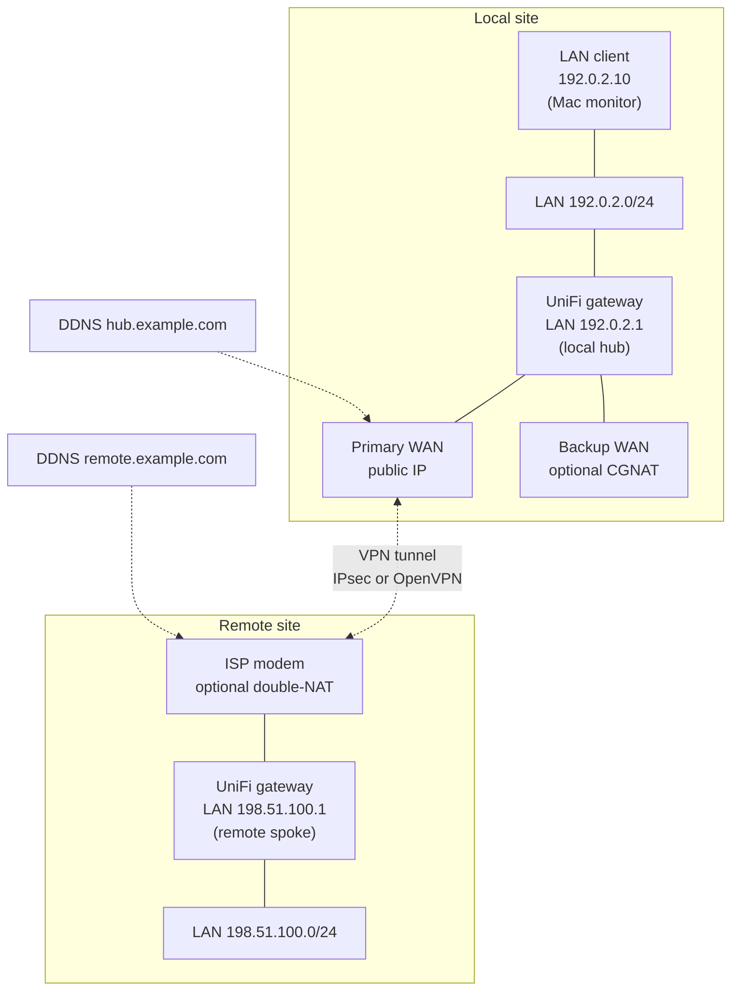
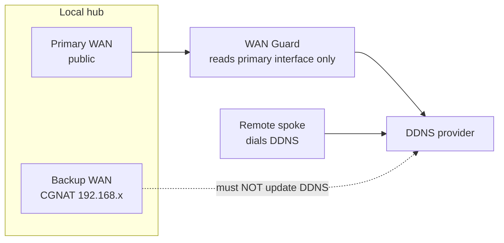

# Network overview (generic topology)

Illustrative layout for a **local hub** + **remote spoke** deployment. Replace placeholder IPs with your values ([[Placeholders-Reference]]).

---

## Site diagram

---

## Address mapping

| Role | Example placeholder | Config variable |
|------|---------------------|-----------------|
| Local gateway LAN | `192.0.2.1` | `ROUTER_HOST` (Mac SSH) |
| Mac on local LAN | `192.0.2.10` | (not in config) |
| Remote LAN gateway | `198.51.100.1` | `REMOTE_LAN_IP` |
| Remote public IP | `198.51.100.50` | `REMOTE_WAN_IP` |
| Remote DDNS | `remote.example.com` | `REMOTE_DDNS` |
| Local hub DDNS (dual WAN) | `hub.example.com` | `WAN_GUARD_HOSTNAME` |

RFC 5737 blocks (`192.0.2.0/24`, `198.51.100.0/24`) are **documentation only** — not routable on the public internet.

---

## VPN options

| Transport | When to use | Ports |
|-----------|-------------|-------|
| **IPsec** | Both sites have public or straightforward NAT | UDP 500, 4500 |
| **OpenVPN** | Upstream modem blocks IPsec | UDP 1194 (or 8443) |

OpenVPN tunnel IPs (example): `10.255.0.1` (hub) ↔ `10.255.0.2` (spoke) on a `/30` or as UniFi assigns.

---

## Dual WAN (local hub only)

Without WAN Guard, failover can publish a **private** address → remote VPN breaks. See [[WAN-Guard-OpenVPN-Failover]].

---

## Monitoring traffic flows

| From | To | Purpose |
|------|-----|---------|
| Mac monitor | `REMOTE_LAN_IP` | Tunnel health (client view) |
| Mac monitor | `REMOTE_WAN_IP` | Remote ISP up? |
| Mac monitor | `ROUTER_HOST` SSH | Dedup state read |
| Gateway monitor | `REMOTE_LAN_IP` | Tunnel health (router view) |
| Gateway monitor | `REMOTE_WAN_IP` | Remote ISP up? |
| WAN Guard | Primary WAN interface | DDNS sync |
| Remote spoke | Hub DDNS:port | OpenVPN initiate |

---

## UniFi object naming (suggested)

Use **consistent names** across sites:

| Site | Suggested tunnel name | Points to |
|------|----------------------|-----------|
| Local hub | `Remote-Site-OpenVPN` | `remote.example.com` |
| Remote spoke | `Spoke-to-Hub-OpenVPN` | `hub.example.com` |

Policy routing objects should reference the **OpenVPN** tunnel name after migration off IPsec.

---

## External references

- [RFC 5737 — TEST-NET addresses](https://www.rfc-editor.org/rfc/rfc5737)
- [Ubiquiti VPN documentation](https://help.ui.com/hc/en-us/articles/115001218267-UniFi-Gateway-Route-Based-VPN-IPsec)
