# Troubleshooting decision tree diagrams

Mermaid flowcharts for every branch in [[Troubleshooting-Decision-Trees]]. **First match wins** unless noted.

Text tables: [[Troubleshooting-Decision-Trees]] · Step-by-step: [[Troubleshooting]] · General workflows: [[Workflow-Diagrams]]

---

## 1. Master triage

Start here when an alert fires or `tunnel-check` looks wrong.

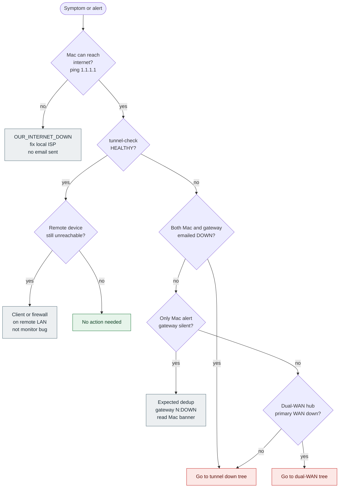

---

## 2. Tunnel down — identify diagnosis

Mac `tunnel-check` shows DOWN (after local internet is OK).

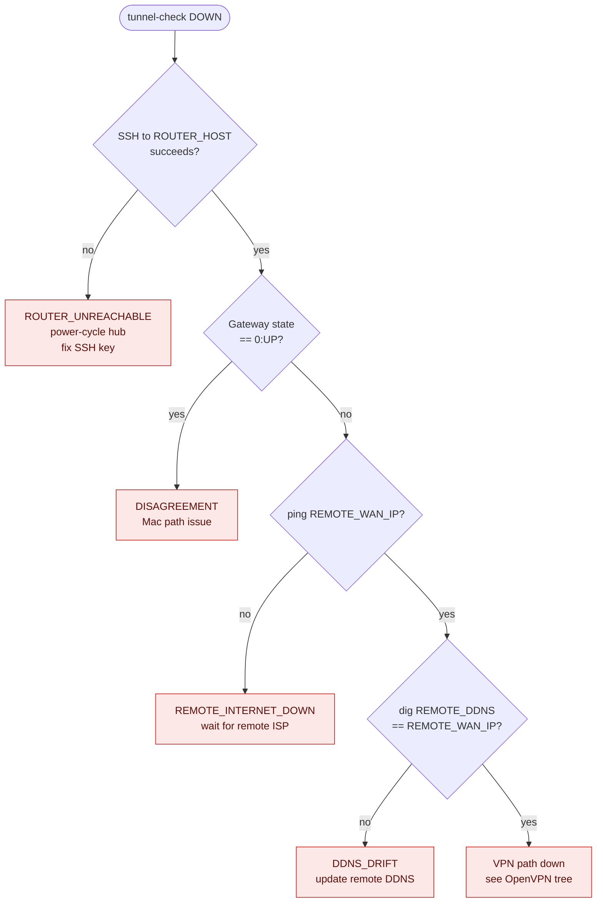

---

## 3. OpenVPN / VPN path down

Remote WAN reachable and remote DDNS correct, but tunnel ping fails.

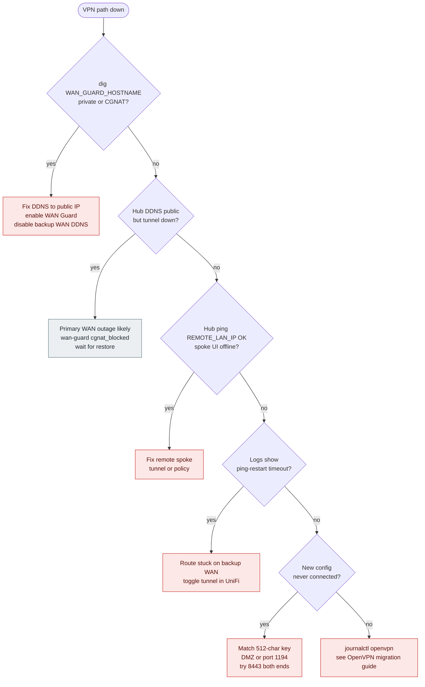

---

## 4. Dual-WAN / WAN Guard

Local hub has primary public WAN plus backup CGNAT WAN.

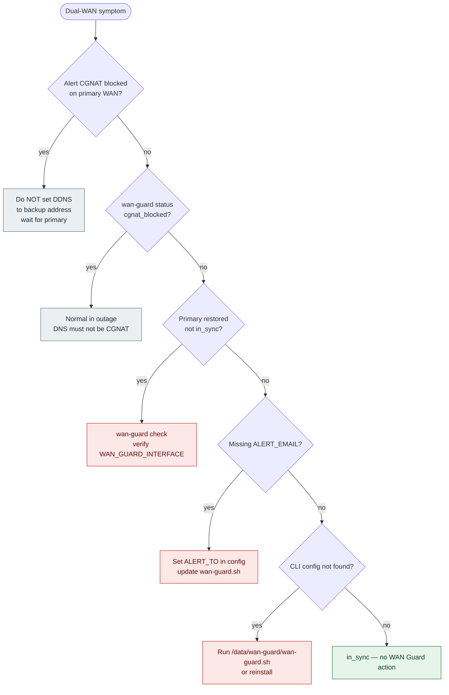

Runbook: [[WAN-Guard-OpenVPN-Failover]].

---

## 5. DDNS_DRIFT (remote)

`REMOTE_DDNS` resolves to something other than `REMOTE_WAN_IP`.

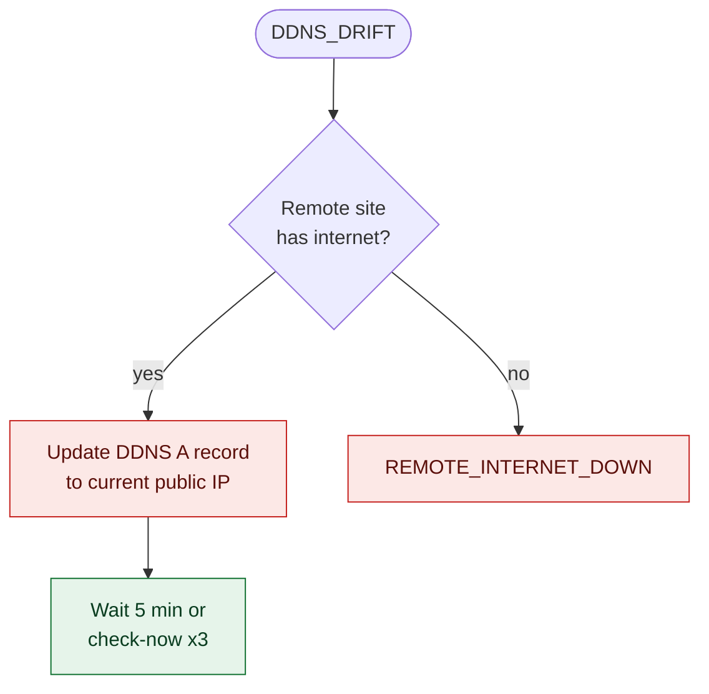

---

## 6. REMOTE_INTERNET_DOWN

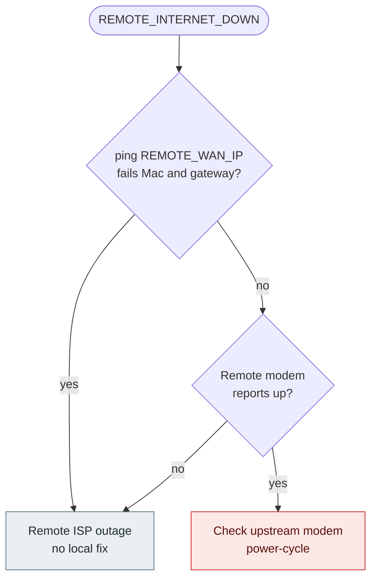

---

## 7. ROUTER_UNREACHABLE

Mac cannot SSH to `ROUTER_HOST` for dedup.

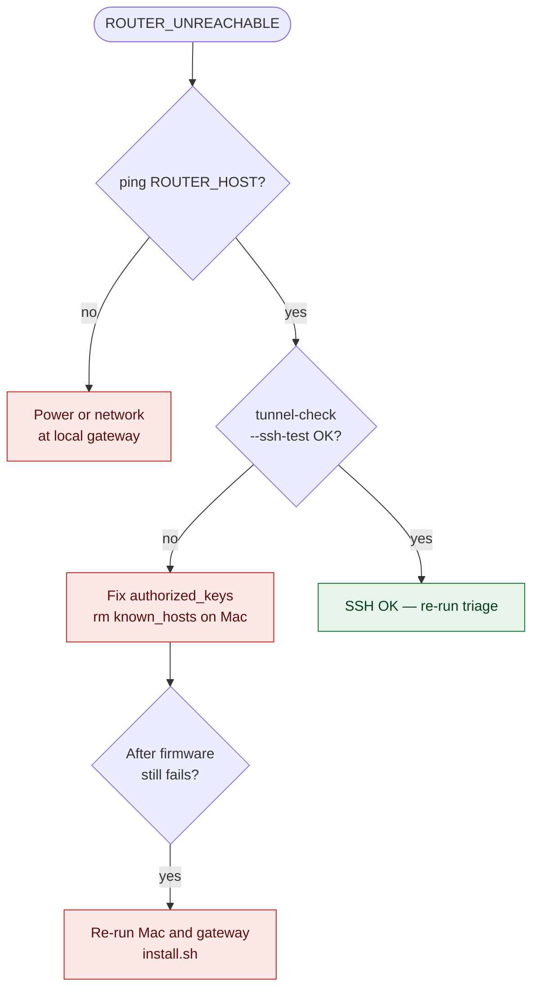

---

## 8. DISAGREEMENT

Gateway state `0:UP`, Mac cannot ping `REMOTE_LAN_IP`.

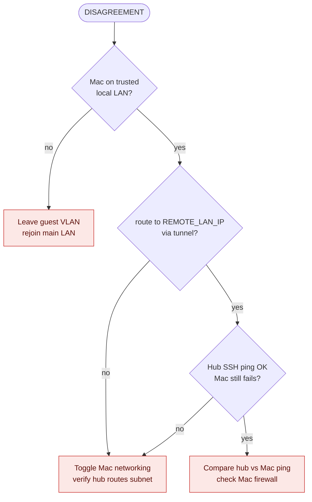

---

## 9. OUR_INTERNET_DOWN (Mac)

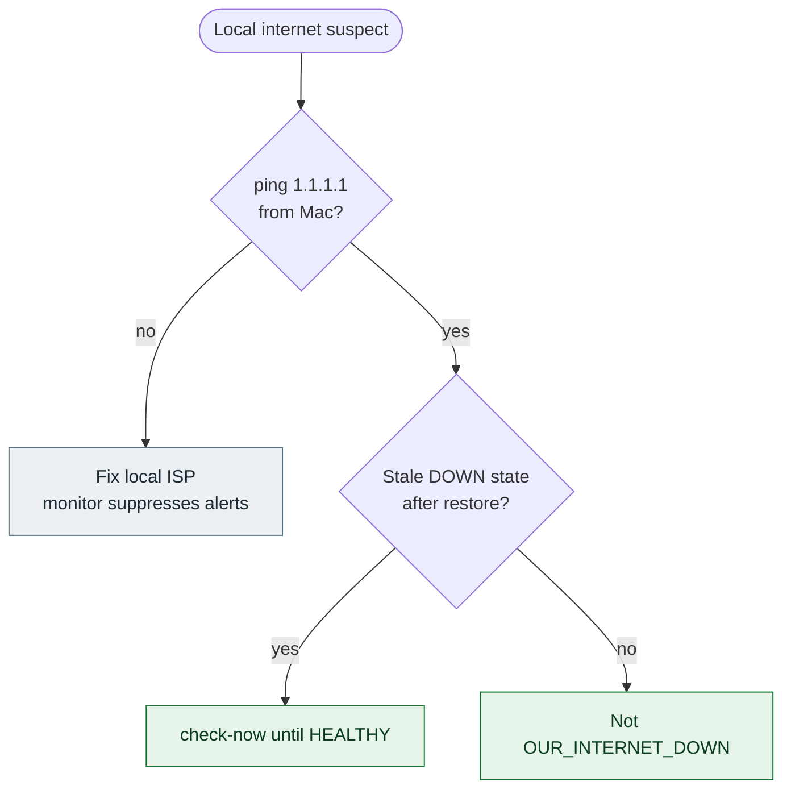

---

## 10. Email and alerting

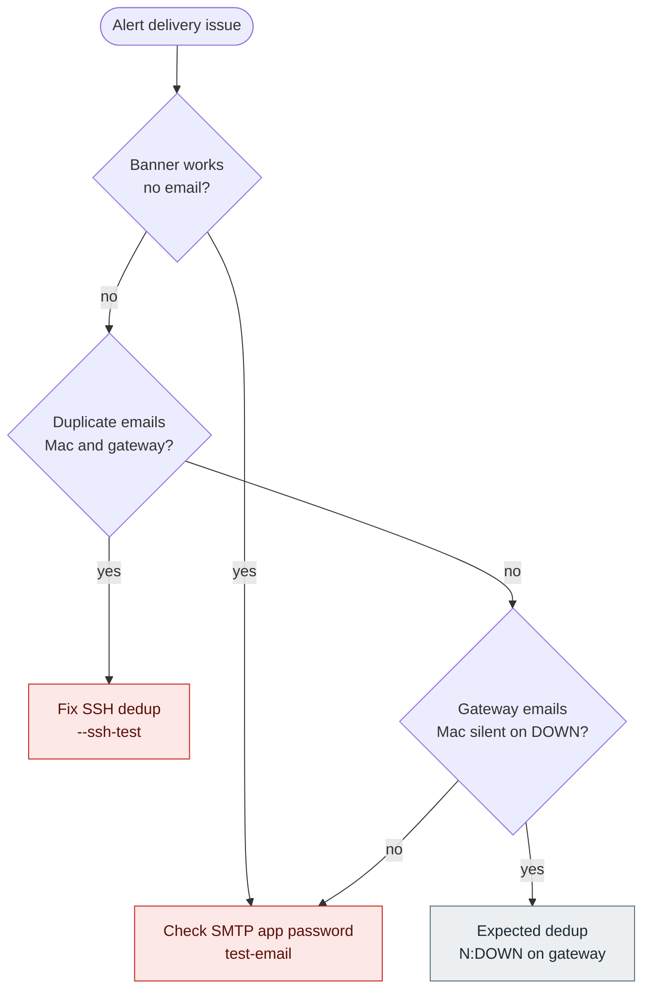

---

## 11. Post–firmware update (gateway)

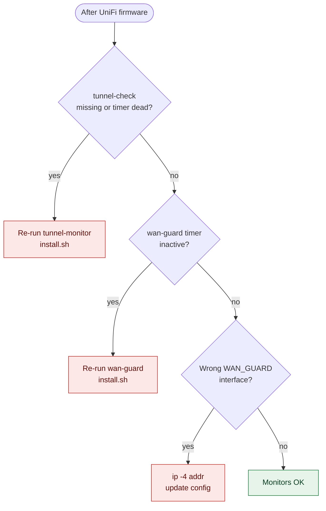

---

## 12. Legacy IPsec

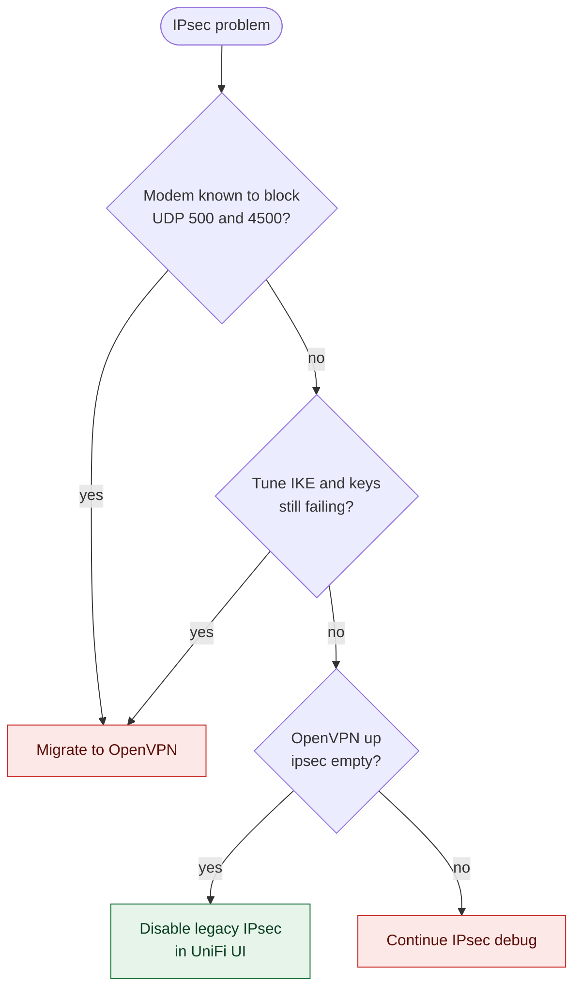

Guide: [[OpenVPN-Site-to-Site-Migration]].

---

## 13. Mac alert dedup (email vs banner)

Applied after a DOWN diagnosis when threshold is crossed.

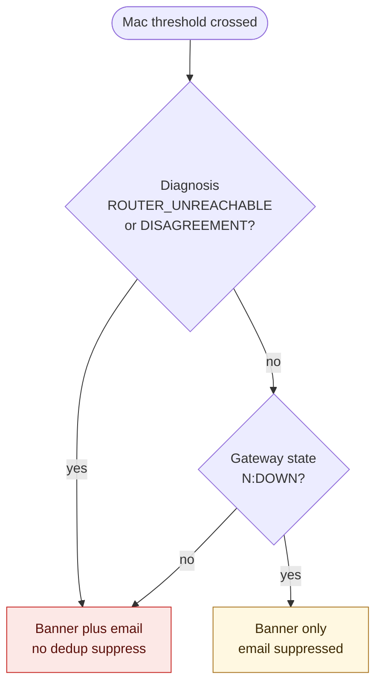

Same logic as [[Architecture]] dedup tree.

---

## Legend

| Color | Meaning |
|-------|---------|
| Green | Healthy / done |
| Grey | Expected / no action / wait |
| Red | Action required |
| Yellow | Dedup — banner only |
