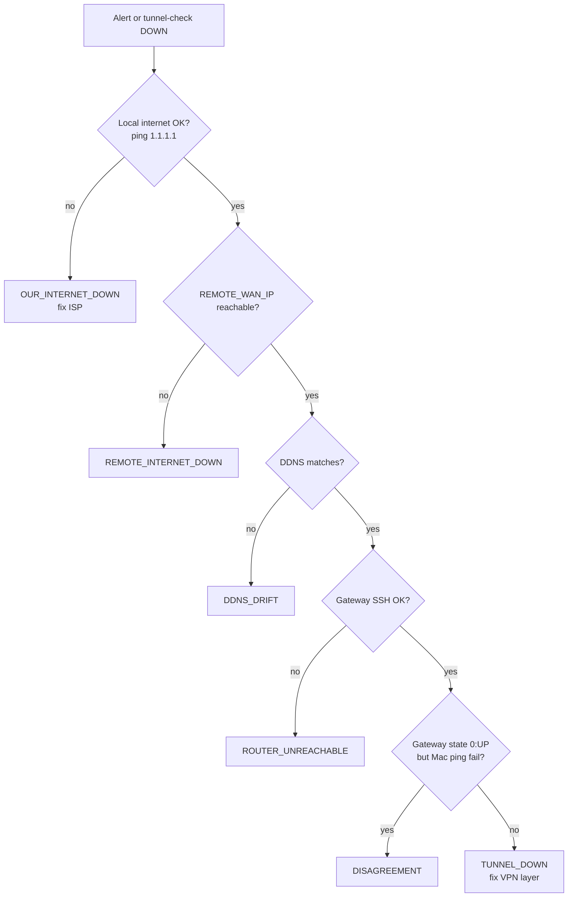

# Troubleshooting

Dual-audience guide: **quick steps** for beginners, **technical depth** for advanced operators.

Alert diagnoses appear in **email subjects** and Mac **banner titles**. Match your symptom below.

Placeholder IPs refer to [[Placeholders-Reference]].

---

## Quick reference table

| If you see… | Likely cause | First action |
|-------------|--------------|--------------|
| `TUNNEL DOWN` / `TUNNEL_DOWN` | VPN path dead, remote WAN up | [Tunnel down](#tunnel-down) |
| `DDNS DRIFT` / `DDNS_DRIFT` | Hostname ≠ expected public IP | [DDNS drift](#ddns-drift) |
| `REMOTE INTERNET DOWN` | Remote site offline | Wait / contact remote site |
| `ROUTER UNREACHABLE` / `UDR7_UNREACHABLE` | Mac can't SSH local gateway | [Gateway SSH](#gateway-unreachable-mac) |
| `DISAGREEMENT` | Gateway says UP, Mac says DOWN | [Disagreement](#disagreement) |
| `OUR INTERNET DOWN` | Local ISP down | Fix local internet (no alert sent) |
| WAN Guard `cgnat_blocked` | Backup CGNAT WAN active | [Dual WAN](#dual-wan-and-wan-guard) |
| OpenVPN never connects | NAT/modem/key mismatch | [OpenVPN](#openvpn-wont-connect) |

---

## Tunnel down

### Beginner

1. Open UniFi **Local hub** → **VPN** → site-to-site tunnel. Note status (Connected / Offline).
2. On your Mac, run `tunnel-check`. Read the **diagnosis** line.
3. If **DDNS DRIFT** → fix DNS first ([below](#ddns-drift)).
4. If **REMOTE INTERNET DOWN** → nothing to fix locally.
5. Otherwise toggle tunnel **off/on** in UniFi. Wait 5 minutes. Run `tunnel-check` again.

### Advanced

**Gateway (local hub):**

```bash
ssh root@YOUR_ROUTER_LAN_IP
tunnel-check
journalctl -u tunnel-monitor.service -n 30
```

For **IPsec** (if still in use):

```bash
ipsec statusall
journalctl -fu strongswan -n 100
```

For **OpenVPN**:

```bash
journalctl -t openvpn -n 50
ping -c 5 REMOTE_LAN_IP
```

Look for:

- SA / tunnel **not established**
- **`Inactivity timeout (--ping-restart)`** — routing or NAT issue
- Ping OK on gateway but Mac fails → [Disagreement](#disagreement)

**Mac:**

```bash
tunnel-check
ping -c 3 REMOTE_LAN_IP
ping -c 3 REMOTE_WAN_IP
dig +short REMOTE_DDNS @1.1.1.1
tunnel-check --ssh-test
```

---

## DDNS drift

### Beginner

Your monitor compares `REMOTE_DDNS` to `REMOTE_WAN_IP`. If the hostname resolves to a **different** address, the remote ISP probably changed their public IP.

1. Get the remote site's current public IP (modem status page or whatismyip.com **at the remote site**).
2. Log into your DDNS provider. Update the **A record** for `REMOTE_DDNS`.
3. Wait ~5 minutes. Run `tunnel-check` on Mac and gateway.

### Advanced

```bash
dig +short REMOTE_DDNS @1.1.1.1
# Compare to REMOTE_WAN_IP in config.env
```

Update `REMOTE_WAN_IP` in **both** config files if you intentionally changed the expected IP.

**Local hub DDNS (WAN Guard):** If **your** hostname (what remote dials) shows a **private** address (`10.x`, `192.168.x`, `172.16–31.x`), see [Dual WAN](#dual-wan-and-wan-guard).

---

## Remote internet down

### Beginner

The remote site's modem/WAN is offline. Your equipment is fine. Wait or contact whoever manages the remote site.

### Advanced

Confirm from **both** vantage points:

```bash
ping -c 3 REMOTE_WAN_IP          # Mac
ssh root@ROUTER_LAN_IP 'ping -c 3 REMOTE_WAN_IP'
```

If both fail, diagnosis is correct.

---

## Gateway unreachable (Mac)

### Beginner

The Mac monitor cannot SSH to your **local gateway** for dedup.

1. Can you open `https://ROUTER_LAN_IP` in a browser?
2. If no → power-cycle the local gateway.
3. If yes → run `tunnel-check --ssh-test`. Follow installer SSH key steps in [[macOS-Monitor]].

### Advanced

```bash
ping -c 3 ROUTER_LAN_IP
ls -la /opt/tunnel-monitor/.ssh/
ssh -i /opt/tunnel-monitor/.ssh/id_ed25519 root@ROUTER_LAN_IP 'cat /data/tunnel-monitor/state'
```

Fix `authorized_keys`, permissions (`0600` key), or remove stale `known_hosts`.

---

## Disagreement

### Beginner

The **gateway thinks the tunnel is UP**; your **Mac cannot** reach the remote LAN.

1. Confirm the Mac is on the **main LAN**, not guest Wi‑Fi.
2. Turn Wi‑Fi off and on (or replug Ethernet).
3. Run `tunnel-check` again.

### Advanced

```bash
route -n get REMOTE_LAN_IP    # Mac — should route via local gateway
ping -c 3 ROUTER_LAN_IP
ping -c 3 REMOTE_LAN_IP
```

SSH to gateway — if gateway ping to `REMOTE_LAN_IP` works but Mac fails, suspect Mac VLAN/firewall or split routing.

---

## Dual WAN and WAN Guard

### Beginner

If your **local hub** has two internet connections and the **backup uses CGNAT** (private `192.168.x` on WAN):

- **Do not** point DDNS at the backup address.
- Install [[WAN-Guard-Install]] and **turn off UniFi Dynamic DNS** on both WANs.
- When primary WAN is down, the VPN may stay offline until primary returns — that protects remote clients from dialing a bad address.

Full guide: [[WAN-Guard-OpenVPN-Failover]].

### Advanced

```bash
ssh root@ROUTER_LAN_IP
wan-guard status
dig +short YOUR_HUB_DDNS @1.1.1.1
ip -4 addr show WAN_GUARD_INTERFACE
```

| If | Then |
|----|------|
| `last_check_status=cgnat_blocked` | Expected during primary outage; DNS should **not** show CGNAT |
| `last_check_status=in_sync` | Primary public IP matches DNS |
| Missing `ALERT_EMAIL` error | Set `ALERT_TO` in config; use latest `wan-guard.sh` (aliases `SMTP_PASSWORD`) |

---

## OpenVPN won't connect

### Beginner

1. Confirm **same 512-char key** on both UniFi tunnels (copy/paste error is common).
2. Remote modem: set **DMZ** to UniFi WAN IP **or** forward **UDP 1194** to UniFi.
3. Try **UDP 8443** on **both** ends if 1194 fails ([migration guide](openvpn-site-to-site-migration.md)).
4. Remote tunnel **Remote hostname** must match your **DDNS**, not an old IP.

### Advanced

**Hub gateway logs:**

```bash
journalctl -t openvpn -n 100 | grep -E 'Initialization|timeout|ROUTE'
```

**Checklist:**

- [ ] Tunnel IPs unique (e.g. `10.255.0.1` / `.2`)
- [ ] Remote networks list includes peer LAN CIDR
- [ ] Hub DDNS resolves to **public** primary WAN
- [ ] No double port-forward + DMZ conflict on upstream modem

Reference: [Ubiquiti OpenVPN Site-to-Site](https://help.ui.com/hc/en-us/articles/12646699585047-UniFi-Gateway-OpenVPN-Site-to-Site).

---

## IPsec blocked by ISP modem

### Beginner

Symptoms: tunnel worked before, remote site behind **ISP modem double-NAT**, **IPsec never comes up** despite correct UniFi settings.

**Fix:** Migrate to OpenVPN — [[OpenVPN-Site-to-Site-Migration]]. IPsec UDP 500/4500 is blocked on some firmware revisions regardless of port forwards.

### Advanced

From remote WAN, packet capture or external port check on UDP 500 — if closed while UDP 1194 forwarded works, confirms modem filter.

---

## Email not sending

### Beginner

Run test on each installed side:

```bash
tunnel-check --test-email          # Mac or gateway
wan-guard test-email               # WAN Guard on hub
```

Use an **app-specific password**, not your normal email password (iCloud, Google, etc.).

### Advanced

- `ALERT_FROM` must match `SMTP_USER` on iCloud.
- Port **587** STARTTLS — scripts use `curl smtp://`, not implicit SSL 465.
- Check `journalctl -u tunnel-monitor` or Mac `monitor.log` for curl errors.

---

## After UniFi firmware update

### Beginner

Re-run installers from saved source folders — config is preserved:

```bash
cd /root/tunnel-monitor-src && bash install.sh
cd /root/wan-guard-src && bash install.sh   # if used
```

### Advanced

Verify timers:

```bash
systemctl list-timers tunnel-monitor.timer wan-guard.timer
```

Re-check `WAN_GUARD_INTERFACE` — interface names (`eth0`, `eth2`, etc.) can change after firmware updates.

---

## Decision flow (combined monitors)



Dedup details: [[Architecture]] §3.

---

## Still stuck?

1. Collect: `tunnel-check` (Mac + gateway), `wan-guard status` (if any), OpenVPN/IPsec logs.
2. Compare to [[Implementation-Guide]] acceptance tests.
3. Review [[Network-Overview]] — confirm your diagram matches reality.
