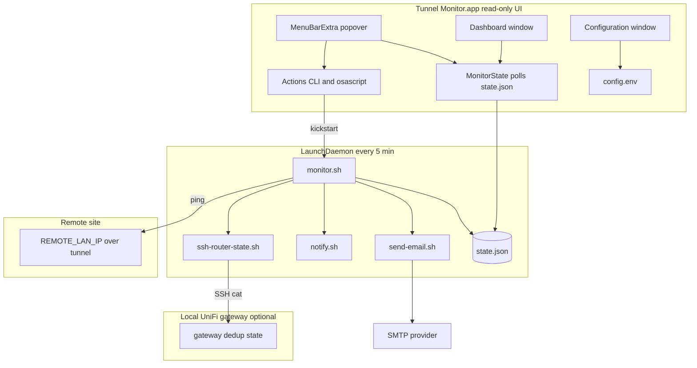
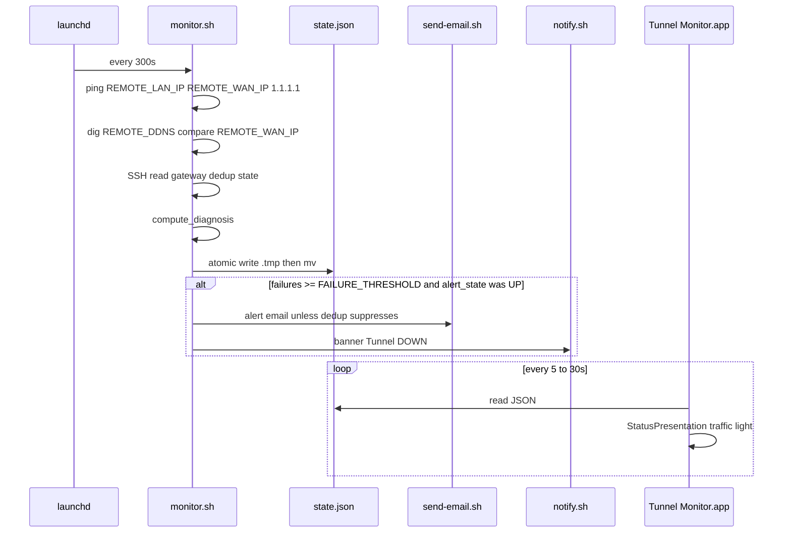
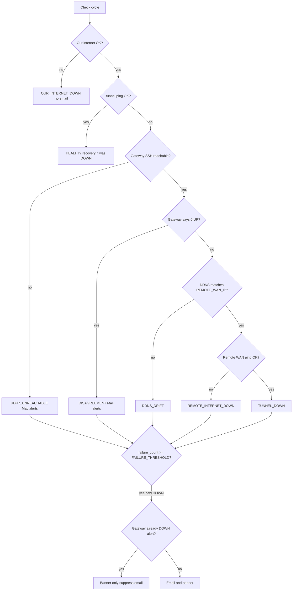
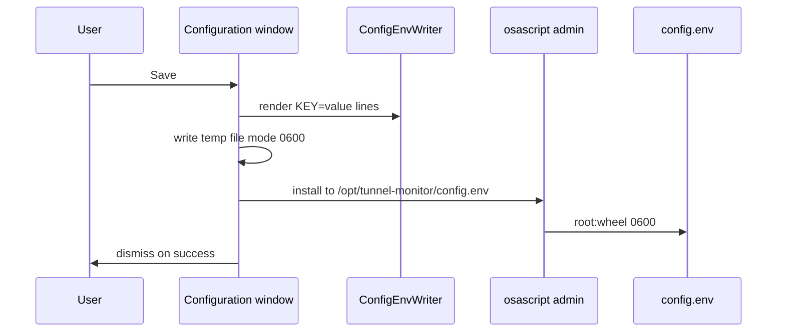
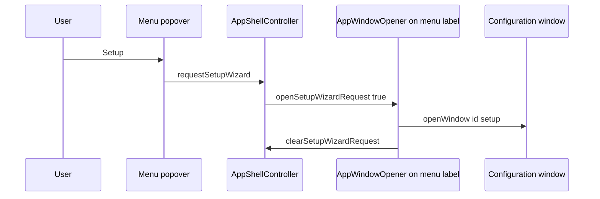

# Tunnel Monitor.app — architecture & diagrams

[← Hub](Tunnel-Monitor-App)

Mac LAN-client stack: **Tunnel Monitor.app** + `/opt/tunnel-monitor/`. For gateway monitors and WAN Guard, see [[Architecture]].

---

## System components

---

## Data flow (one check cycle)

---

## Alert decision flow

---

## Configuration save (GUI)

---

## Opening Setup from menu bar

`AppWindowOpener` sits on the **menu bar label** so Setup works before any dashboard exists.

---

## `state.json` (GUI fields)

| Field | Meaning |
|-------|---------|
| `alert_state` | `UP` / `DOWN` |
| `diagnosis` | `HEALTHY`, `TUNNEL_DOWN`, `DDNS_DRIFT`, … |
| `failure_count` | Consecutive bad cycles |
| `down_since` | ISO down streak start |
| `checks.*` | Per-check ok / latency |
| `udr7_dedup` or `router_dedup` | SSH dedup block |

---

## Traffic light mapping

| Color | Meaning |
|-------|---------|
| Green | HEALTHY, failure count 0 |
| Yellow | Issues, alert still UP |
| Red | `alert_state` DOWN |

Settings poll interval (5/15/30 s) only affects how often the **app** re-reads JSON — not the daemon.

---

## Legacy UX changes

| Before | Now |
|--------|-----|
| SwiftBar only | App + optional SwiftBar |
| Sheet in popover | **Configuration** window |
| Popover `StatusView` | `MenuBarPopoverView` |

Build signing: [[Build-and-Release]] only.
