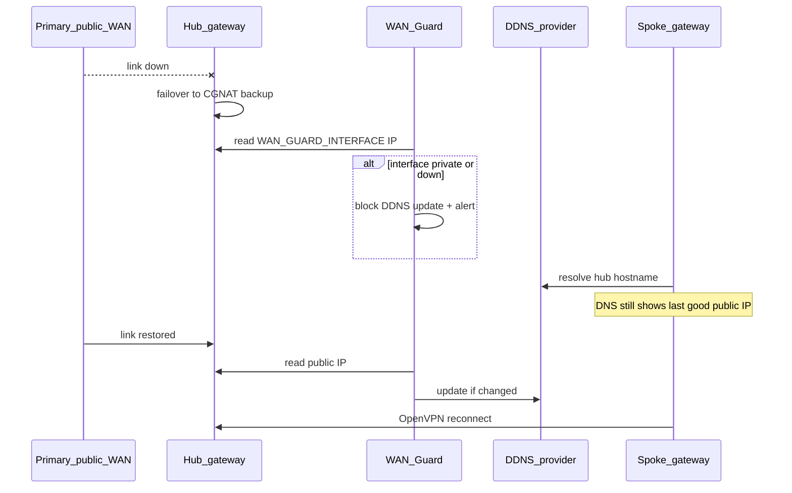

# WAN Guard + OpenVPN on dual-WAN hubs

Protect **`REPLACE_WITH_HUB_DDNS_HOSTNAME`** on the **local hub** when **primary public WAN** fails over to a **CGNAT backup**. Without this guard, DDNS can publish a **private** address; the spoke’s **`Spoke-to-Hub-OpenVPN`** tunnel then dials an unroutable target and drops or flaps.

Package: [wan-guard](https://github.com/roto31/UniFi-Tunnel-Monitor/tree/main/unifi/wan-guard)

---

## Example topology (generic)

| Site | Role | WAN | Example address | Notes |
|------|------|-----|-----------------|-------|
| Hub | Local | WAN1 (backup) | CGNAT `192.168.x.x` or `100.64.x.x` | **Must not** be published to DDNS |
| Hub | Local | WAN2 (primary) | Public `203.0.113.10` | OpenVPN listens here; DDNS must match |
| Spoke | Remote | WAN1 | `198.51.100.50` behind upstream modem | Initiates to **`hub.example-ddns.test:1194`** |

Remote tunnel config (spoke):

- **Name:** `Spoke-to-Hub-OpenVPN`
- **Remote hostname:** `REPLACE_WITH_HUB_DDNS_HOSTNAME` (not a raw IP — allows recovery after primary WAN returns)
- **Remote networks:** hub LAN, e.g. `192.0.2.0/24`

---

## Failure mode

When primary public WAN went down, UniFi failed over to CGNAT backup. One or more of these happened:

1. **UniFi DDNS** (or another updater) wrote a **private** address to **`REPLACE_WITH_HUB_DDNS_HOSTNAME`**.
2. Spoke resolved that address and tried to build a tunnel to an **unreachable** endpoint.
3. OpenVPN on the hub may pick a default route via the backup WAN during bring-up — asymmetric routing and **`Inactivity timeout (--ping-restart)`** in logs.

OpenVPN does **not** fix bad DDNS. It still depends on **`REPLACE_WITH_HUB_DDNS_HOSTNAME` → hub public IP**.

**WAN Guard’s job:** never push a private/CGNAT IP to your DDNS provider; preserve the last good public record during outage; alert you; auto-heal when primary WAN returns.

---

## What WAN Guard does

On the hub (`/data/wan-guard/wan-guard.sh`):

1. Read IP from **`WAN_GUARD_INTERFACE`** (your primary public WAN — verify with `ip -4 addr`).
2. If IP is **private/CGNAT** → **block** DDNS update, alert once per bad IP.
3. If IP is **public** → compare to DNS for **`REPLACE_WITH_HUB_DDNS_HOSTNAME`**.
4. Update DDNS only when public IP **changed**.
5. Write **`wan-guard.state`** for correlation with tunnel-monitor.

Timer: every **5 minutes** (same cadence as tunnel-monitor).

---

## Install on hub gateway

From your workstation (VPN or LAN to hub):

```bash
scp -r unifi/wan-guard/ root@REPLACE_WITH_HUB_GATEWAY_LAN_IP:/root/wan-guard-src
ssh root@REPLACE_WITH_HUB_GATEWAY_LAN_IP
cd /root/wan-guard-src && bash install.sh
```

Append [config-additions.env](https://github.com/roto31/UniFi-Tunnel-Monitor/blob/main/unifi/wan-guard/config-additions.env) to `/data/tunnel-monitor/config.env` (or `/data/wan-guard/config.env`).

| Key | Example | Meaning |
|-----|---------|---------|
| `WAN_GUARD_INTERFACE` | `eth2` | Primary **public** WAN only — verify with `ip -4 addr show eth2` |
| `WAN_GUARD_HOSTNAME` | `hub.example-ddns.test` | Hostname spoke dials |
| `WAN_GUARD_NOIP_USER` | `REPLACE_WITH_NOIP_USERNAME` | DDNS account |
| `WAN_GUARD_NOIP_PASS` | `REPLACE_WITH_NOIP_PASSWORD` | DDNS password or token |

Verify:

```bash
wan-guard check
wan-guard status
wan-guard test-email
```

---

## UniFi settings checklist (hub)

Do these **once** on the hub; they complement WAN Guard (DNS) with routing behaviour.

### 1. Disable UniFi DDNS on the CGNAT backup WAN

**Settings → Internet → backup WAN** → turn **off** Dynamic DNS for that interface.

Only **`REPLACE_WITH_HUB_DDNS_HOSTNAME`** should be updated — and **only** from WAN Guard reading the **primary public** interface, not from UniFi auto-update on backup WAN.

### 2. Failover policy — do not prefer CGNAT for VPN traffic

**Settings → Internet → WAN failover**

- **Critical:** when primary public WAN is **up**, ensure VPN/OpenVPN egress uses that WAN. After an outage, when primary returns, confirm OpenVPN reconnects on the **public** path, not the CGNAT backup.

If OpenVPN logs show **`ROUTE_GATEWAY`** via the backup interface while primary is up, adjust failover weights so **primary WAN is default** for new sessions, or add a **static route** on the hub:

- Destination: **`REPLACE_WITH_SPOKE_PUBLIC_IP/32`**
- Interface: **primary public WAN**

### 3. OpenVPN tunnel naming (both sites)

| Site | Tunnel name | Remote hostname | Port |
|------|-------------|-----------------|------|
| Hub | `Hub-to-Spoke-OpenVPN` | `REPLACE_WITH_SPOKE_DDNS_HOSTNAME` | UDP 1194 |
| Spoke | `Spoke-to-Hub-OpenVPN` | `REPLACE_WITH_HUB_DDNS_HOSTNAME` | UDP 1194 |

Do **not** point **`Spoke-to-Hub-OpenVPN`** at a static IP unless you accept manual updates when the hub public IP changes.

### 4. Policy routing

Update **Policy Engine** rules to use **`Spoke-to-Hub-OpenVPN`** (not legacy IPsec tunnel interfaces).

---

## Timeline when primary WAN fails



| Phase | DDNS | OpenVPN | Policy-routed VLANs |
|-------|------|---------|---------------------|
| Primary up | hub hostname = public IP | Connected | Routes via tunnel |
| Primary down, CGNAT active | **Unchanged** (guard blocks bad push) | May drop until primary back; DNS still valid | Kill switch — no WAN leak |
| Primary restored | Auto-update if IP changed | Reconnect within ~1–5 min | Resumes |

**Without WAN Guard:** DDNS may flip to a **private** address → tunnel broken until manual DDNS fix even after primary WAN returns.

---

## Operator runbook

### Primary WAN outage (alert: “CGNAT IP on WAN — DDNS blocked”)

1. **Do not** manually set DDNS to the CGNAT backup address.
2. **`wan-guard status`** — confirm block active.
3. **`dig +short REPLACE_WITH_HUB_DDNS_HOSTNAME`** — should **not** be a private/CGNAT address.
4. Expect **`Spoke-to-Hub-OpenVPN`** offline until primary returns — intentional kill switch behaviour.
5. Hub Mac: **`tunnel-check`** shows tunnel **DOWN**; dedup may still reach hub gateway via LAN.

### Primary WAN restored (alert: “DDNS updated” or “CGNAT RECOVERY”)

1. **`wan-guard status`**
2. **`dig +short REPLACE_WITH_HUB_DDNS_HOSTNAME`** → current public IP.
3. UniFi both sites: **`Hub-to-Spoke-OpenVPN`** / **`Spoke-to-Hub-OpenVPN`** → **Connected**.
4. **`ping REPLACE_WITH_SPOKE_LAN_GATEWAY_IP`** from hub LAN; **`sudo tunnel-check --check-now`**.

### OpenVPN flaps after failover

1. Check **`journalctl -t openvpn -n 50`** on hub for **`Inactivity timeout`** vs **`Initialization Sequence Completed`**.
2. Confirm **`ROUTE_GATEWAY`** is not stuck on backup WAN after primary is back.
3. Toggle tunnel off/on in UniFi or **`service openvpn reload`** on hub (last resort).

### After hub firmware update

```bash
wan-guard status   # verify WAN_GUARD_INTERFACE still primary public WAN
systemctl list-timers wan-guard.timer
```

---

## Coexistence with tunnel-monitor

| Component | Path | Role |
|-----------|------|------|
| Mac monitor | `/opt/tunnel-monitor/` | Pings remote LAN from hub LAN client |
| Hub gateway monitor | `/data/tunnel-monitor/` | Pings remote LAN, dedup state |
| WAN Guard | `/data/wan-guard/` | Protects **hub DDNS** only |

WAN Guard does **not** replace tunnel-monitor. Install both on dual-WAN **hub** gateways running OpenVPN site-to-site.

Optional **spoke-side** monitors: [[Spoke-Templates]].

---

## Dry run / testing

```bash
# On hub, temporarily in config.env:
WAN_GUARD_DRY_RUN="true"
wan-guard check
```

Unit tests (no network):

```bash
bash unifi/wan-guard/test-wan-guard.sh
```

Simulate CGNAT block logic: tests use RFC 5737 / CGNAT example addresses only.
