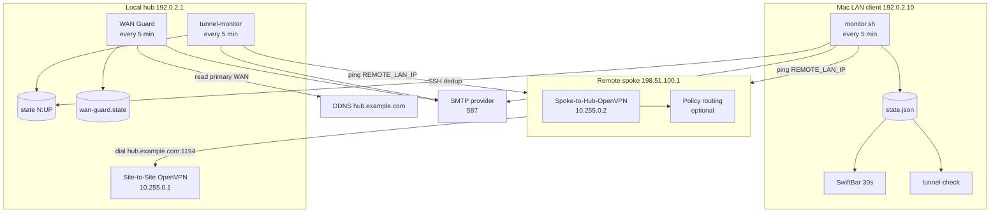
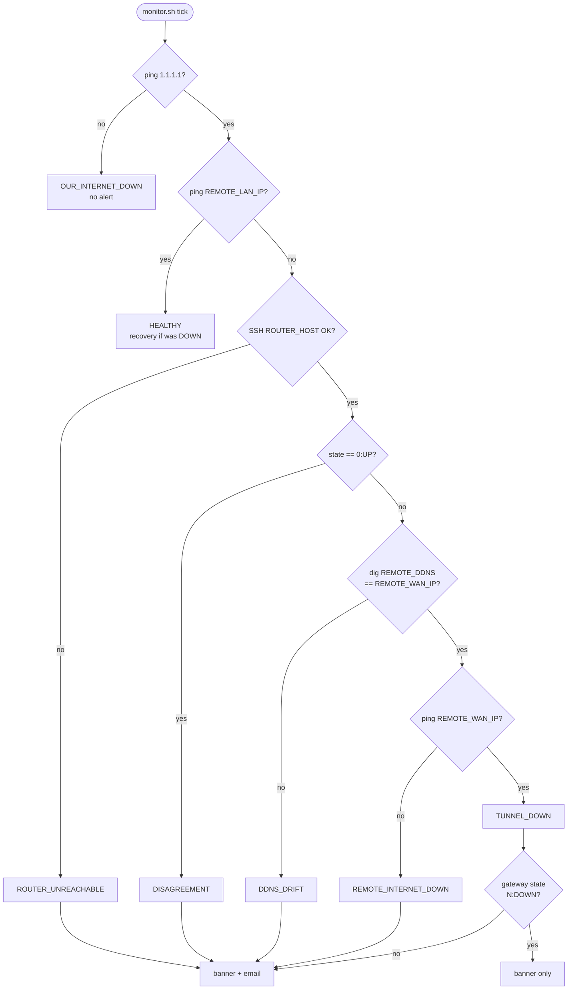
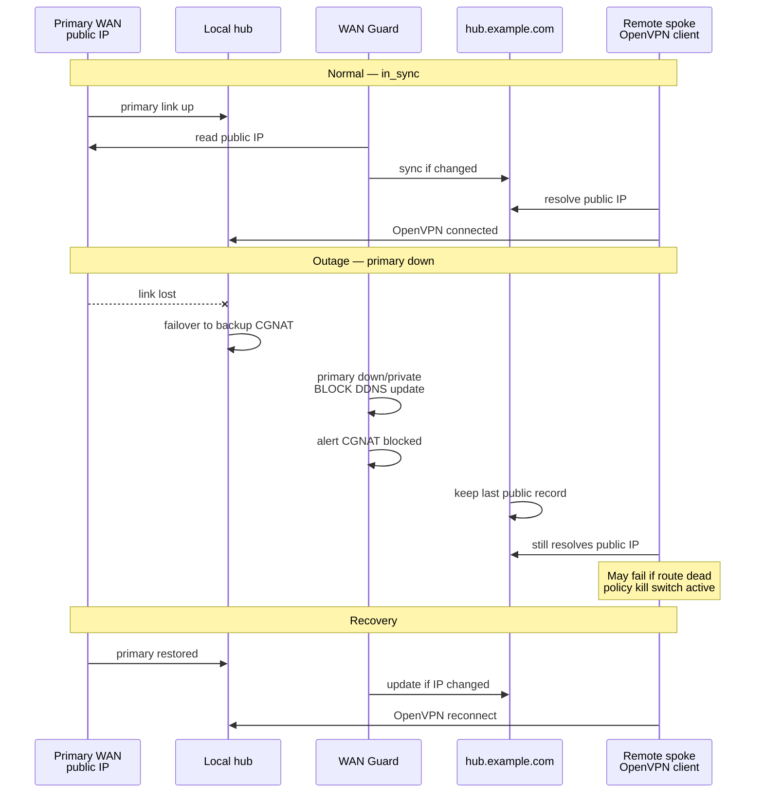
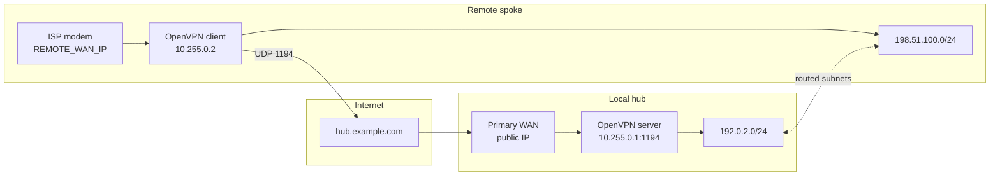
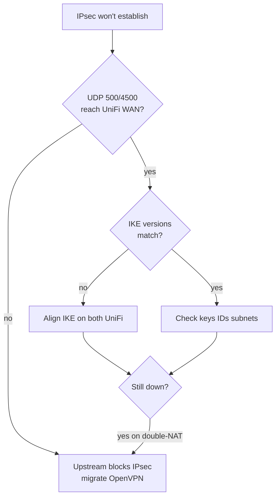
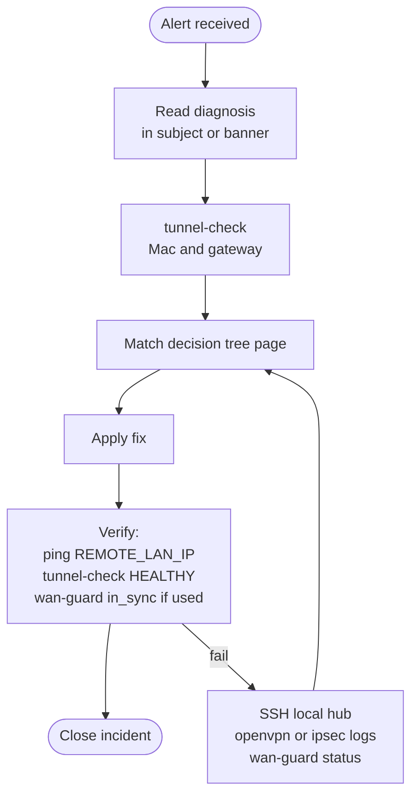
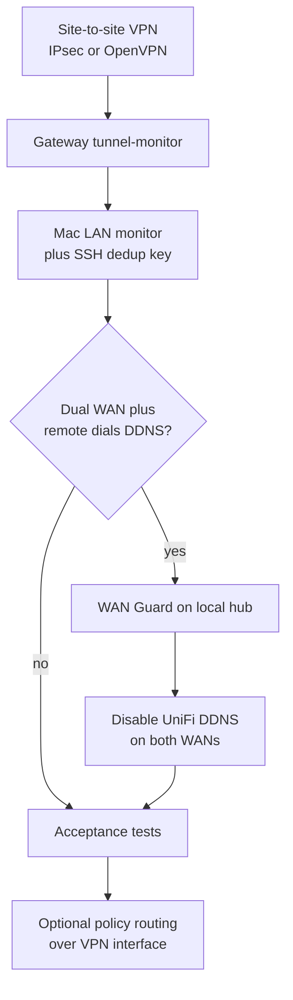
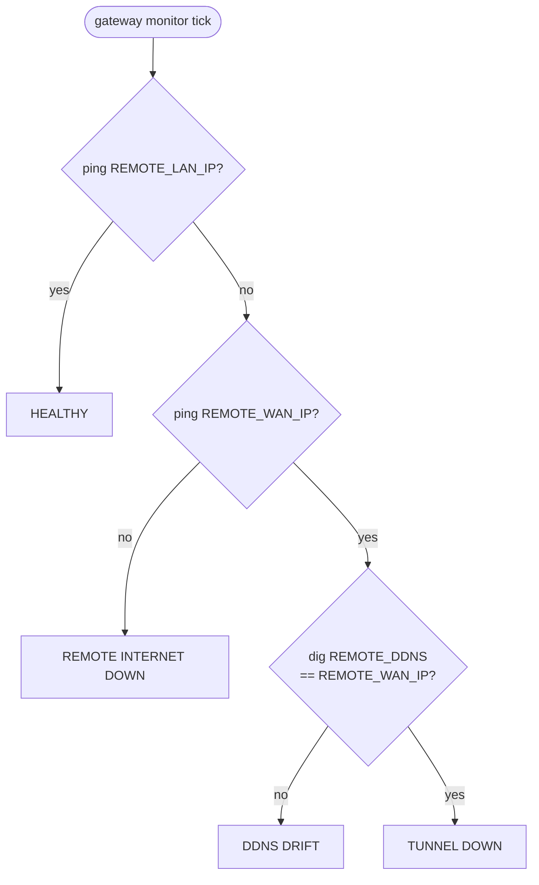

# Workflow diagrams

Mermaid diagrams for monitoring, failover, and incident response. Uses **placeholder** addresses ([[Placeholders-Reference]]). Render on GitHub wiki, or paste into [mermaid.live](https://mermaid.live).

Related: [[Architecture]], [[Network-Overview]], [[Troubleshooting-Decision-Trees]], [[Troubleshooting]].

---

## 1. End-to-end monitoring architecture

---

## 2. Mac diagnosis flow (one cycle)

Same logic as [[Architecture]] §3 and `diagnose()` in `monitor.sh`.

**If/then reference:** [[Troubleshooting-Decision-Trees]].

---

## 3. Dual-WAN failover timeline

When local hub has **primary public WAN** + **backup CGNAT WAN** and remote VPN dials **hub DDNS**.

Detail: [[WAN-Guard-OpenVPN-Failover]].

---

## 4. OpenVPN site-to-site path

Generic layout after migrating off blocked IPsec.

Setup: [[OpenVPN-Site-to-Site-Migration]].

---

## 5. IPsec failure investigation

Use when IPsec never establishes — common on modems that filter UDP 500/4500.

---

## 6. Operator incident workflow

---

## 7. Component install dependency order

Recommended greenfield order ([[Implementation-Guide]]):

---

## 8. Gateway-side alert classification

Simpler tree than Mac side — no SSH dedup.

After `FAILURE_THRESHOLD` failures, email subject matches diagnosis.
