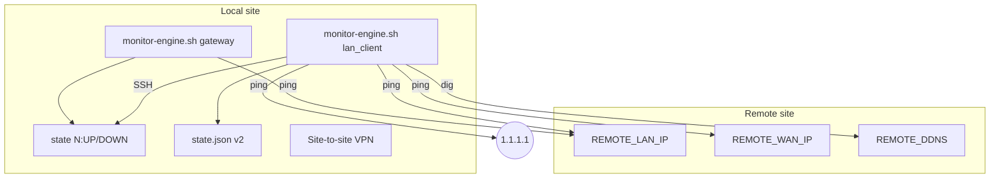
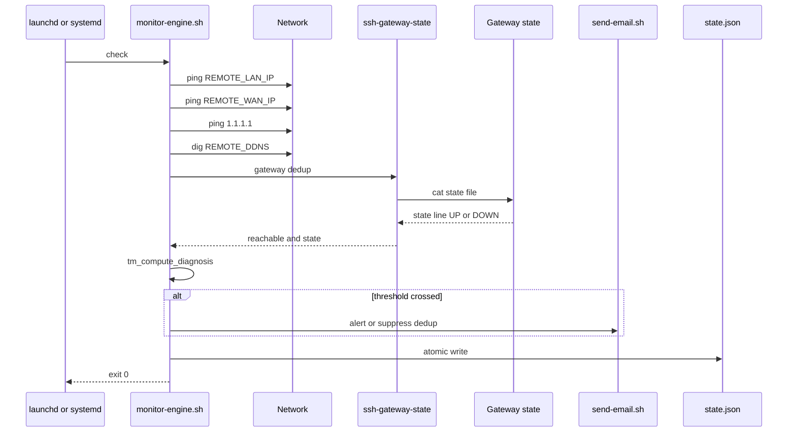
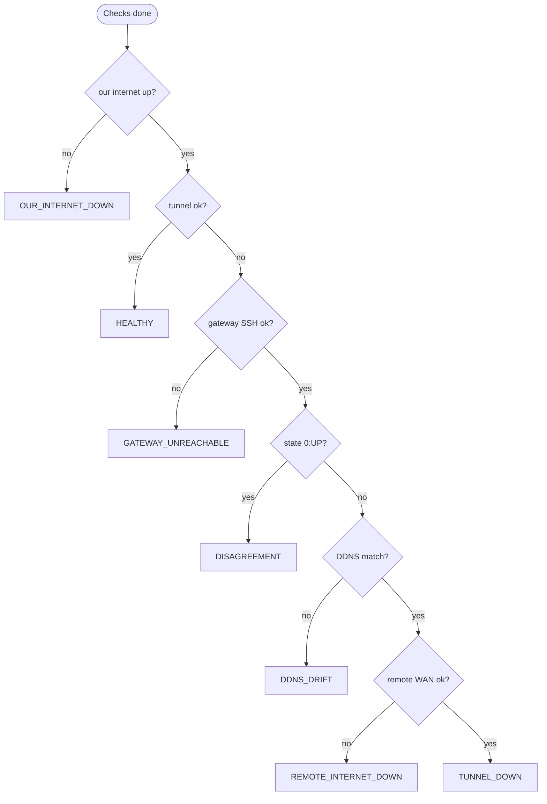

# Signal flow and architecture

Production Mermaid diagrams for v2 core **2.0.0**. Full text:
[repo doc](https://github.com/roto31/Tunnel-Monitor---Universal/blob/main/Public/docs/v2/signal-flow-and-architecture.md).

## System context

The engine does **not** call vendor VPN APIs — ICMP + DNS + optional SSH only.

## LAN client check cycle

## Diagnosis tree (LAN client)

First match wins — see [Diagnoses and Alerts](Diagnoses-and-Alerts).

## Email dedup

Suppress SMTP when gateway reachable, gateway state DOWN, and diagnosis is not `GATEWAY_UNREACHABLE` or `DISAGREEMENT`. Banner still fires.

## UI path

SwiftBar / Tunnel Monitor.app **read** `state.json` only — never ping.

## Optional modules (outside core)

- **WAN Guard** — hub dual-WAN DDNS ([WAN Guard](WAN-Guard))
- **OpenVPN recover** — UniFi only

See [Architecture](Architecture) for stack overview.
