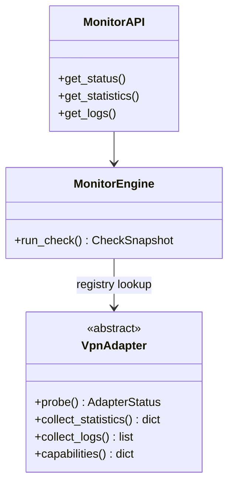

# Plugin / adapter architecture

## VpnAdapter contract

All VPN-specific logic lives in `src/uvpn/adapters/`. The core engine never branches on vendor names.

```python
class VpnAdapter(ABC):
    adapter_id: str
    vpn_type: str

    def probe(self, config: dict) -> AdapterStatus: ...
    def collect_statistics(self, config, status) -> dict: ...
    def collect_logs(self, config, limit=50) -> list[str]: ...
    def capabilities(self) -> dict[str, bool]: ...
```

**Rule:** `probe()` must not raise. Return `supported=False` when CLI/tools are missing.

## Registration

```python
# src/uvpn/adapters/registry.py
ADAPTERS["my_vendor"] = MyVendorAdapter
```

Config key: `"vpn_type": "my_vendor"`.

## Adding a new adapter (checklist)

1. Subclass `VpnAdapter` in `src/uvpn/adapters/<name>.py`.
2. Cite vendor CLI/API in `docs/architecture/research-vpn-platforms.md`.
3. Add setup guide in `docs/vpn-solutions/<name>.md`.
4. Register in `registry.py`.
5. Add wiki page under VPN Solutions.
6. Document version matrix entry if CLI is version-pinned.

## Capability matrix (v1.0)

| vpn_type | Status | Statistics | Logs | Source |
|----------|--------|------------|------|--------|
| generic | reachability | probes only | — | — |
| openvpn | mgmt `state` | mgmt `status` | log file | [OpenVPN mgmt](https://openvpn.net/community-docs/management-interface.html) |
| wireguard | `wg show dump` | peer rx/tx | — | [wg(8)](https://manpages.debian.org/bookworm/wireguard-tools/wg.8.en.html) |
| ipsec/ikev2 | `swanctl --list-sas` | same | journalctl | [strongSwan](https://docs.strongswan.org/docs/latest/swanctl/swanctl.html) |
| cisco_anyconnect | `vpn state` | `vpn stats` | — | [Cisco admin guide](https://www.cisco.com/c/en/us/td/docs/security/vpn_client/anyconnect/Cisco-Secure-Client-5/admin/guide/b-cisco-secure-client-admin-guide-5-0/customize-localize-anyconnect.html) |
| fortinet | production CLI parser | version-pinned | — | [FortiClient docs](https://docs.fortinet.com/product/forticlient) + [matrix](adapter-version-matrix.md) |
| globalprotect | `gpctl` parser | version-pinned | — | [PAN GlobalProtect](https://docs.paloaltonetworks.com/globalprotect) + fixtures |
| pulse | `pulselauncher status` | CLI contract | — | [pulse-cli-contract.md](pulse-cli-contract.md) |

## Diagram



See [system-design.md](system-design.md) for full architecture diagrams.
