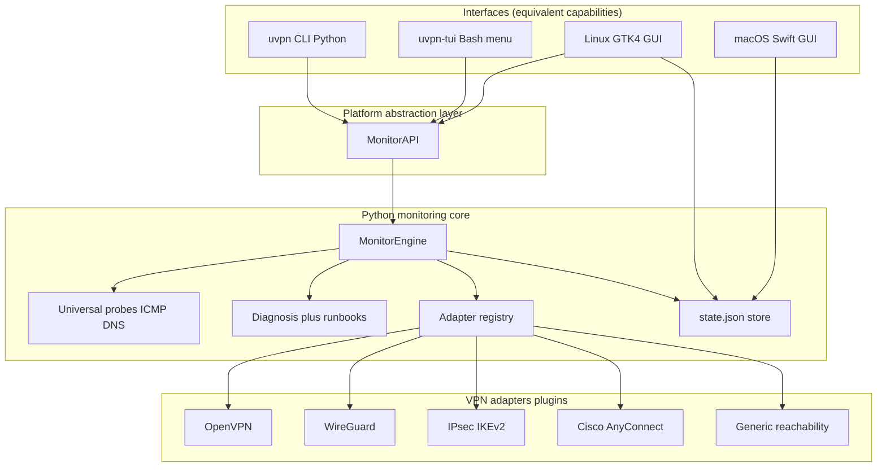
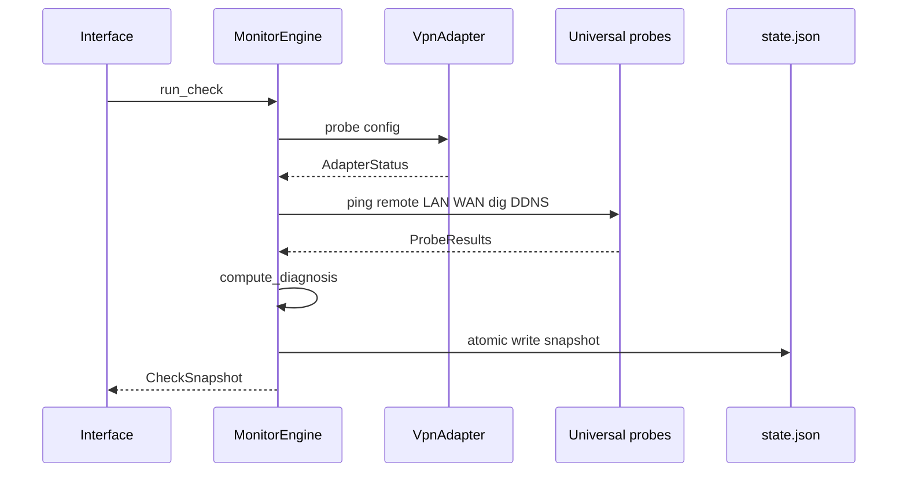
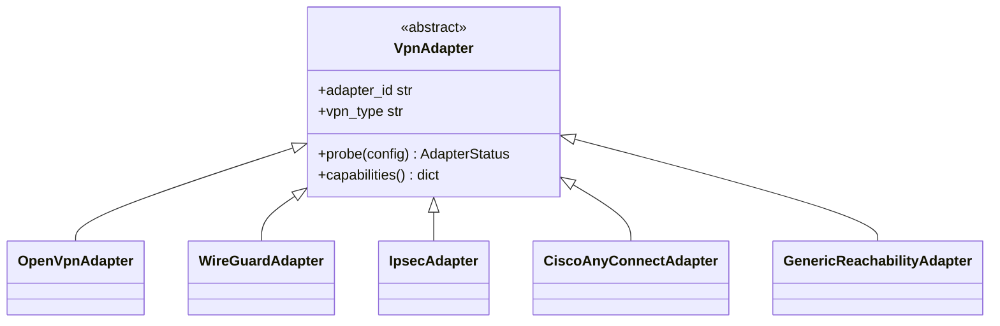
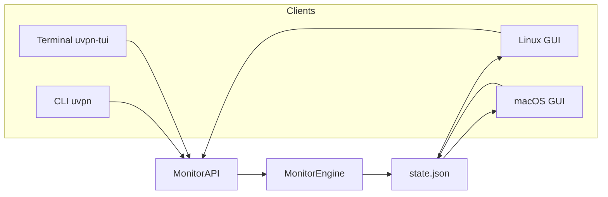
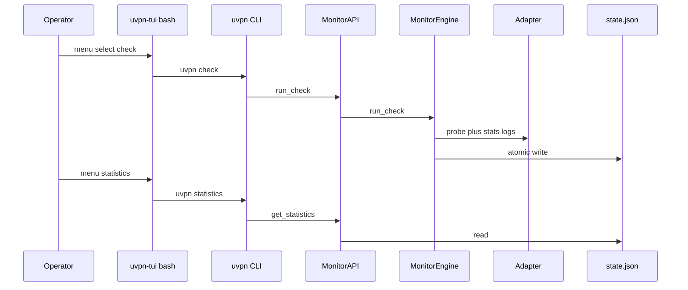
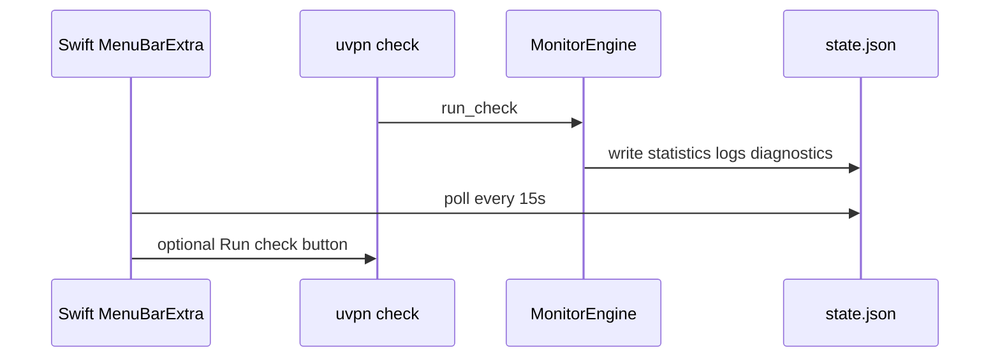
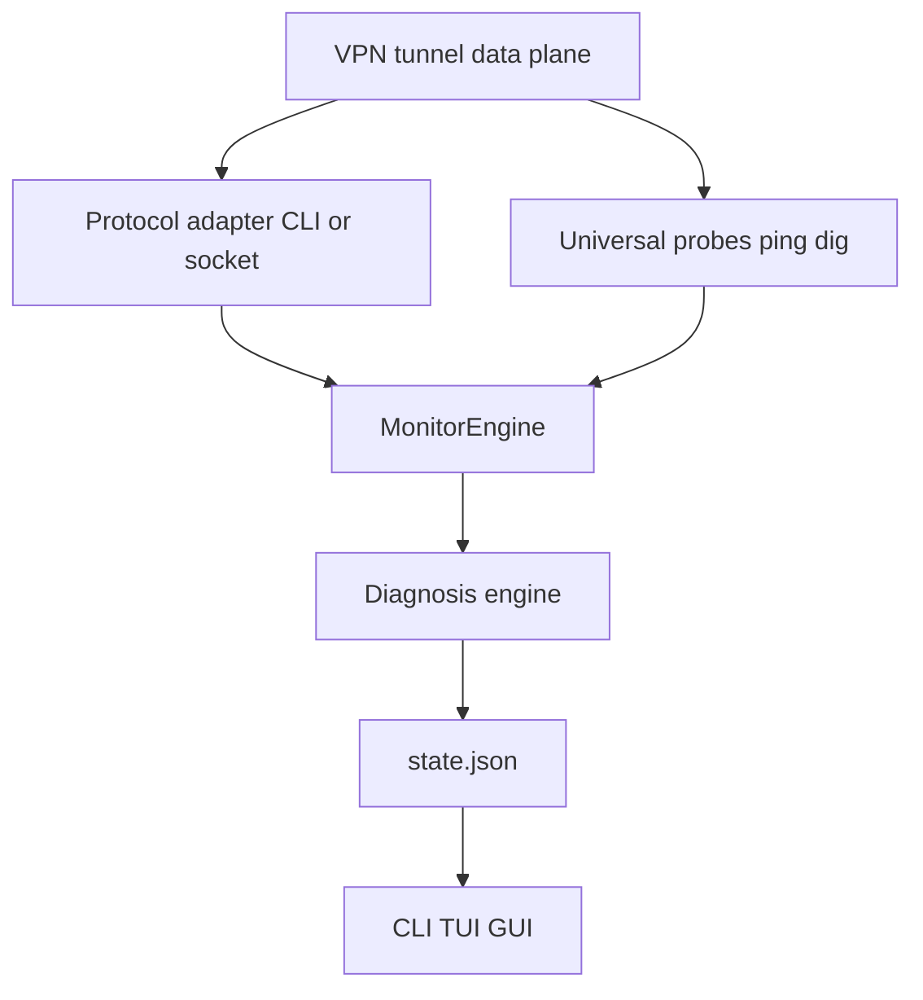

# Universal VPN Monitor — architecture

Product codename: **uvpn**. Python backend; shell CLI/TUI; native GUIs on Linux (GTK4) and macOS (Swift).

---

## 1. Layered architecture



**Rule:** GUIs never implement probes. macOS GUI reads the same `~/.config/uvpn/state.json` written by `MonitorEngine` (or invokes `uvpn check` via helper).

---

## 2. Check cycle data flow



---

## 3. Adapter plugin pattern



Register in `uvpn/adapters/registry.py`:

```python
ADAPTERS["my_vendor"] = MyVendorAdapter
```

Each adapter returns `AdapterStatus` without raising — the engine always completes a cycle.

---

## 4. Universal vs protocol-specific metrics

| Layer | Always runs | Purpose |
|-------|-------------|---------|
| **Universal probes** | Yes | End-to-end P2P health independent of vendor |
| **Adapter probe** | Per `vpn_type` | Daemon/session state (OpenVPN mgmt, `wg show`, etc.) |
| **Diagnosis** | Yes | Combines both layers |

This matches operational reality: [RFC 4271 BGP-style reachability](https://www.rfc-editor.org/rfc/rfc4271) thinking applies — **data plane** (ping) and **control plane** (VPN daemon) can diverge.

---

## 5. System requirements

### Linux (server or desktop)

| Requirement | Version |
|-------------|---------|
| Python | 3.11+ |
| ping, dig | iputils, bind-utils |
| Optional GUI | GTK 4, PyGObject 3.42+ (Ubuntu 22.04+, Fedora 38+, Debian 12+) |
| WireGuard adapter | `wireguard-tools` |
| IPsec adapter | `strongswan-swanctl` or `strongswan-starter` |
| OpenVPN adapter | OpenVPN with `--management` enabled |
| Cisco adapter | Cisco Secure Client installed |

### macOS (desktop client)

| Requirement | Version |
|-------------|---------|
| Python | 3.11+ (system or Homebrew) |
| macOS | 14+ (GUI); 26+ for Liquid Glass styling |
| Cisco adapter | Secure Client / AnyConnect binary |

---

## 6. Repository layout

```
src/
  uvpn/                 Python package (core, adapters, api, cli module)
  cli/uvpn              Shell CLI wrapper
  terminal-app/uvpn-tui Universal terminal application
  gui-linux/            GTK4 + tkinter fallback
  gui-macos/            Swift menu bar app
docs/
  architecture/         System design, research, PAL, plugins
  platform-linux/       Linux install, CLI, TUI, GUI
  platform-macos/       macOS install, CLI, TUI, GUI
  vpn-solutions/        Per-VPN configuration guides
legacy/                 Archived bash monitor
wiki/                   GitHub wiki source pointer
```

See also [platform-abstraction.md](platform-abstraction.md) and [plugin-adapters.md](plugin-adapters.md).

---

## 8. Interface architecture

All four interfaces expose **status, statistics, logs, diagnostics**:



| Capability | CLI | TUI | Linux GUI | macOS GUI |
|------------|-----|-----|-----------|-----------|
| Connection status | `status` | menu 2 | Status tab | menu bar title |
| Statistics | `statistics` | menu 3 | Statistics tab | Statistics disclosure |
| Logs | `logs` | menu 4 | Logs tab | Logs disclosure |
| Diagnostics | `diagnostics` | menu 5 | Diagnostics tab | Steps disclosure |
| Run check | `check` | menu 1 | Run check btn | Run check btn |

---

## 9. Platform-specific data flow

### Linux



GTK path: `launch_gui.py` → `MonitorAPI.full_view()` directly (no duplicate probes).

### macOS



Liquid Glass styling: `glassEffect` on macOS 26+ with material fallback on macOS 14–25.

---

## 10. VPN monitoring signal flow



---

## 11. Extensibility roadmap

| Phase | Deliverable |
|-------|-------------|
| v0.1 | Core engine, 4 adapters, CLI/TUI, GTK scaffold, Swift reader |
| v0.2 | MonitorAPI, statistics/logs, Forti/GP/Pulse heuristics, tkinter fallback, Liquid Glass |
| v0.3 | Harden enterprise adapters per validated CLI versions |
| v1.0 | Signed packages, systemd/launchd scheduling |

Each new adapter requires **cited** vendor CLI/API documentation in `docs/research/`.
