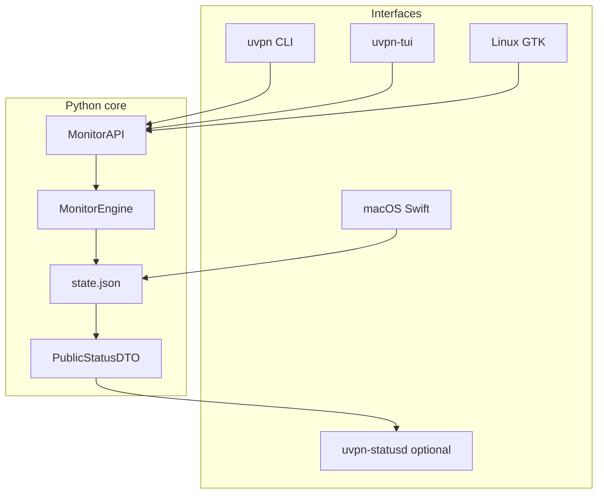
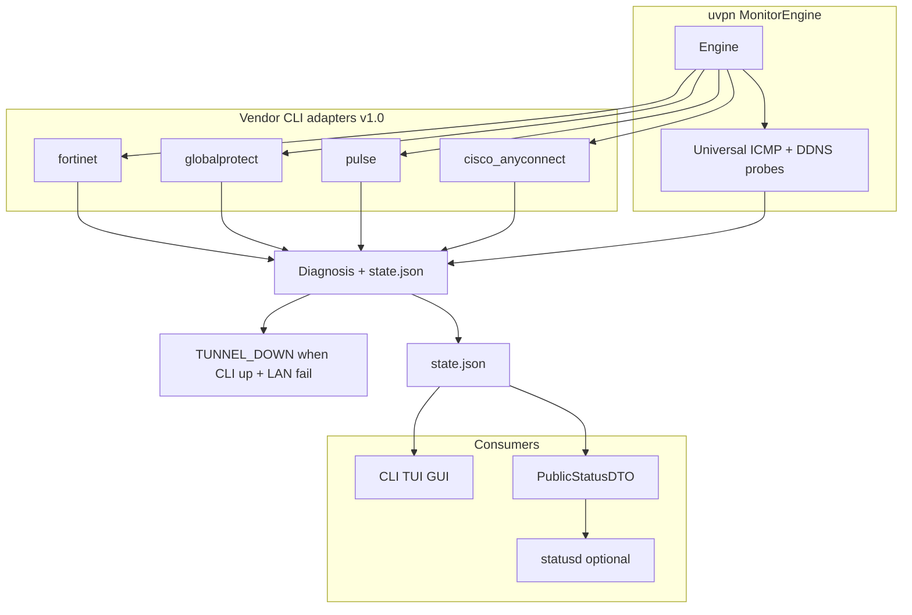
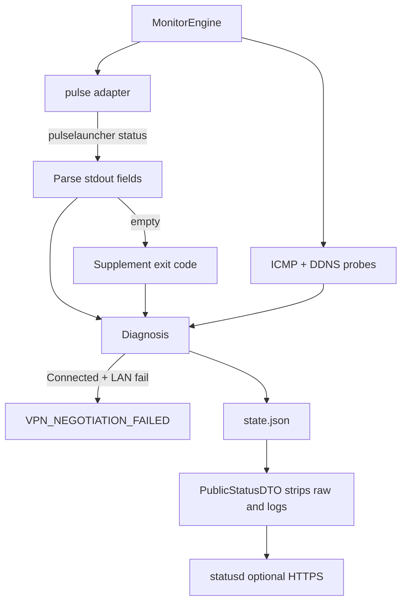
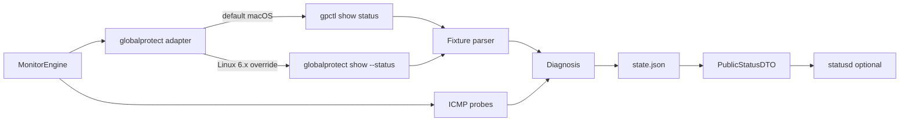
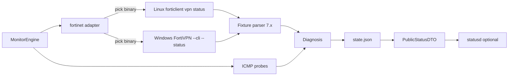

# VPN platform diagrams (uvpn)

Mermaid diagrams and visual assets for vendor guides under [../vpn-solutions/](../vpn-solutions/). Wiki mirror: regenerate with `python3 scripts/sync-wiki-vpn-guides.py` and edit this file for index pages.

**Visual assets (PNG + SVG):** [../vpn-solutions/assets/](../vpn-solutions/assets/README.md)

---

## System interfaces (v1.1)

Full design: [system-design.md](system-design.md) · Security: [../security/nist-portal-architecture.md](../security/nist-portal-architecture.md)

---

## Diagram types (every platform guide)

| Diagram | Purpose |
|---------|---------|
| Visual reference | Static PNG topology (repo `assets/`) |
| Product architecture | Vendor admin / user guide topology |
| Connection lifecycle | Vendor session states + exit codes where applicable |
| uvpn monitoring flow | Adapter CLI + probes + diagnosis + state.json + optional statusd |

---

## Platform index

| Platform | Guide | Visual |
|----------|-------|--------|
| OpenVPN | [openvpn.md](../vpn-solutions/openvpn.md) | `openvpn-architecture.png` |
| WireGuard | [wireguard.md](../vpn-solutions/wireguard.md) | `wireguard-architecture.png` |
| IPsec/IKEv2 | [ipsec-ikev2.md](../vpn-solutions/ipsec-ikev2.md) | `ipsec-architecture.png` |
| Cisco Secure Client | [cisco-anyconnect.md](../vpn-solutions/cisco-anyconnect.md) | `cisco-architecture.png` |
| FortiClient | [fortinet-forticlient.md](../vpn-solutions/fortinet-forticlient.md) | `fortinet-architecture.png` |
| GlobalProtect | [palo-alto-globalprotect.md](../vpn-solutions/palo-alto-globalprotect.md) | `globalprotect-architecture.png` |
| Pulse/Ivanti | [pulse-ivanti.md](../vpn-solutions/pulse-ivanti.md) | `pulse-architecture.png` |

---

## Enterprise comparison

---

## Pulse — monitoring flow (example)

---

## GlobalProtect — dual CLI path

---

## FortiClient — platform CLI selection

