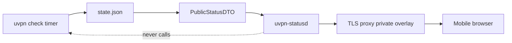

# Status portal (optional, private overlay)

Read-only **uvpn-statusd** for mobile or admin browsers on LAN/Tailscale. **Disabled by default** — requires `pip install -e ".[portal]"`.

Security architecture: [NIST portal architecture](../security/nist-portal-architecture.md)  
Threat model: [threat model](../security/threat-model.md) · Audit: [verification](../security/verification.md) · CTM: [ctm-portal.csv](../security/ctm-portal.csv)



---

## Quick start (development)

```bash
pip install -e ".[portal,dev]"
python3 -c "import secrets; print(secrets.token_urlsafe(32))" > ~/.config/uvpn/status-token
chmod 0600 ~/.config/uvpn/status-token
export UVPN_STATUS_TOKEN_FILE=~/.config/uvpn/status-token
export UVPN_STATUS_BIND=127.0.0.1:8080
uvpn check   # populate state.json first
uvpn-statusd
```

```bash
curl -sS -H "Authorization: Bearer $(cat ~/.config/uvpn/status-token)" \
  http://127.0.0.1:8080/api/v1/status | jq .
```

---

## Production (Linux)

1. Install monitor timer: [scheduling.md](scheduling.md)
2. `sudo bash src/deploy/linux/install-statusd.sh`
3. `sudo systemctl enable --now uvpn-statusd`
4. TLS: [Caddyfile.example](../../src/deploy/statusd/Caddyfile.example)
5. Firewall: [nftables example](../../src/deploy/statusd/nftables-uvpn-statusd.nft.example)
6. Hardening: [host-hardening-linux.md](../security/host-hardening-linux.md)

macOS: [host-hardening-macos.md](../security/host-hardening-macos.md)

---

## Environment

| Variable | Default | Description |
|----------|---------|-------------|
| `UVPN_STATUS_BIND` | `127.0.0.1:8080` | Listen address (use Tailscale IP in prod behind proxy) |
| `UVPN_STATUS_TOKEN_FILE` | — | Bearer secret (`0600`) |
| `UVPN_STATUS_TOKEN` | — | Inline token (avoid in prod) |
| `UVPN_STATUS_MASK_IPS` | `0` | `1` to mask IPs in JSON/HTML |

---

## Verification

See [verification.md](../security/verification.md) and [ctm-portal.csv](../security/ctm-portal.csv).
