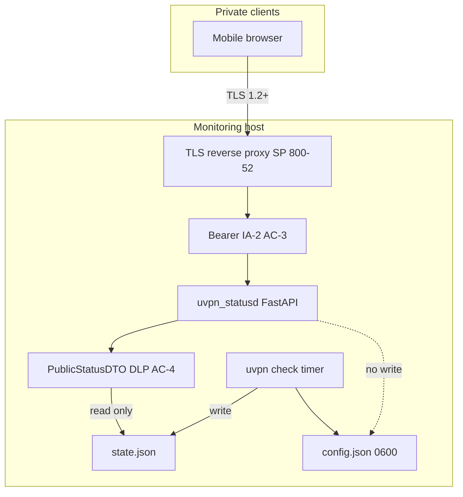

# NIST-aligned status portal architecture (uvpn-statusd)

**Component:** Optional FastAPI read-only portal (`uvpn-statusd`) on the same host as `uvpn check`.  
**Reachability:** Private overlay only (LAN, Tailscale, site VPN)—not internet-facing.  
**Baseline:** Organizational mapping to **NIST SP 800-53 Rev 5 Moderate**; outcomes described with **NIST CSF 2.0** (NIST CSWP 29); TLS per **NIST SP 800-52 Rev 2**.

**Fact:** CSF and SP 800-52 are guidelines unless your System Security Plan (SSP) adopts specific controls as mandatory.

---

## Logical architecture

**Separation:** `run_check()` runs only via CLI/systemd timer. The portal never writes `config.json` or invokes `MonitorEngine.run_check()` remotely.

---

## NIST CSF 2.0 mapping

| Function | Categories | Implementation |
|----------|------------|----------------|
| Govern | GV.OC, GV.PO | `docs/security/`; portal opt-in; semver + CI |
| Identify | ID.AM, ID.RA | Asset list: host, `state.json`, TLS cert |
| Protect | PR.AA, PR.DS | Bearer auth, TLS (800-52), redaction, firewall |
| Detect | DE.CM | JSON audit logs; auth failure monitoring |
| Respond | RS.MA | Revoke token; `systemctl stop uvpn-statusd` |
| Recover | RC.RP | Redeploy unit + rotate secrets; no portal DB |

---

## NIST SP 800-53 Rev 5 Moderate (selected)

| Family | Control | Portal implementation |
|--------|---------|------------------------|
| AC | AC-3, AC-4, AC-6, AC-17 | Bearer auth; `PublicStatusDTO`; unprivileged user; overlay bind |
| AU | AU-2, AU-3, AU-8, AU-12 | Structured audit middleware; NTP on host |
| IA | IA-2, IA-5 | Token file `0600`; rotation in [verification.md](verification.md) |
| SC | SC-7, SC-8, SC-13, SC-28 | Firewall; TLS at proxy; secrets at rest permissions |
| SI | SI-2, SI-10 | `pip-audit`/bandit CI; Pydantic; 405 mutations |
| CM | CM-6 | Hardened [uvpn-statusd.service](../../src/deploy/linux/uvpn-statusd.service) |
| RA | RA-5 | CI vulnerability scan on `[portal]` extra |

Full traceability: [ctm-portal.csv](ctm-portal.csv).

---

## NIST SP 800-52 Rev 2 (TLS)

| Topic | SP 800-52 Rev 2 | Deployment |
|-------|-----------------|------------|
| Protocol | **Sec. 3.1** — TLS 1.2+; disallow 1.0/1.1 | **Mandatory** if 800-52 adopted; prefer TLS 1.3 |
| Ciphers | **Sec. 3.2** — approved AEAD suites | [Caddyfile.example](../../src/deploy/statusd/Caddyfile.example) |
| Certificates | **Sec. 4** — protect keys, validate chain | Internal CA or Tailscale; rotate before expiry |
| App data | **Sec. 5** — minimize sensitive payloads | Redaction layer |

Terminate TLS at **Caddy/nginx** in production; uvicorn may use HTTP on loopback behind the proxy.

---

## API surface (v1)

| Endpoint | Auth | Data |
|----------|------|------|
| `GET /health` | None | Liveness only |
| `GET /api/v1/status` | Bearer | Sanitized status |
| `GET /api/v1/diagnostics` | Bearer | Diagnosis + redacted steps |
| `GET /` | Bearer | Minimal HTML status page |

**Forbidden:** `POST /check`, config CRUD, full log download.

---

## Environment variables

| Variable | Purpose |
|----------|---------|
| `UVPN_CONFIG_DIR` | Same as monitor (`/etc/uvpn` or `~/.config/uvpn`) |
| `UVPN_STATUS_BIND` | Host:port (default `127.0.0.1:8080`) |
| `UVPN_STATUS_TOKEN_FILE` | Bearer secret file (mode `0600`) |
| `UVPN_STATUS_MASK_IPS` | `1` to mask probe targets in responses |

---

## References

- [NIST CSF 2.0](https://www.nist.gov/cyberframework)
- [SP 800-53 Rev 5](https://csrc.nist.gov/publications/detail/sp/800-53/rev-5/final)
- [SP 800-52 Rev 2](https://csrc.nist.gov/publications/detail/sp/800-52/rev-2/final)
