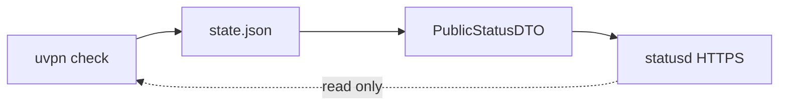

# uvpn troubleshooting index

Most VPN outages are not dramatic—they are **misleading**. The icon is green, the share does not open, and everyone argues about Wi‑Fi. These runbooks separate *what the client says* from *what actually answers*, with flowcharts you can follow at 11 p.m. without a NOC.

Dual-audience format modeled after [legacy/Public/docs/troubleshooting.md](../legacy/Public/docs/troubleshooting.md): **quick steps** for operators, **technical depth** for engineers. Tone: [brand/narrative-and-voice.md](../brand/narrative-and-voice.md).

**External sharing:** Optional [status portal](../deploy/status-portal.md) returns redacted diagnostics only—see [threat model](../security/threat-model.md).



## Universal (all `vpn_type` values)

| Document | Contents |
|----------|----------|
| [universal.md](universal.md) | Diagnosis codes, alert timing, master decision flow, GUI/CLI tools |

## Per-platform workflows

Each guide includes symptom tables, **Mermaid troubleshooting flowcharts**, adapter CLI checks, log locations, and mapping to uvpn diagnoses.

| Platform | `vpn_type` | Guide |
|----------|------------|--------|
| OpenVPN | `openvpn` | [openvpn.md](openvpn.md) |
| WireGuard | `wireguard` | [wireguard.md](wireguard.md) |
| IPsec / IKEv2 | `ipsec`, `ikev2` | [ipsec-ikev2.md](ipsec-ikev2.md) |
| Cisco Secure Client | `cisco_anyconnect` | [cisco-anyconnect.md](cisco-anyconnect.md) |
| FortiClient | `fortinet`, `forticlient` | [fortinet-forticlient.md](fortinet-forticlient.md) |
| GlobalProtect | `globalprotect`, `gp` | [palo-alto-globalprotect.md](palo-alto-globalprotect.md) |
| Pulse / Ivanti ISAC | `pulse`, `ivanti` | [pulse-ivanti.md](pulse-ivanti.md) |
| Generic reachability | `generic` | [generic.md](generic.md) |

## Product guides (install + CLI reference)

Platform setup and incorporated vendor material: [../vpn-solutions/README.md](../vpn-solutions/README.md).

## First commands (every install)

```bash
uvpn preflight
uvpn check
uvpn explain
uvpn statistics   # when implemented for your build
```

| Path | Role |
|------|------|
| `~/.config/uvpn/config.json` (Linux) | Monitor configuration |
| `/etc/uvpn/config.json` | systemd deployment |
| `~/.config/uvpn/state.json` | Last snapshot + diagnosis |

Legacy site-specific bash monitor: [Troubleshooting-Legacy-Public](Troubleshooting-Legacy-Public) (UniFi gateway SSH dedup, WAN Guard — **not** part of uvpn core).
