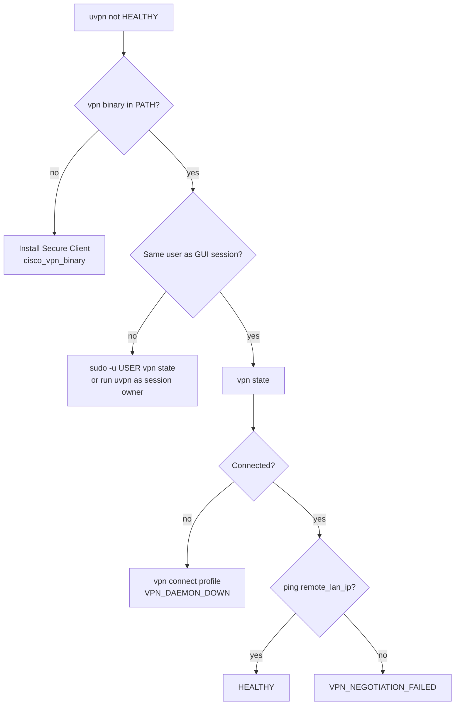
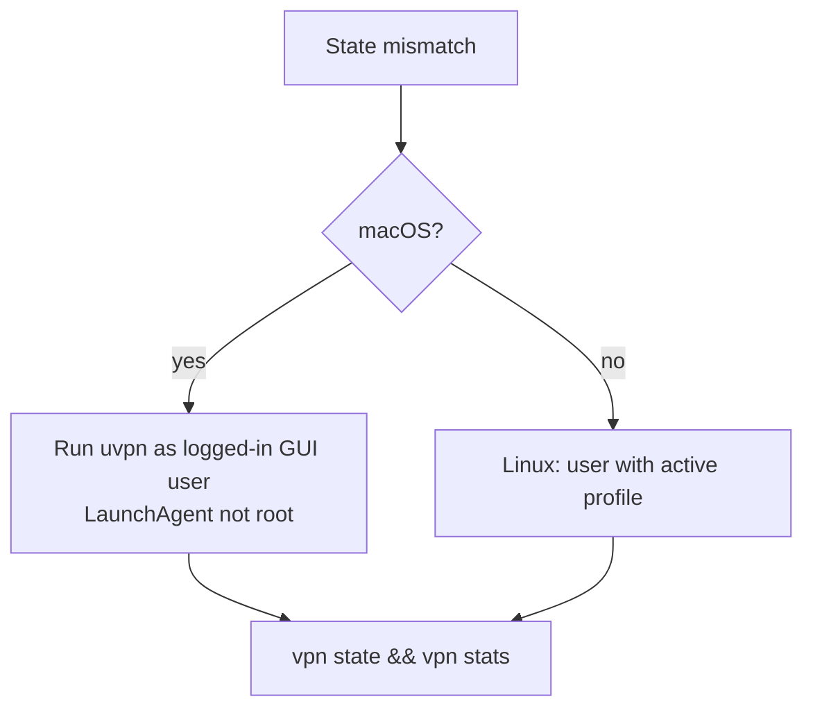
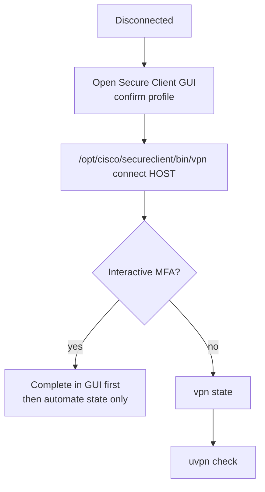
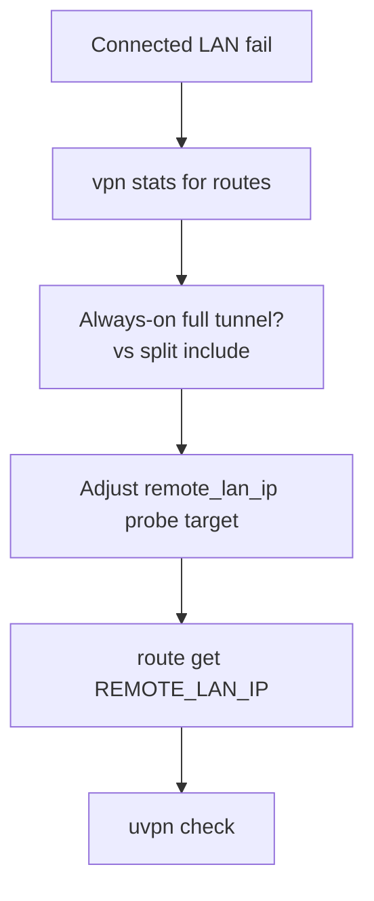

# Troubleshooting — Cisco Secure Client

**vpn_type:** `cisco_anyconnect`  
**Product guide:** [cisco-anyconnect.md](../vpn-solutions/cisco-anyconnect.md)

---

## Quick symptom table

| Symptom | Likely cause | uvpn diagnosis |
|---------|--------------|----------------|
| `vpn` not found | Secure Client not installed | `UNSUPPORTED` |
| State disconnected | No profile session | `VPN_DAEMON_DOWN` |
| Connected + LAN fail | Split routing / wrong user context | `VPN_NEGOTIATION_FAILED` |
| GUI connected, CLI disconnected | Wrong OS user / keychain | `VPN_DAEMON_DOWN` |
| Headend down | Remote WAN | `REMOTE_INTERNET_DOWN` |

**Scope:** Endpoint SSL VPN only — not ASA site-to-site on appliance.

---

## Master troubleshooting flow

---

## User context flow

---

## VPN_DAEMON_DOWN branch

Windows: `vpncli.exe` from `C:\Program Files (x86)\Cisco\Cisco Secure Client\`.

---

## VPN_NEGOTIATION_FAILED branch

---

## Logs

Secure Client logs via GUI / DART — not via `vpn state`. uvpn does not collect DART automatically.

---

## Related

- [universal.md](universal.md)
