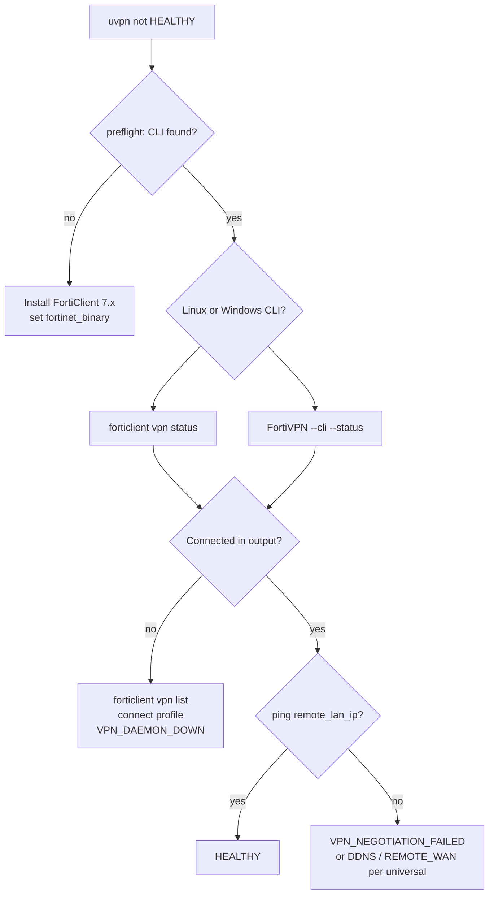
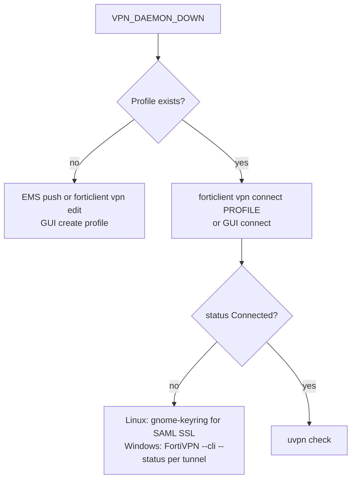
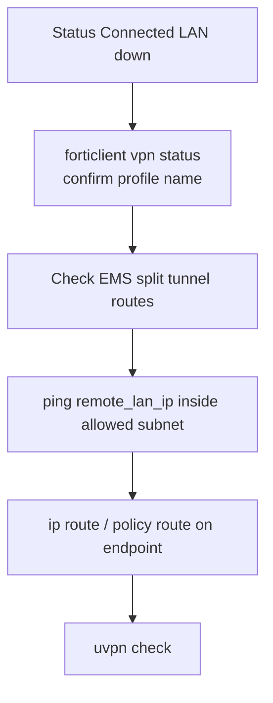
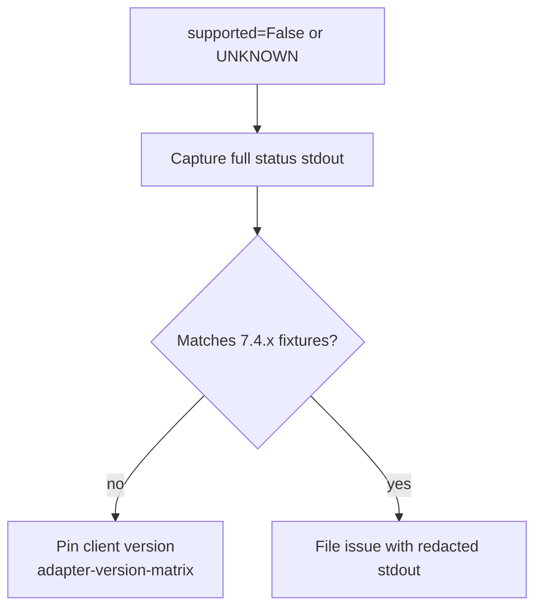

# Troubleshooting — FortiClient

**vpn_type:** `fortinet`, `forticlient`  
**Product guide:** [fortinet-forticlient.md](../vpn-solutions/fortinet-forticlient.md)

---

## Quick symptom table

| Symptom | Likely cause | uvpn diagnosis |
|---------|--------------|----------------|
| `forticlient` / `FortiVPN` missing | Not installed | `UNSUPPORTED` |
| `VPN Status: Disconnected` | No tunnel | `VPN_DAEMON_DOWN` |
| `Connecting` stuck | Auth / gateway | `VPN_DAEMON_DOWN` |
| Connected + LAN fail | Split tunnel EMS policy | `VPN_NEGOTIATION_FAILED` |
| Empty status | No profile / wrong version | `UNSUPPORTED` |
| Ubuntu SSL VPN 0 bytes | Known 7.x issue — see Fortinet release notes | probe may fail |

---

## Master troubleshooting flow



---

## VPN_DAEMON_DOWN branch



### Commands

```bash
forticlient vpn list
forticlient vpn status
forticlient vpn connect corporate-vpn
# Windows
"/c/Program Files/Fortinet/FortiClient/FortiVPN.exe" --cli --status
uvpn preflight
```

---

## VPN_NEGOTIATION_FAILED branch



EMS may push **split tunnel** — `remote_lan_ip` must be an address reachable when tunnel is “up”.

---

## Parser / version issues



Fixtures: `tests/fixtures/adapters/fortinet/`.

---

## Logs

| Source | Command |
|--------|---------|
| Linux GUI | FortiClient diagnostic bundle |
| EMS | Centralized logging if enrolled |
| uvpn | `jq '.adapter' ~/.config/uvpn/state.json` |

FortiESNAC `--details` is **EMS registration**, not VPN status — do not use for tunnel diagnosis.

---

## Related

- [universal.md](universal.md)  
- [adapter-version-matrix.md](../architecture/adapter-version-matrix.md)
