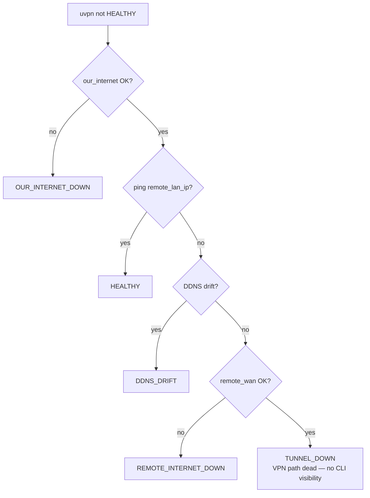
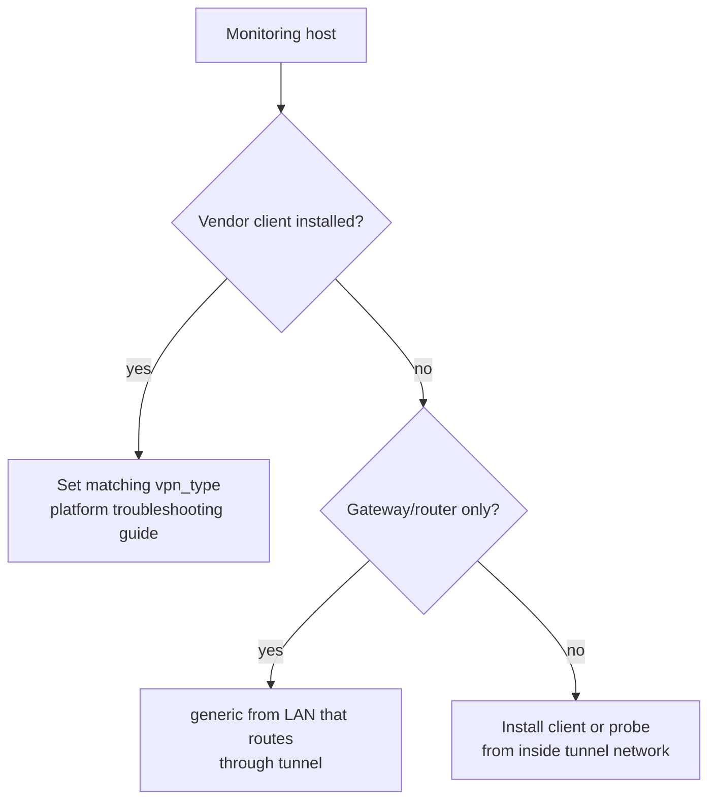

# Troubleshooting — Generic reachability

**vpn_type:** `generic`  
Use when **no vendor CLI** is installed or you only need ICMP/DDNS probes.

---

## Quick symptom table

| Symptom | Likely cause | uvpn diagnosis |
|---------|--------------|----------------|
| Always TUNNEL_DOWN | Wrong `remote_lan_ip` or ICMP blocked | `TUNNEL_DOWN` |
| WAN fail | Remote site offline | `REMOTE_INTERNET_DOWN` |
| DDNS mismatch | DNS drift | `DDNS_DRIFT` |
| Local internet down | ISP | `OUR_INTERNET_DOWN` |

No `VPN_DAEMON_DOWN` / `VPN_NEGOTIATION_FAILED` from adapter — adapter does not inspect a VPN client.

---

## Master troubleshooting flow



---

## When to leave generic vs adopt an adapter



Examples: cloud VPN gateway without local client; monitoring from a host on a routed VLAN.

---

## TUNNEL_DOWN branch

### Beginner

1. Confirm VPN is actually up by independent means (portal, router UI, peer admin).
2. Pick a ping target that should answer inside the remote LAN.
3. Update `remote_lan_ip`.

### Advanced

```bash
ping -c 3 REMOTE_LAN_IP
ping -c 3 REMOTE_WAN_IP
dig +short REMOTE_DDNS @1.1.1.1
traceroute REMOTE_LAN_IP
```

ICMP blocked on target still yields TUNNEL_DOWN — use a different probe host or adopt vendor adapter for control-plane state.

---

## Migrating to a specific adapter

When you install FortiClient, GlobalProtect, OpenVPN, etc., change `vpn_type` and follow that platform’s [troubleshooting guide](README.md).

---

## Related

- [universal.md](universal.md)
