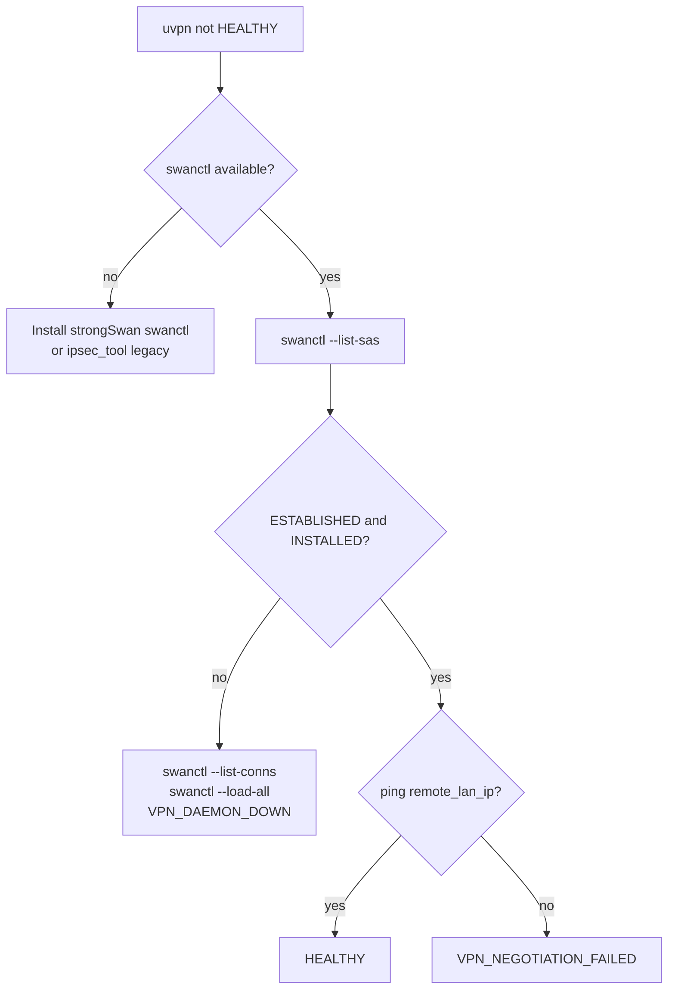
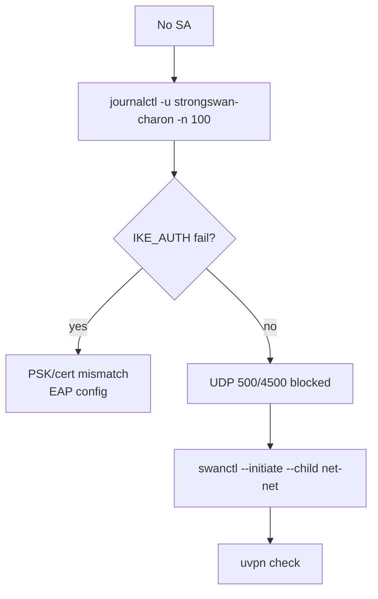
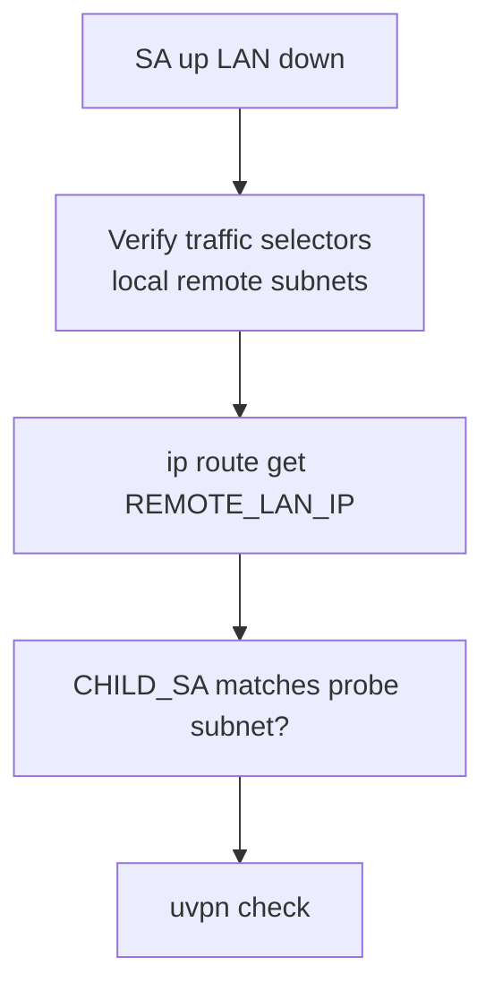
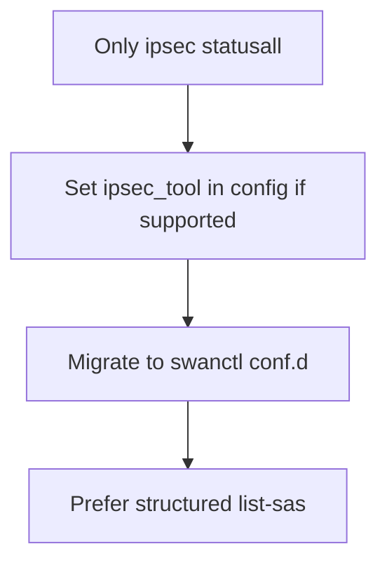

# Troubleshooting — IPsec / IKEv2 (strongSwan)

**vpn_type:** `ipsec`, `ikev2`  
**Product guide:** [ipsec-ikev2.md](../vpn-solutions/ipsec-ikev2.md)

---

## Quick symptom table

| Symptom | Likely cause | uvpn diagnosis |
|---------|--------------|----------------|
| `swanctl` missing | Package not installed | `UNSUPPORTED` |
| No ESTABLISHED/INSTALLED | SA down | `VPN_DAEMON_DOWN` |
| CHILD up, LAN fail | Selector / routing | `VPN_NEGOTIATION_FAILED` |
| charon not running | Daemon stopped | `VPN_DAEMON_DOWN` |
| Legacy only ipsec.conf | Parser weak | prefer swanctl |

---

## Master troubleshooting flow



---

## IKE / CHILD branch



```bash
swanctl --list-sas
swanctl --list-conns
sudo swanctl --load-all
```

---

## VPN_NEGOTIATION_FAILED branch



IKE_SA without matching CHILD_SA → uvpn treats as down.

---

## Legacy starter



---

## Related

- [universal.md](universal.md)
