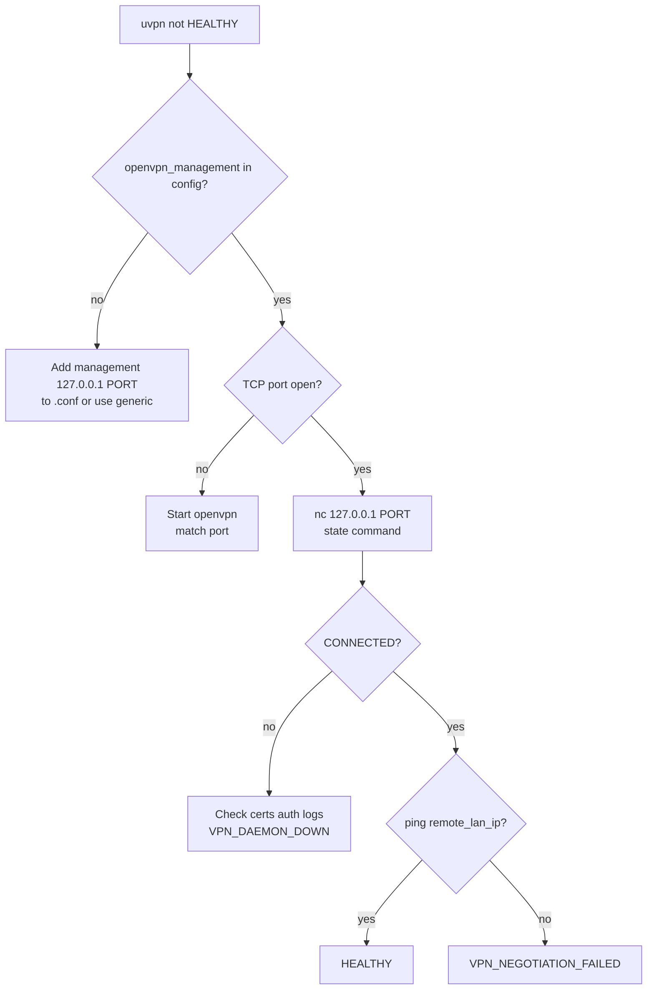
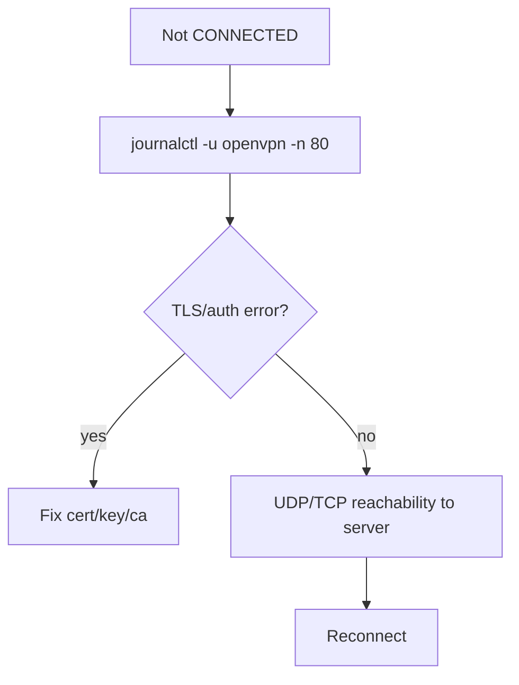
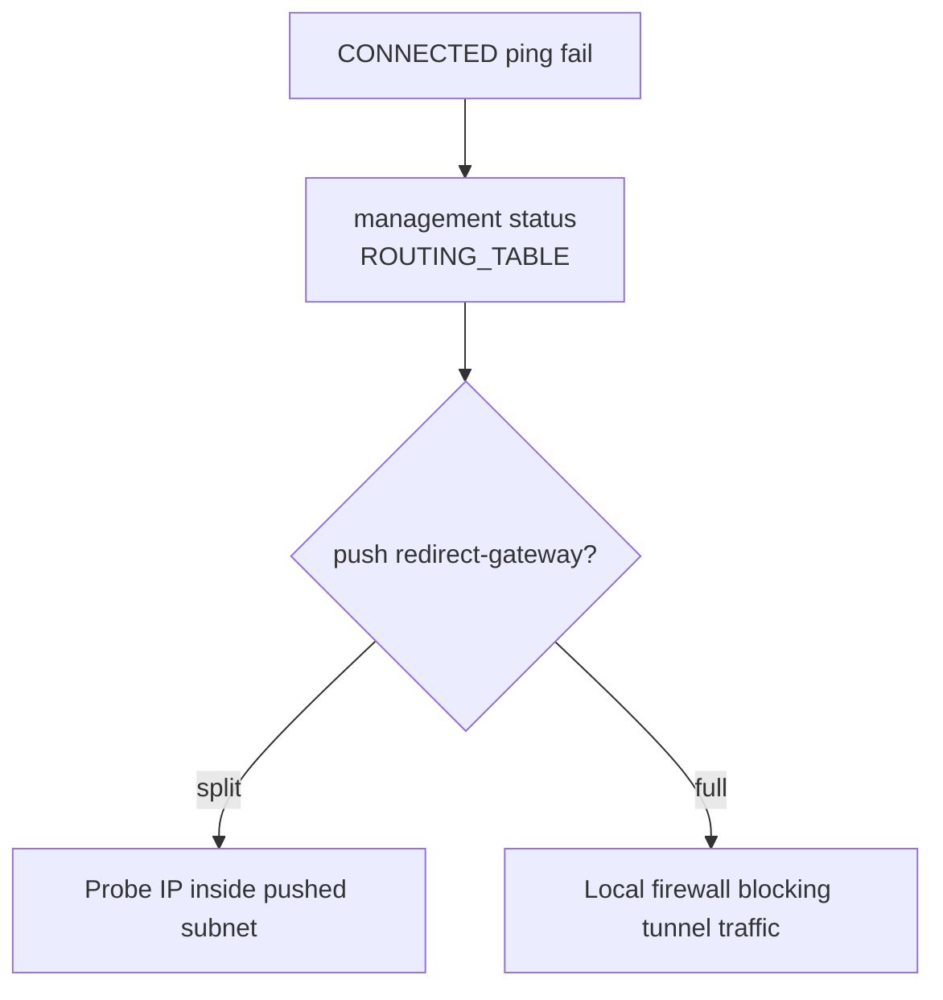

# Troubleshooting — OpenVPN

**vpn_type:** `openvpn`  
**Product guide:** [openvpn.md](../vpn-solutions/openvpn.md)

---

## Quick symptom table

| Symptom | Likely cause | uvpn diagnosis |
|---------|--------------|----------------|
| Management connection refused | `management` not enabled | `UNSUPPORTED` / weak probe |
| State not CONNECTED | Tunnel down | `VPN_DAEMON_DOWN` |
| CONNECTED + LAN fail | Routes / redirect-gateway | `VPN_NEGOTIATION_FAILED` |
| RECONNECTING loop | Link flap | yellow until threshold |
| Process up, no mgmt | Wrong port in config | `UNSUPPORTED` |

---

## Master troubleshooting flow



---

## Management interface branch

```mermaid
flowchart TD
    A[Mgmt fails] --> B[grep management openvpn.conf]
    B --> C[systemctl status openvpn@client]
    C --> D{--management-hold?}
    D -- yes --> E[echo hold release | nc ...]
    D -- no --> F[Read greeting + help]
    F --> G[state / status]
```

```bash
nc 127.0.0.1 7505
# or
openvpn_management in config.json → host:port
uvpn preflight
```

---

## VPN_DAEMON_DOWN branch



Look for `AUTH`, `TLS Error`, `Inactivity timeout`.

---

## VPN_NEGOTIATION_FAILED branch



---

## Without management socket

Use `"vpn_type": "generic"` for ICMP-only, or enable management for production `openvpn` adapter.

---

## Related

- [universal.md](universal.md)
