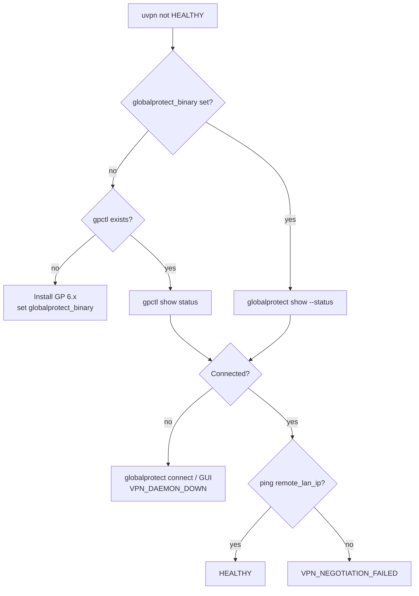
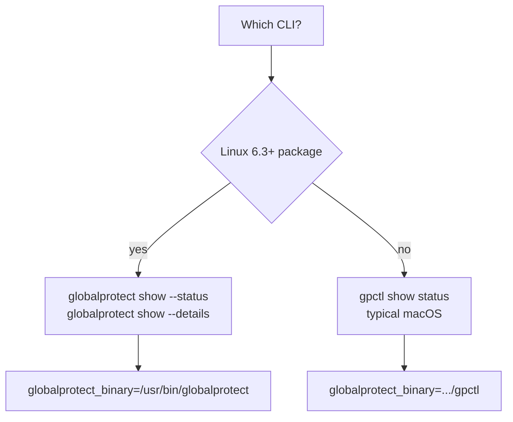
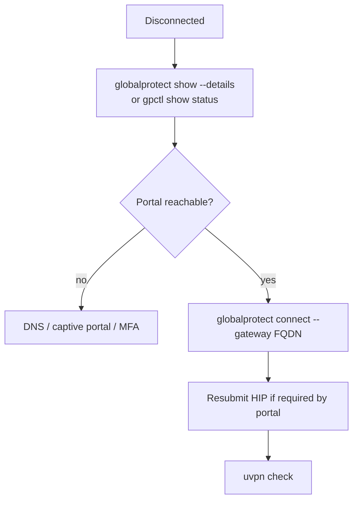
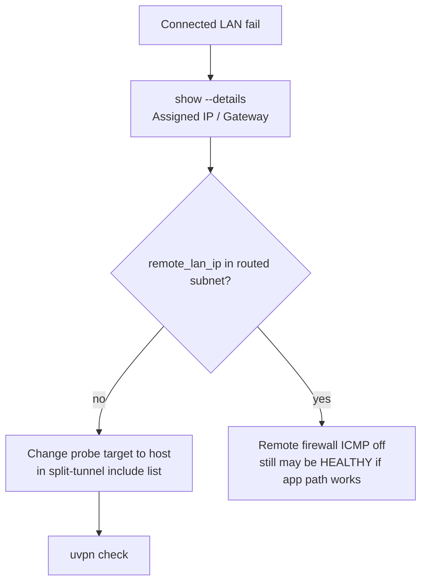

# Troubleshooting — Palo Alto GlobalProtect

**vpn_type:** `globalprotect`, `gp`  
**Product guide:** [palo-alto-globalprotect.md](../vpn-solutions/palo-alto-globalprotect.md)

---

## Quick symptom table

| Symptom | Likely cause | uvpn diagnosis |
|---------|--------------|----------------|
| Neither `gpctl` nor `globalprotect` in PATH | Agent not installed | `UNSUPPORTED` |
| `Not Connected` | No portal session | `VPN_DAEMON_DOWN` |
| `Connected` + LAN fail | Split tunnel / internal host list | `VPN_NEGOTIATION_FAILED` |
| Wrong binary on Linux 6.x | Still calling `gpctl` only | `UNSUPPORTED` or empty parse |
| HIP / MFA pending | Stuck Connecting | `VPN_DAEMON_DOWN` |

---

## Master troubleshooting flow



---

## CLI selection flow



---

## VPN_DAEMON_DOWN branch



```bash
globalprotect show --status
globalprotect show --details
globalprotect show --version
```

---

## VPN_NEGOTIATION_FAILED branch



Always-on vs on-demand does not change uvpn parsing — only whether session stays up.

---

## Parser failures

```bash
gpctl show status 2>&1 | tee /tmp/gp-status.txt
globalprotect show --status 2>&1 | tee /tmp/gp-status.txt
```

Compare to `tests/fixtures/adapters/globalprotect/`.

---

## Related

- [universal.md](universal.md)
