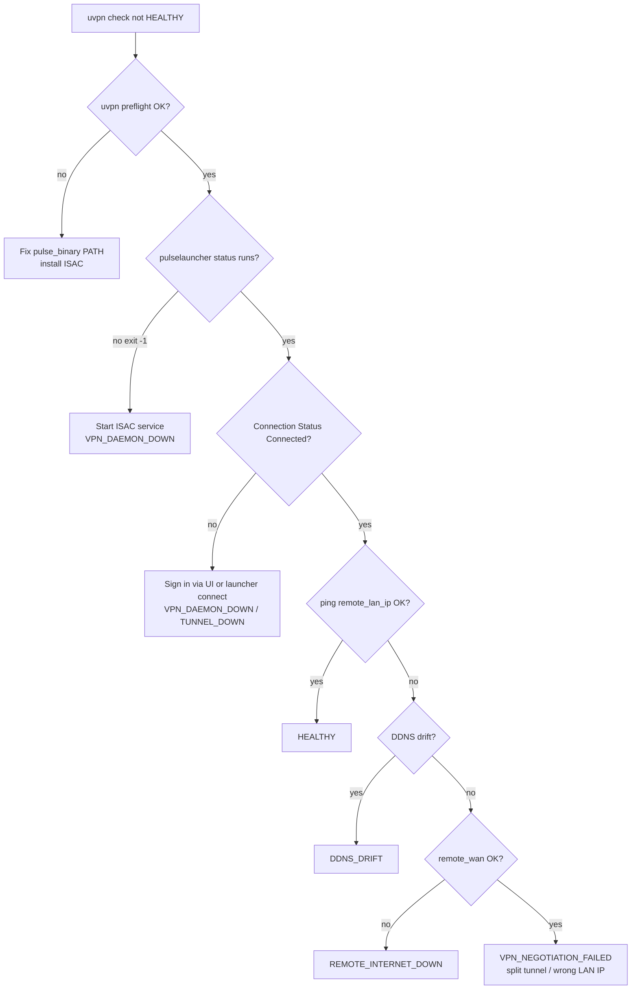
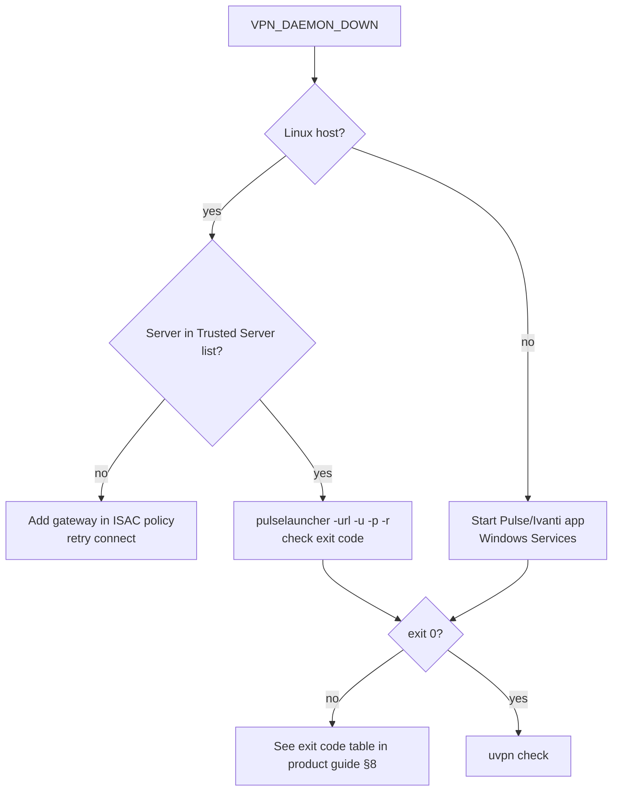
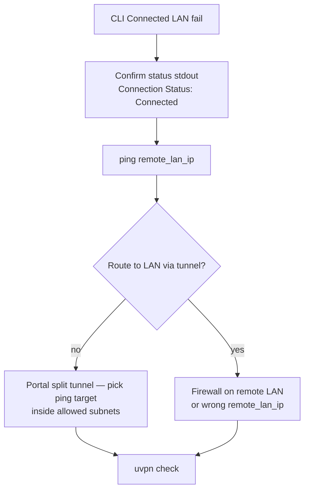
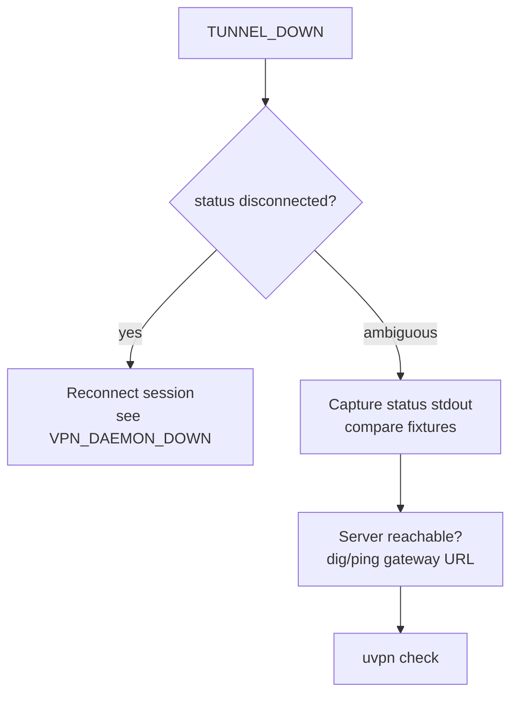

# Troubleshooting — Pulse / Ivanti ISAC

**vpn_type:** `pulse`, `ivanti`  
**Product guide:** [pulse-ivanti.md](../vpn-solutions/pulse-ivanti.md)

---

## Quick symptom table

| Symptom | Likely cause | uvpn diagnosis |
|---------|--------------|----------------|
| `pulselauncher` not found | Client not installed / PATH | `UNSUPPORTED` |
| Exit `-1` on connect | ISAC service stopped | `VPN_DAEMON_DOWN` |
| Linux connect fails instantly | Trusted Server not configured | `VPN_DAEMON_DOWN` |
| Status Connected, LAN ping fails | Split tunnel / routing | `VPN_NEGOTIATION_FAILED` |
| Status Disconnected | No session | `VPN_DAEMON_DOWN` or `TUNNEL_DOWN` |
| Remote WAN ping fails | Remote ISP | `REMOTE_INTERNET_DOWN` |
| DDNS ≠ `remote_wan_ip` | Stale DNS | `DDNS_DRIFT` |

---

## Master troubleshooting flow



---

## VPN_DAEMON_DOWN branch



### Commands

```bash
pulselauncher -help
pulselauncher status
echo $?    # connect/disconnect ops
/opt/pulsesecure/bin/pulselauncher status   # Linux
uvpn preflight
```

| Exit | Action |
|------|--------|
| -1 | Start ISAC agent service |
| 2 | URL, realm, or role-selection UI required |
| 7 | Increase `-t` timeout; check network |

---

## VPN_NEGOTIATION_FAILED branch



```bash
pulselauncher status
ping -c 3 REMOTE_LAN_IP
jq '.adapter,.probes.tunnel' ~/.config/uvpn/state.json
```

---

## TUNNEL_DOWN branch



Fixture reference: `tests/fixtures/adapters/pulse/`.

---

## DDNS_DRIFT / REMOTE_INTERNET_DOWN

Follow [universal.md](universal.md#ddns-drift) and [universal.md](universal.md#remote_internet_down).

Pulse does not replace WAN monitoring — configure `remote_wan_ip` / `remote_ddns` for the **peer site's public IP**, not the Connect Secure hostname alone unless that hostname tracks WAN.

---

## Logging

| OS | Action |
|----|--------|
| Linux | `pulselauncher -L 5 …` for verbose launcher logs |
| Windows / macOS | ISAC GUI diagnostic export |

uvpn stores `adapter.raw.snippet` in `state.json` — never includes passwords.

---

## uvpn config sanity

```json
{
  "vpn_type": "pulse",
  "pulse_binary": "/opt/pulsesecure/bin/pulselauncher",
  "remote_lan_ip": "10.0.0.1",
  "remote_wan_ip": "203.0.113.1",
  "remote_ddns": "vpn.example.com",
  "failure_threshold": 3,
  "check_interval_sec": 300
}
```

---

## Related

- [pulse-cli-contract.md](../architecture/pulse-cli-contract.md)  
- [universal troubleshooting](universal.md)  
- [Public legacy troubleshooting](../legacy/Public/docs/troubleshooting.md)
