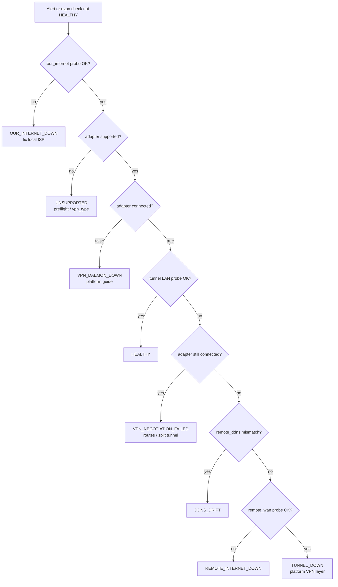
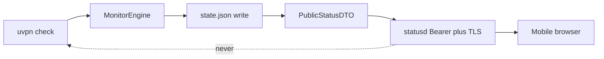

# Universal troubleshooting (uvpn)

You landed here because something across a VPN did not respond—and the client may still look fine. uvpn names **which kind of problem** you have (client down, split tunnel, DDNS drift, remote site offline) so you do not burn time on the wrong fix.

Applies to **every** supported `vpn_type`. Platform-specific CLI and log steps live in the [per-platform guides](README.md). Brand tone guide: [brand/narrative-and-voice.md](../brand/narrative-and-voice.md).

---

## Quick reference

| If you see… | uvpn diagnosis | First action |
|-------------|----------------|--------------|
| Green / `HEALTHY` | `HEALTHY` | None |
| Yellow, local internet broken | `OUR_INTERNET_DOWN` | Fix ISP; counter frozen |
| Red, VPN client down | `VPN_DAEMON_DOWN` | [Platform guide](README.md) → start client |
| Red, CLI up, LAN ping fail | `VPN_NEGOTIATION_FAILED` | Split tunnel / routing — [Platform guide](README.md) |
| Red, DDNS wrong | `DDNS_DRIFT` | [DDNS drift](#ddns-drift) |
| Red, remote WAN dead | `REMOTE_INTERNET_DOWN` | Contact remote site |
| Red, WAN OK, LAN dead | `TUNNEL_DOWN` | VPN path / firewall — [Platform guide](README.md) |
| Preflight fails | `UNSUPPORTED` / config | [Unsupported](#unsupported) |
| Unknown / empty state | `UNKNOWN` | `uvpn preflight`; complete config |

**CLI runbook:** `uvpn explain`  
**Human labels:** Linux GTK / macOS Swift GUI diagnosis panel (when present)

---

## How diagnosis is computed

`compute_diagnosis` in `src/uvpn/core/diagnosis.py` evaluates **one code per check** — **first match wins**:

1. `OUR_INTERNET_DOWN` — probe `our_internet` (default target 1.1.1.1) failed  
2. `VPN_DAEMON_DOWN` — adapter `supported` and `connected == false`  
3. `HEALTHY` — probe `tunnel` (remote LAN) succeeded  
4. `VPN_NEGOTIATION_FAILED` — adapter reports connected but LAN probe failed  
5. `DDNS_DRIFT` — `remote_ddns` configured and resolution ≠ `remote_wan_ip`  
6. `REMOTE_INTERNET_DOWN` — probe `remote_wan` failed  
7. `TUNNEL_DOWN` — remaining failure (WAN/DNS looked OK)

Legacy bash monitor codes such as `GATEWAY_UNREACHABLE` and `DISAGREEMENT` are **not** emitted by uvpn; closest mappings:

| Legacy (tunnel-monitor) | uvpn equivalent |
|-------------------------|-----------------|
| `DISAGREEMENT` (gateway UP, Mac LAN fail) | `VPN_NEGOTIATION_FAILED` when vendor CLI says connected |
| `GATEWAY_UNREACHABLE` | Not applicable — uvpn has no gateway SSH dedup |
| `TUNNEL_DOWN` | `TUNNEL_DOWN` or `VPN_NEGOTIATION_FAILED` |

---

## Master decision flow



---

## Status portal read path (optional)

Does not change diagnosis logic. `uvpn check` (timer/CLI) writes `state.json`; **uvpn-statusd** serves a redacted copy only.



See [status portal](../deploy/status-portal.md) and [threat model](../security/threat-model.md).

---

## Alert timing and traffic light

| Setting | Default | Effect |
|---------|---------|--------|
| `check_interval_sec` | 300 | systemd timer / LaunchAgent period |
| `failure_threshold` | 3 | Failures before `alert_state` → DOWN |
| Traffic yellow | below threshold | Degraded but not “committed” DOWN |
| Traffic red | ≥ threshold | Sustained failure |

`OUR_INTERNET_DOWN` does **not** increment `failure_count` (same behavior as legacy: avoid false DOWN streaks during local outages).

Inspect state:

```bash
jq '{diagnosis,traffic_light,alert_state,failure_count,adapter}' ~/.config/uvpn/state.json
```

---

## OUR_INTERNET_DOWN

### Beginner

1. Open a browser — can you reach the public internet?
2. Fix Wi‑Fi/Ethernet or ISP outage.
3. Run `uvpn check` again — diagnosis should clear without VPN changes.

### Advanced

```bash
ping -c 3 1.1.1.1
ip route get 1.1.1.1
uvpn check && uvpn explain
```

No VPN-specific action until local connectivity returns.

---

## VPN_DAEMON_DOWN

Vendor client or daemon reports **not connected** (or binary missing → `supported=false` may surface as unsupported — see platform guide).

### Beginner

1. Open the VPN client GUI — connect manually.
2. Run `uvpn preflight` — confirm CLI binary exists.
3. Run `uvpn check`.

### Advanced

Open the [platform troubleshooting guide](README.md) for your `vpn_type` — each includes a **VPN_DAEMON_DOWN** branch flowchart.

---

## VPN_NEGOTIATION_FAILED

**Meaning:** Control plane says **connected**; data-plane probe to `remote_lan_ip` fails. Analogous to legacy **DISAGREEMENT** when a gateway monitor said UP but the Mac could not ping the remote LAN.

### Beginner

1. Confirm you are on the corporate network path (not guest VLAN).
2. Disconnect and reconnect VPN from the client.
3. If remote LAN is a small subnet, confirm `remote_lan_ip` in config is a host that answers ping.

### Advanced

```bash
route -n get REMOTE_LAN_IP    # macOS
ip route get REMOTE_LAN_IP    # Linux
ping -c 3 REMOTE_LAN_IP
# Compare to vendor status CLI — platform guide
```

Check split-tunnel policy (common on GlobalProtect, FortiClient, Cisco).

---

## DDNS_DRIFT

### Beginner

1. Compare `remote_wan_ip` in config to what `remote_ddns` resolves to today.
2. Update DDNS A record **or** update `remote_wan_ip` if the ISP change is intentional.
3. Wait TTL (~5 min). `uvpn check`.

### Advanced

```bash
dig +short "${REMOTE_DDNS}" @1.1.1.1
jq '.probes.dns' ~/.config/uvpn/state.json
```

---

## REMOTE_INTERNET_DOWN

### Beginner

Remote site's internet is likely down. Nothing to fix on your VPN client until the remote WAN returns.

### Advanced

```bash
ping -c 3 REMOTE_WAN_IP
# If ICMP filtered but tunnel should work, interpret with vendor CLI + LAN probe
```

---

## TUNNEL_DOWN

Remote WAN and DNS probes looked OK; LAN still unreachable; vendor CLI may show disconnected or ambiguous.

### Beginner

1. Platform guide → **TUNNEL_DOWN** flow.
2. Bounce VPN session.
3. Verify firewall allows traffic to remote LAN.

### Advanced

Collect adapter snippet from state:

```bash
jq '.adapter.raw' ~/.config/uvpn/state.json
```

---

## UNSUPPORTED

### Beginner

- Wrong `vpn_type` or missing VPN software.
- Use `generic` for ICMP-only monitoring when no vendor CLI exists.

### Advanced

```bash
uvpn preflight
which pulselauncher forticlient gpctl wg swanctl vpn openvpn
```

Set explicit binary overrides (`pulse_binary`, `fortinet_binary`, etc.) per [vpn-solutions](../vpn-solutions/README.md).

---

## UNKNOWN

Incomplete config or first run before checks.

```bash
uvpn preflight   # must pass
uvpn check
```

Ensure `remote_lan_ip` and `remote_wan_ip` are set.

---

## GUI and scheduling issues

### Linux GTK missing

Install `python3-gi` + GTK4, or use `uvpn-tui`. See [platform-linux/gui-setup.md](../platform-linux/gui-setup.md).

### macOS menu bar stale

- Manual **Refresh** or `uvpn check`
- Install LaunchAgent — [scheduling.md](../deploy/scheduling.md)

### systemd not running

```bash
systemctl status uvpn.timer uvpn.service
journalctl -u uvpn.service -n 30
```

---

## Escalation checklist

1. `uvpn preflight` output  
2. `uvpn check` + `jq . ~/.config/uvpn/state.json`  
3. Platform guide flowchart for your `vpn_type`  
4. Redacted `config.json` (no secrets) if filing an issue  
5. **Status portal users:** API omits `adapter.raw` and log tails by design — see [security/threat-model.md](../security/threat-model.md)  

---

## Related

- [troubleshooting hub](README.md)  
- [Public legacy troubleshooting](../legacy/Public/docs/troubleshooting.md) (UniFi + WAN Guard)  
- [Diagnosis source](../../src/uvpn/core/diagnosis.py)
