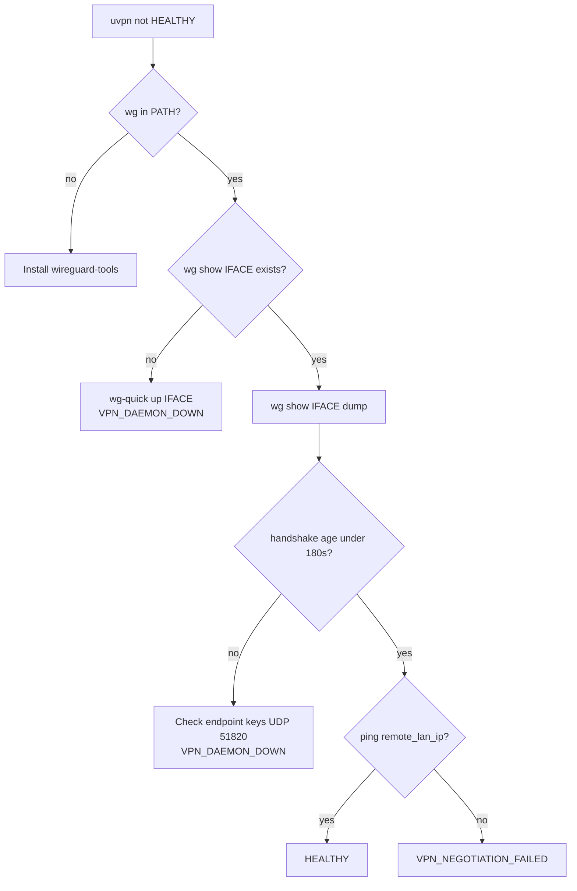
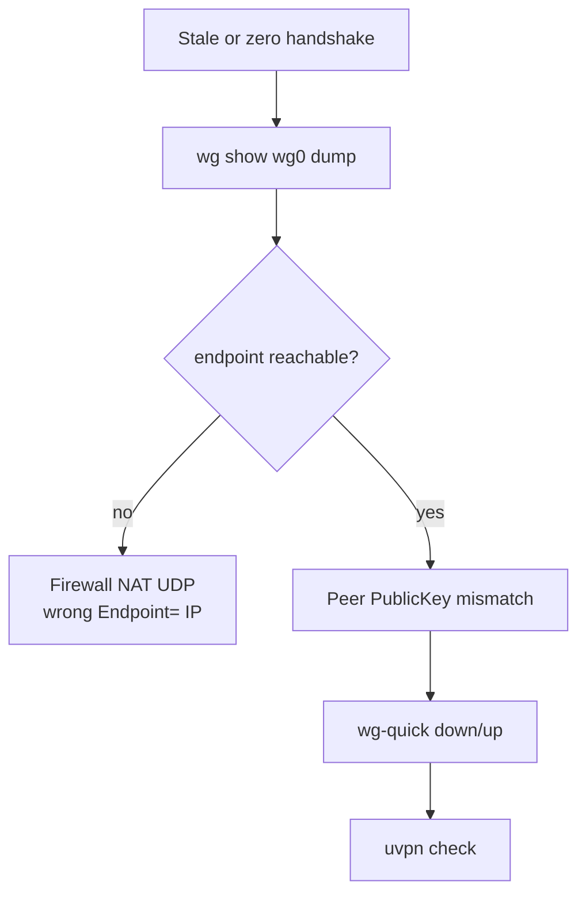
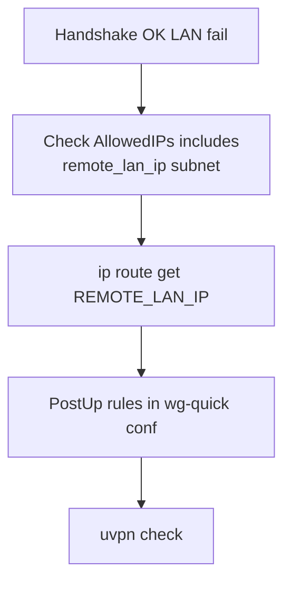

# Troubleshooting — WireGuard

**vpn_type:** `wireguard`  
**Product guide:** [wireguard.md](../vpn-solutions/wireguard.md)

---

## Quick symptom table

| Symptom | Likely cause | uvpn diagnosis |
|---------|--------------|----------------|
| `wg` not found | wireguard-tools missing | `UNSUPPORTED` |
| Interface missing | wg0 down | `VPN_DAEMON_DOWN` |
| Stale handshake | Peer idle / UDP blocked | `VPN_DAEMON_DOWN` |
| Fresh handshake, LAN fail | AllowedIPs / routing | `VPN_NEGOTIATION_FAILED` |
| Handshake 0 | Never established | `TUNNEL_DOWN` |

---

## Master troubleshooting flow



---

## Handshake branch



```bash
wg show wg0
wg show wg0 dump
sudo wg-quick up wg0
```

---

## VPN_NEGOTIATION_FAILED branch



Handshake fresh + LAN fail is common with **too-narrow AllowedIPs**.

---

## Permissions

`wg` often requires root — run `uvpn check` with privileges that can read interface state.

---

## Related

- [universal.md](universal.md)
