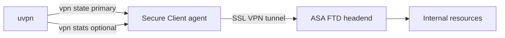
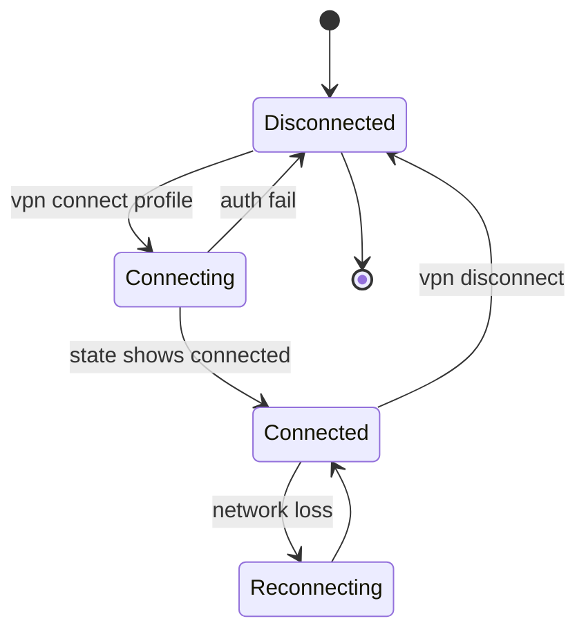
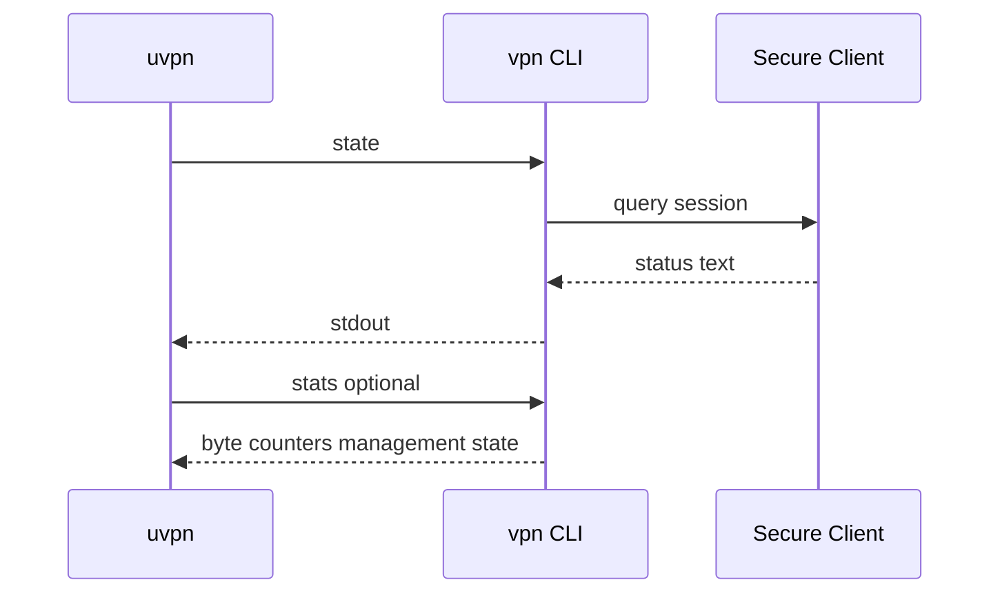
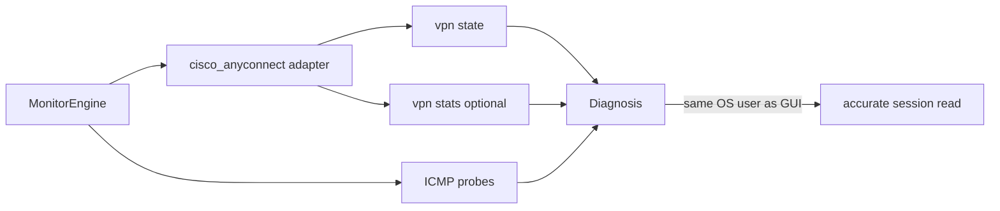

# Cisco AnyConnect / Secure Client

**vpn_type:** `cisco_anyconnect`  
**Reference:** Cisco Secure Client 5.x administration — local CLI customization chapter

## uvpn at a glance

Invokes **`vpn state`** (and **`vpn stats`** for statistics) on the Secure Client CLI binary. Scope: **SSL VPN client on Linux/macOS endpoints**—not ASA site-to-site on network appliances.

---

## Incorporated reference map

| Topic | Source material (maintainer record) | Sections |
|-------|--------------------------------------|----------|
| Local CLI | Secure Client 5 admin guide — CLI / state | §3 |
| Client deployment | Secure Client installation guides | §2 |
| Profile model | Secure Client profile XML / headend | §4, §6 |

---

## Visual reference


## Diagrams









---

## 1. Product overview

Cisco Secure Client (formerly AnyConnect) terminates remote access on ASA, FTD, or vendor headends. The local **`vpn`** executable exposes text commands for automation and scripting when profiles are pre-deployed.

uvpn reads session state—it does not initiate connects.

---

## 2. Installation and deployment

Install Secure Client via corporate package or MDM. Typical CLI path:

| OS | Binary |
|----|--------|
| Linux | `/opt/cisco/secureclient/bin/vpn` |
| macOS | Same tree under `/opt/cisco/secureclient/bin/vpn` |

Configure `cisco_vpn_binary` if installed elsewhere.

Profiles must exist before `vpn connect` automation; uvpn only requires `vpn state` readability.

---

## 3. CLI and management interface

Documented local commands include:

| Command | Purpose |
|---------|---------|
| `vpn state` | **Primary uvpn probe** — reports connection state |
| `vpn stats` | Byte and session counters (statistics collection) |
| `vpn connect …` | Start session (out of uvpn scope) |
| `vpn disconnect` | Stop session |

Output strings vary by platform and profile; adapter parses common connected / disconnected / reconnecting tokens.

Run as the user context that owns the active VPN session (important on macOS keychain-backed profiles).

### 3.1 Launching the CLI

| OS | Interactive | Non-interactive example |
|----|-------------|-------------------------|
| Linux / macOS | `/opt/cisco/secureclient/bin/vpn` | `vpn state` |
| Windows | `vpncli.exe` in `C:\Program Files (x86)\Cisco\Cisco Secure Client\` | `vpncli.exe state` |

Documented automation commands: `connect <host|alias>`, `disconnect`, `stats`, `state`, `quit` / `exit`. uvpn invokes **`state`** only.

### 3.2 Monitoring-relevant output

Exact strings depend on headend and profile, but adapters look for tokens such as **Connected**, **Disconnected**, and **Reconnecting** in stdout. Use `vpn stats` when collecting byte counters for `uvpn statistics`—not required for the traffic-light check cycle.

**Scope guard:** This adapter targets the **Secure Client on endpoints**. Monitoring IPsec site-to-site SAs on an ASA/FTD appliance requires `ipsec` or `generic` from a routed monitoring host, not `cisco_anyconnect`.

---

## 4. Connection lifecycle

| State | Meaning |
|-------|---------|
| Connected | Tunnel active |
| Disconnected | No session |
| Connecting / Reconnecting | Transitional—may map to yellow traffic light until probes confirm |

Always-on and on-demand behaviors depend on headend policy in the profile XML.

---

## 5. Status and monitoring

| Layer | Method |
|-------|--------|
| Control plane | `vpn state` stdout |
| Statistics | `vpn stats` |
| Data plane | ICMP / DDNS probes |

---

## 6. Authentication and certificates

Profiles embed authentication server lists, certificate trust, and SAML/Posture settings. uvpn does not modify profiles.

---

## 7. Logging and diagnostics

Client diagnostic logs are enabled via headend policy or local preference panes—not via `vpn state`.

---

## 8. Exit codes and return values

Non-zero exit when binary missing or no profile loaded. uvpn distinguishes unsupported install from disconnected session via adapter logic.

---

## 9. Product troubleshooting

| Observation | Action |
|-------------|--------|
| Command not found | Verify Secure Client install path |
| State disconnected while user sees VPN up | Run check under same OS user / GUI session |
| Connected + LAN probe fail | Split routing or full-tunnel policy gap |

---

## uvpn configuration

```json
{
  "vpn_type": "cisco_anyconnect",
  "cisco_vpn_binary": "/opt/cisco/secureclient/bin/vpn",
  "remote_lan_ip": "10.1.0.1",
  "remote_wan_ip": "203.0.113.1"
}
```

For appliance IPsec site-to-site on a gateway host, use `ipsec` adapter or `generic` from a routed LAN—not this client adapter.

---

## uvpn monitoring

```bash
vpn state
uvpn check && uvpn explain
```

---

## Supported versions

Secure Client 5.x local CLI as documented in administration guide for your release train.

---

## uvpn troubleshooting

- Wrong user context → run uvpn as session owner or use launchd user agent.
- Probe failure → `TUNNEL_DOWN`.

---

## Citations

| Topic | Authoritative source |
|-------|---------------------|
| Local CLI (`vpn state`, `vpn stats`) | [Secure Client 5 — Use the CLI commands](https://www.cisco.com/c/en/us/td/docs/security/vpn_client/anyconnect/Cisco-Secure-Client-5/admin/guide/b-cisco-secure-client-admin-guide-5-0/customize-localize-anyconnect.html) |
| Administrator guide (5.1) | [Cisco Secure Client Administrator Guide 5.1](https://www.cisco.com/c/en/us/td/docs/security/vpn_client/anyconnect/Cisco-Secure-Client-5/admin/guide/b-cisco-secure-client-admin-guide-5-1.html) |

Manifest: [manifests/cisco-anyconnect.yaml](manifests/cisco-anyconnect.yaml)

---

## Related

- [plugin-adapters.md](../architecture/plugin-adapters.md)
