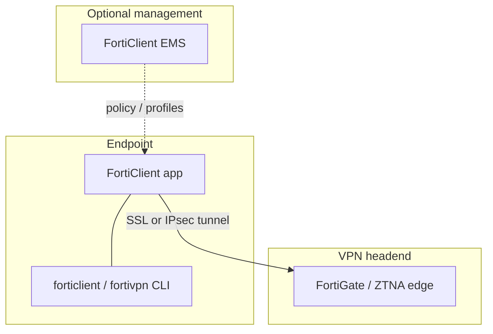
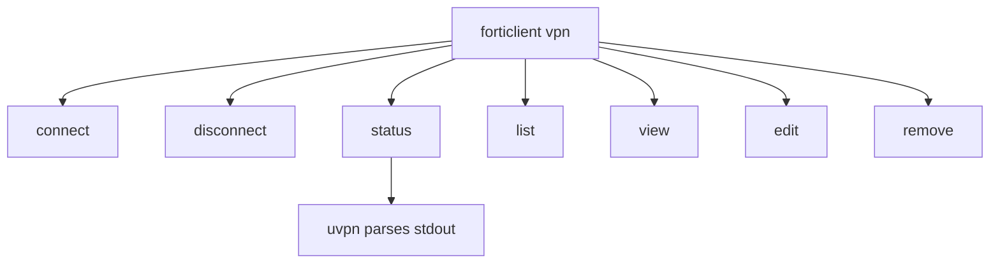
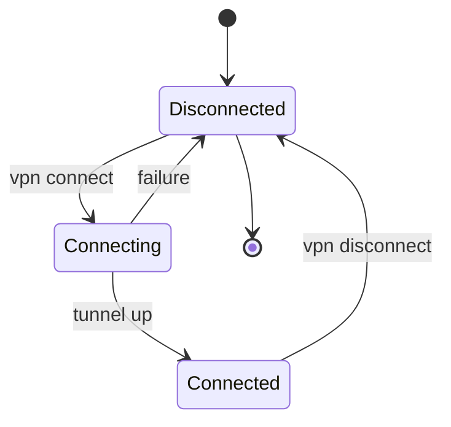
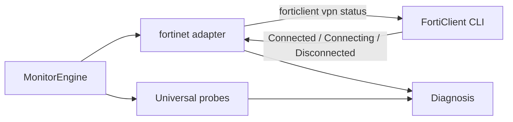

# Fortinet FortiClient

**vpn_type:** `fortinet` or `forticlient`

## uvpn at a glance

Parses **`forticlient vpn status`** (Linux) or **`fortivpn --cli --status`** (Windows/macOS style) with version-pinned fixtures. Unsupported CLI output → `supported=False`.

---

## Vendor documentation index

| Vendor section | Official document | URL |
|----------------|-------------------|-----|
| Product library | FortiClient document library | https://docs.fortinet.com/product/forticlient |
| Linux CLI (7.4.7) | FortiClient (Linux) CLI commands | https://docs.fortinet.com/document/forticlient/7.4.7/administration-guide/41299/forticlient-linux-cli-commands |
| Windows CLI (7.4.7) | FortiClient (Windows) CLI commands | https://docs.fortinet.com/document/forticlient/7.4.7/administration-guide/95591/forticlient-windows-cli-commands |
| macOS CLI | FortiClient (macOS) CLI commands | https://docs.fortinet.com/document/forticlient/7.4.7/administration-guide/95491/forticlient-macos-cli-commands |
| Appendix D (CLI index) | Appendix D - CLI commands | https://docs.fortinet.com/document/forticlient/7.4.7/administration-guide/792335 |

Internal: [adapter-version-matrix.md](../architecture/adapter-version-matrix.md)

---

## Diagrams (vendor + uvpn)

### FortiClient deployment (vendor)



### VPN CLI command tree (vendor Linux)



### Tunnel state lifecycle (vendor)



### uvpn monitoring flow



---

## 1. Product overview

FortiClient provides SSL/IPsec VPN, ZTNA, and EMS telemetry. VPN status is exposed via **`forticlient vpn`** subcommands (Linux) or **FortiVPN.exe --cli** (Windows).

**uvpn relevance:** `status` subcommand stdout parsed per FortiClient 7.x fixtures.

---

## 2. Installation and deployment

Install FortiClient from Fortinet or EMS deployment. Ensure VPN CLI on PATH:

| Platform | Typical binary |
|----------|----------------|
| Linux | `forticlient` |
| macOS | `/opt/forticlient/fortivpn` or EMS-managed path |
| Windows | `FortiVPN.exe` |

Set `fortinet_binary` when not on PATH.

---

## 3. CLI and management interface

**Linux** ([41299](https://docs.fortinet.com/document/forticlient/7.4.7/administration-guide/41299/forticlient-linux-cli-commands)):

```text
forticlient vpn [command]

Commands: connect | disconnect | edit | list | remove | status | view
```

**Windows** ([95591](https://docs.fortinet.com/document/forticlient/7.4.7/administration-guide/95591/forticlient-windows-cli-commands)):

```text
FortiVPN.exe --cli --status [--tunnel <name>]
```

Example output:

```text
sslvpn test :: Connected
ipsec :: Disconnected
```

uvpn tries configured binary + `fortivpn vpn status` / `forticlient vpn status` per platform.

---

## 4. Connection lifecycle

| State (vendor) | Meaning |
|----------------|---------|
| Connected | Tunnel up |
| Connecting | In progress |
| Disconnected | No session |

---

## 5. Status and monitoring

| Layer | Method |
|-------|--------|
| Control plane | `vpn status` / `--cli --status` |
| Data plane | ICMP probes |
| EMS telemetry | FortiESNAC (out of uvpn scope) |

---

## 6. Authentication and certificates

Tunnels configured via GUI/EMS; CLI `connect` accepts `--user`, `--password`, cert thumbprint (Windows). uvpn monitors only.

---

## 7. Logging and diagnostics

FortiClient logs via GUI diagnostic tools; EMS can collect remotely.

---

## 8. Exit codes and return values

FortiCLI exit codes vary by subcommand; uvpn prioritizes parsed status text over exit code when stdout is recognized.

---

## 9. Vendor troubleshooting

| Issue | Action |
|-------|--------|
| Unknown CLI layout | Pin FortiClient to matrix version or use `generic` |
| EMS-only profiles | Ensure tunnel pre-provisioned before `connect` |

---

## uvpn configuration

```json
{
  "vpn_type": "fortinet",
  "fortinet_binary": "/opt/forticlient/fortivpn",
  "remote_lan_ip": "10.10.0.1",
  "remote_wan_ip": "203.0.113.5"
}
```

---

## uvpn monitoring

```bash
forticlient vpn status
uvpn check
```

| Validation | Fixture-validated FortiClient 7.x stdout |

---

## Supported versions

[adapter-version-matrix.md](../architecture/adapter-version-matrix.md) — FortiClient **7.x** for v1.0.0.

---

## uvpn troubleshooting

- CLI not found → `fortinet_binary` or `generic`.
- Connected + LAN fail → `TUNNEL_DOWN`.

---

## Related

- [plugin-adapters.md](../architecture/plugin-adapters.md)
