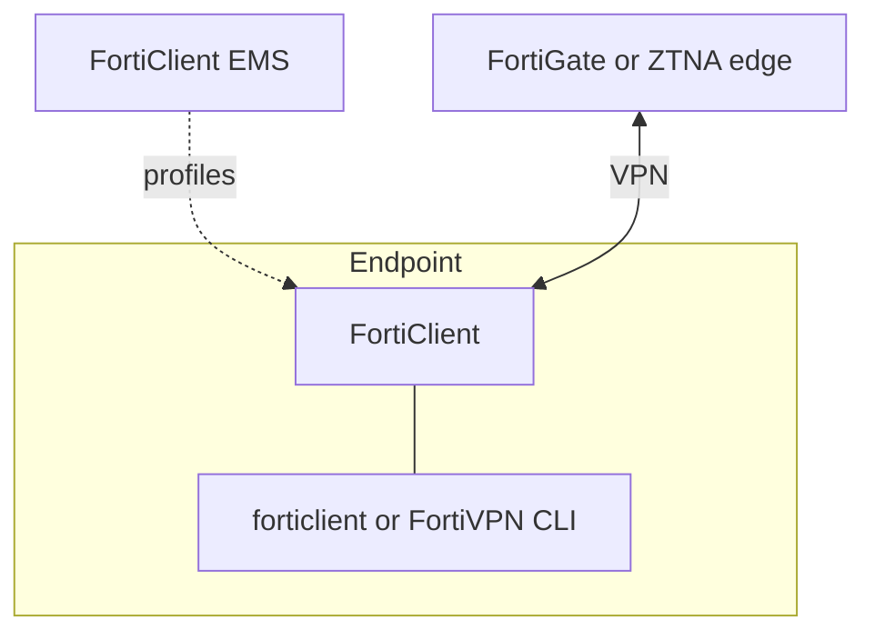
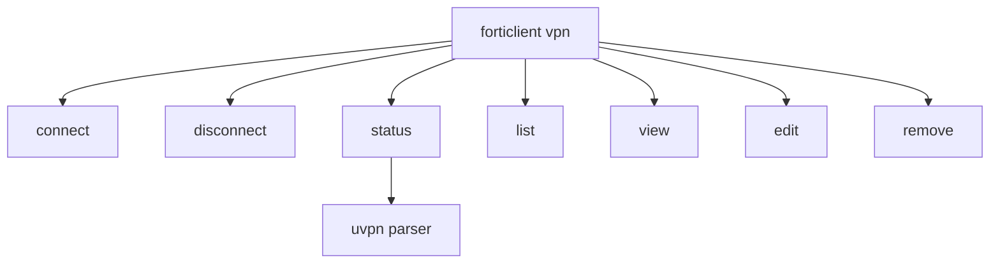
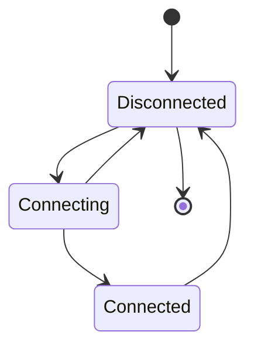
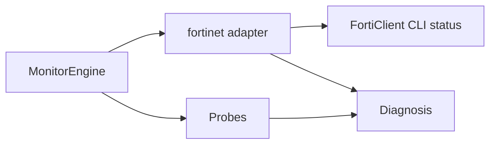

# Fortinet FortiClient

**vpn_type:** `fortinet` or `forticlient`  
**Pinned client line:** FortiClient 7.4.x (Linux / Windows / macOS administration guides)

## uvpn at a glance

Parses VPN status text from **`forticlient vpn status`** on Linux or **`FortiVPN --cli --status`** on Windows-style installs. Fixture-validated for 7.x output shapes. Unrecognized CLI layouts yield `supported=False`.

---

## Incorporated reference map

| Topic | Source material (maintainer record) | Sections |
|-------|--------------------------------------|----------|
| VPN CLI tree (Linux) | FortiClient 7.4 administration — Linux CLI | §3 |
| VPN CLI (Windows) | FortiClient 7.4 administration — Windows CLI | §3 |
| CLI appendix index | FortiClient administration — Appendix D | §3 |
| EMS registration | Windows CLI — FortiESNAC (out of uvpn probe path) | §7 note |

---

## Diagrams

(See existing FortiClient deployment, command tree, lifecycle, and uvpn flow diagrams in prior revision — retained below.)









---

## 1. Product overview

FortiClient combines remote access VPN (SSL and IPsec), optional ZTNA agents, and endpoint telemetry when registered to FortiClient EMS. VPN profiles are normally created in the GUI or pushed by EMS; the CLI connects existing profiles rather than defining new tunnel definitions on Windows.

**Monitoring relevance:** The `status` subcommand prints per-tunnel state lines uvpn maps to connected / connecting / disconnected.

---

## 2. Installation and deployment

Install via Fortinet installer, EMS deployment package, or MDM. Ensure the VPN CLI is reachable:

| Platform | Typical entry point |
|----------|---------------------|
| Linux | `forticlient` front-end with `vpn` subcommand |
| Windows | `FortiVPN.exe` under the FortiClient program directory |
| macOS | `/opt/forticlient/fortivpn` or EMS-managed equivalent |

Set `fortinet_binary` when multiple copies exist or PATH is restricted.

---

## 3. CLI and management interface

### Linux VPN subcommand tree

The Linux administration material documents a dedicated VPN CLI mode:

```text
forticlient vpn [command]
```

| Subcommand | Purpose |
|------------|---------|
| `connect` | Attach to a named profile; optional username, password, save-password, always-up, auto-connect flags |
| `disconnect` | Tear down active VPN |
| `edit` | Create or modify a profile locally |
| `list` | Enumerate configured profiles |
| `remove` | Delete a profile |
| `status` | **Print current VPN state (uvpn primary)** |
| `view` | Show profile parameters |

### Windows VPN CLI

Windows remote-access automation uses FortiVPN in CLI mode. Pre-provisioned tunnels only—CLI cannot author new tunnel definitions.

```text
FortiVPN.exe --cli --status [--tunnel <profile-name>]
```

Example multi-tunnel output:

```text
machine :: Disconnected
sslvpn test :: Connecting
ipsec :: Disconnected
```

When `--tunnel` is supplied, only that profile is evaluated.

uvpn attempts, in order: configured `fortinet_binary`, then `fortivpn vpn status`, then `forticlient vpn status`.

---

## 4. Connection lifecycle

| Reported state | Meaning |
|----------------|---------|
| Connected | Tunnel established |
| Connecting | Negotiation in progress |
| Disconnected | No active session for that profile |

Multiple profiles may show different states simultaneously on Windows.

---

## 5. Status and monitoring

| Layer | Method |
|-------|--------|
| Control plane | Parsed `status` / `--cli --status` text |
| Data plane | ICMP probes to configured remote IPs |
| EMS telemetry | Separate FortiESNAC registration channel—not used by uvpn |

---

## 6. Authentication and certificates

Profiles store authentication mode (password, certificate, etc.). The Linux `connect` command accepts inline credentials; Windows CLI can pass username, password, certificate thumbprint, and save-credentials flags.

uvpn performs read-only status checks.

---

## 7. Logging and diagnostics

Interactive diagnostics live in the FortiClient GUI. EMS may collect logs centrally. Endpoint registration status is available via FortiESNAC `--details` on Windows—outside uvpn’s VPN status path.

---

## 8. Exit codes and return values

Subcommand exit codes are not fully enumerated in public excerpts; uvpn treats recognizable stdout as authoritative. Empty or unknown output with non-zero exit → ambiguous or unsupported.

---

## 9. Product troubleshooting

| Observation | Action |
|-------------|--------|
| Empty status | Confirm profile exists (`list`) and client version matches matrix |
| EMS-only profile not visible locally | Sync policy or open GUI once before CLI monitoring |
| Parsing failures after upgrade | Re-verify against 7.4.x fixtures or pin binary |

---

## uvpn configuration

```json
{
  "vpn_type": "fortinet",
  "fortinet_binary": "/opt/forticlient/fortivpn",
  "remote_lan_ip": "10.10.0.1",
  "remote_wan_ip": "203.0.113.5"
}
```

---

## uvpn monitoring

```bash
forticlient vpn status
uvpn check
```

Fixtures: `tests/fixtures/adapters/fortinet/`

---

## Supported versions

[adapter-version-matrix.md](../architecture/adapter-version-matrix.md) — FortiClient **7.x**.

---

## uvpn troubleshooting

- CLI missing → set `fortinet_binary` or fall back to `generic` for probes-only.
- Connected in CLI but LAN probe fails → `TUNNEL_DOWN`.

---

## Related

- [adapter-version-matrix.md](../architecture/adapter-version-matrix.md)
- [plugin-adapters.md](../architecture/plugin-adapters.md)
