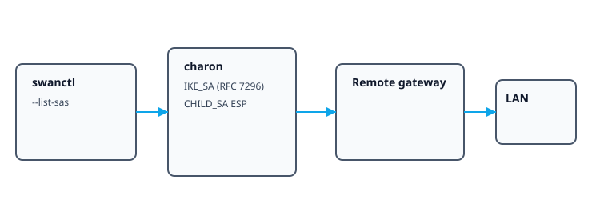
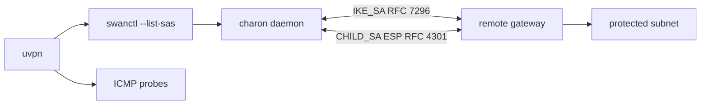
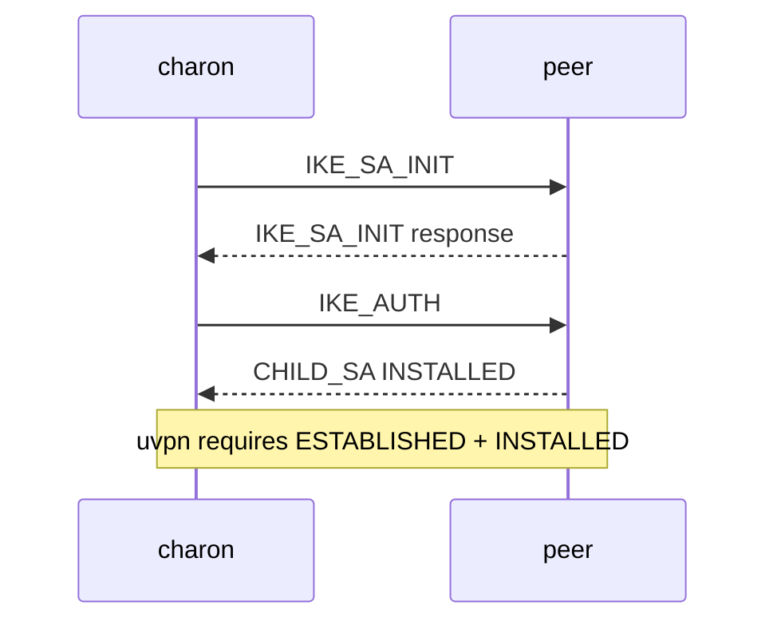
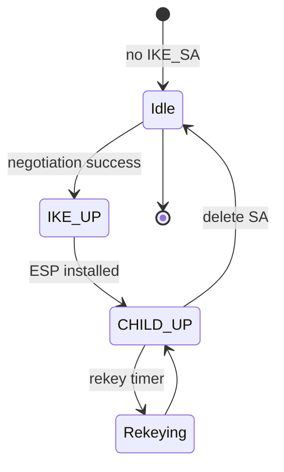
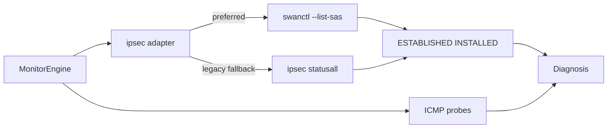

# IPsec / IKEv2

**vpn_type:** `ipsec` or `ikev2`  
**Reference:** strongSwan swanctl documentation; RFC 7296 (IKEv2); RFC 4301 (IPsec architecture)

## uvpn at a glance

Prefers **`swanctl --list-sas`**; falls back to **`ipsec statusall`** on legacy starter deployments. Active CHILD security association required for connected—still verify with LAN probes.

---

## Incorporated reference map

| Topic | Source material (maintainer record) | Sections |
|-------|--------------------------------------|----------|
| swanctl commands | strongSwan documentation — swanctl | §3 |
| IKEv2 protocol | RFC 7296 | §1, §4 |
| IPsec architecture | RFC 4301 | §1 |

---

## Visual reference



## Diagrams









---

## 1. Product overview

IPsec VPNs negotiate **IKE** (Internet Key Exchange) to establish **Security Associations**. IKEv2 (RFC 7296) is the modern key-exchange framework; ESP encapsulates user traffic (RFC 4301 architecture).

**strongSwan** provides the `charon` daemon and `swanctl` control utility on Linux/BSD monitoring hosts.

---

## 2. Installation and deployment

Install strongSwan with swanctl (`swanctl` package on many distributions). Configure connections in `/etc/swanctl/` hierarchy (conf.d fragments) or migrate from legacy `ipsec.conf` + starter.

Set uvpn `"ipsec_tool": "swanctl"` when both swanctl and legacy tools exist.

---

## 3. CLI and management interface

**Primary monitoring command**

```bash
swanctl --list-sas
```

Lists IKE and CHILD SAs with SPIs, addresses, lifetimes, and algorithm names.

**Legacy alternative**

```bash
ipsec statusall
```

Parses starter output when swanctl unavailable—less structured.

uvpn does not invoke `swanctl --initiate`; read-only monitoring only.

---

## 4. Connection lifecycle

| Phase | Meaning |
|-------|---------|
| IKE_SA | Control channel authenticated |
| CHILD_SA | Traffic keys installed for selectors |
| Rekey | SPI rotation before expiry |
| Delete | SA removed; traffic stops |

IKE up without matching CHILD_SA may still mean no usable tunnel.

---

## 5. Status and monitoring

| Layer | Method |
|-------|--------|
| Control plane | Active CHILD_SA in list output |
| Data plane | ICMP probes |
| Logs | journalctl on `charon` unit |

---

## 6. Authentication and certificates

Authentication methods include pre-shared keys, public key certificates, and EAP variants—defined in swanctl connection blocks. uvpn does not manage credentials.

---

## 7. Logging and diagnostics

```bash
journalctl -u strongswan-charon -f
swanctl --list-conns
```

Increase charon debug classes in strongSwan.conf for negotiation traces.

---

## 8. Exit codes and return values

swanctl returns error when daemon stopped or VICI socket missing—map to VPN_DAEMON_DOWN or unsupported.

---

## 9. Product troubleshooting

| Observation | Action |
|-------------|--------|
| No SAs listed | Check `--list-conns` and firewall UDP 500/4500 |
| CHILD up, ping fails | Traffic selectors or routing |
| swanctl missing | Install plugin package or use legacy tool with reduced detail |

---

## uvpn configuration

```json
{
  "vpn_type": "ipsec",
  "ipsec_tool": "swanctl",
  "remote_lan_ip": "192.168.100.1",
  "remote_wan_ip": "198.51.100.10"
}
```

Alias: `"vpn_type": "ikev2"`.

---

## uvpn monitoring

```bash
swanctl --list-sas
uvpn check
```

---

## Supported versions

strongSwan 5.9+ with swanctl recommended.

---

## uvpn troubleshooting

- SA present + LAN fail → `TUNNEL_DOWN`.
- Daemon down → `VPN_DAEMON_DOWN`.

---

## Citations

| Topic | Authoritative source |
|-------|---------------------|
| swanctl command reference | [strongSwan swanctl](https://docs.strongswan.org/docs/5.9/swanctl/swanctl.html) |
| IKEv2 protocol | [RFC 7296](https://www.rfc-editor.org/rfc/rfc7296) |
| IPsec security architecture | [RFC 4301](https://www.rfc-editor.org/rfc/rfc4301) |

Manifest: [manifests/ipsec-ikev2.yaml](manifests/ipsec-ikev2.yaml)

---

## Related

- [research-vpn-platforms.md](../architecture/research-vpn-platforms.md)
