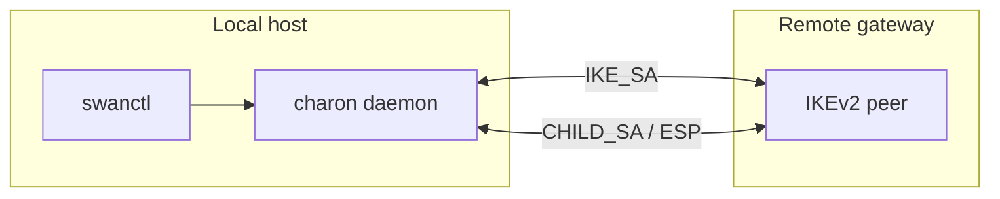
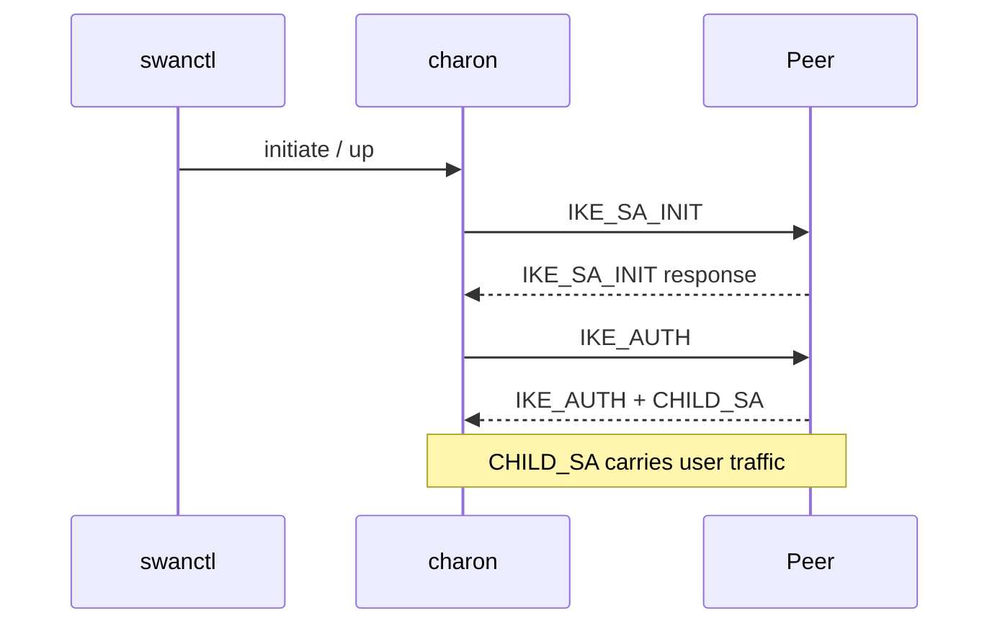
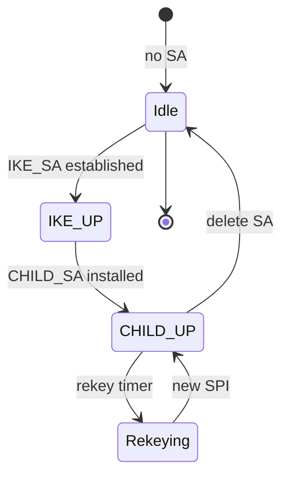
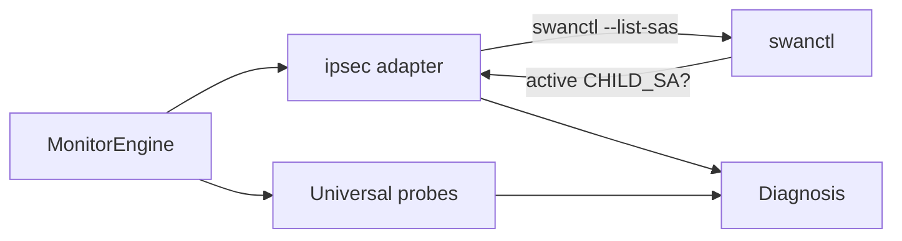

# IPsec / IKEv2

**vpn_type:** `ipsec` or `ikev2`

## uvpn at a glance

Prefers **strongSwan** `swanctl --list-sas`; falls back to legacy `ipsec statusall`. IKE SA up ≠ traffic flowing — universal probes required.

---

## Vendor documentation index

| Vendor section | Official document | URL |
|----------------|-------------------|-----|
| swanctl | strongSwan swanctl reference | https://docs.strongswan.org/docs/latest/swanctl/swanctl.html |
| IKEv2 (standard) | RFC 7296 | https://www.rfc-editor.org/rfc/rfc7296 |
| IPsec architecture | RFC 4301 | https://www.rfc-editor.org/rfc/rfc4301 |
| strongSwan docs home | strongSwan documentation | https://docs.strongswan.org/ |

---

## Diagrams (vendor + uvpn)

### IKEv2 / IPsec architecture (vendor)



### IKE and CHILD SA establishment (vendor)



### Connection lifecycle (vendor)



### uvpn monitoring flow



---

## 1. Product overview

Site-to-site and remote-access IPsec commonly use **IKEv2** for key exchange and **ESP** for data. **strongSwan** provides `swanctl` for VICI/swanctl-based control.

**uvpn relevance:** Parses active CHILD_SAs from `swanctl --list-sas`.

---

## 2. Installation and deployment

Install strongSwan + swanctl on gateway or client host. Configure connections in `/etc/swanctl/` (swanctl) or ipsec.conf (starter).

Set `"ipsec_tool": "swanctl"` in uvpn config (default when available).

---

## 3. CLI and management interface

**swanctl --list-sas** ([docs](https://docs.strongswan.org/docs/latest/swanctl/swanctl.html)) lists IKE and CHILD security associations.

Legacy: **`ipsec statusall`** (starter/ipsec.conf deployments).

---

## 4. Connection lifecycle

| Phase | strongSwan signal |
|-------|-------------------|
| IKE_SA established | Parent SA in list-sas |
| CHILD_SA active | Encapsulated traffic keys installed |
| Rekey | New SPI, updated counters |

---

## 5. Status and monitoring

| Layer | Method |
|-------|--------|
| Control plane | `swanctl --list-sas` / `ipsec statusall` |
| Data plane | Ping remote LAN/WAN |

---

## 6. Authentication and certificates

PSK, RSA certs, EAP — per connection config. uvpn monitors only.

---

## 7. Logging and diagnostics

```bash
journalctl -u strongswan-charon
swanctl --list-conns
```

Adapter may collect journal snippets when configured.

---

## 8. Exit codes and return values

Non-zero `swanctl` → no daemon or no SAs — map to `VPN_DAEMON_DOWN` or disconnected.

---

## 9. Vendor troubleshooting

| Issue | Action |
|-------|--------|
| No CHILD_SA | Phase2 mismatch, PFS, traffic selectors |
| SA up, no ping | Policy/routing — still `TUNNEL_DOWN` in uvpn |

---

## uvpn configuration

```json
{
  "vpn_type": "ipsec",
  "ipsec_tool": "swanctl",
  "remote_lan_ip": "192.168.100.1",
  "remote_wan_ip": "198.51.100.10"
}
```

---

## uvpn monitoring

```bash
swanctl --list-sas
uvpn check
```

---

## Supported versions

strongSwan 5.9+ with swanctl; legacy ipsec starter supported with reduced detail.

---

## uvpn troubleshooting

- Use `ikev2` alias same as `ipsec`.
- IKE up + LAN fail → `TUNNEL_DOWN`.

---

## Related

- [research-vpn-platforms.md](../architecture/research-vpn-platforms.md)
