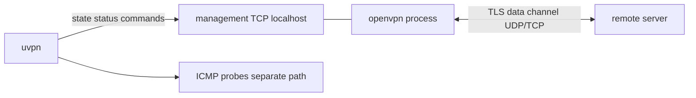
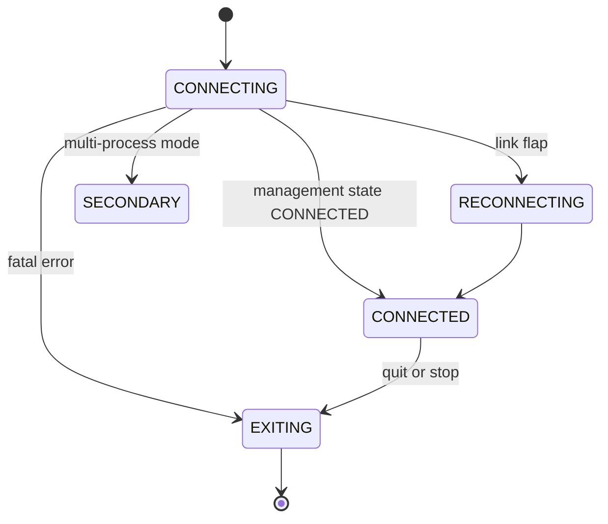
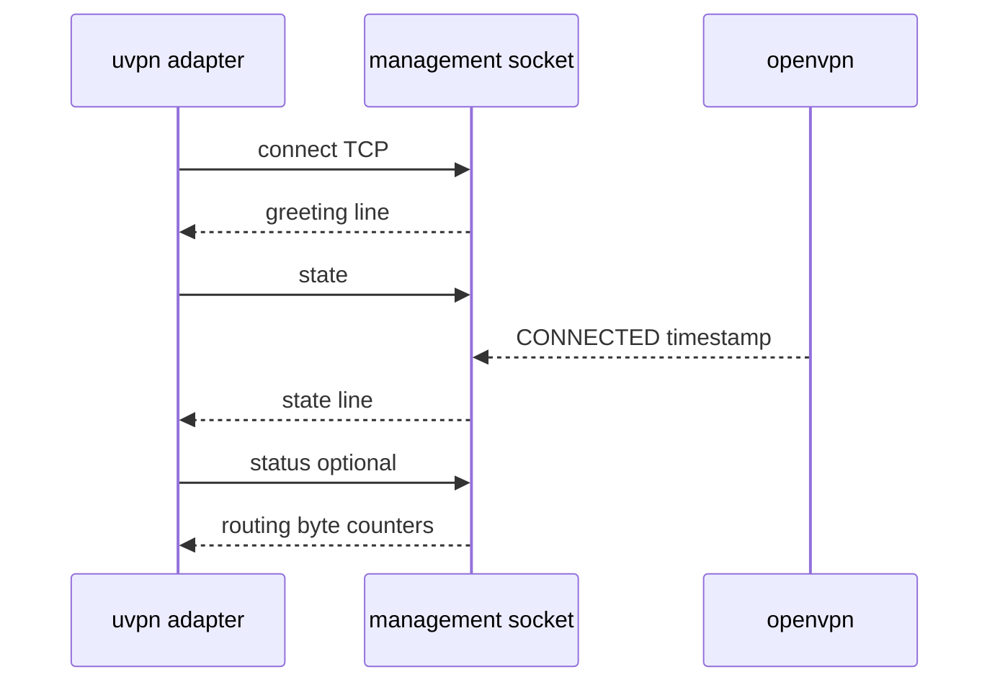
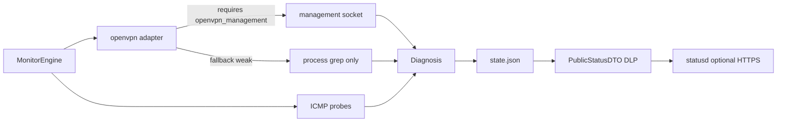

# OpenVPN

**vpn_type:** `openvpn`  
**Reference:** OpenVPN 2.x community management interface and protocol overview

## uvpn at a glance

Queries the OpenVPN **management TCP socket** for `state` and optional `status`. Without management enabled, only weak process detection remains—configure `openvpn_management` for production monitoring.

---

## Incorporated reference map

| Topic | Source material (maintainer record) | Sections |
|-------|--------------------------------------|----------|
| Management interface | OpenVPN community — management interface spec | §3, §4, §8 |
| Protocol / data channel | OpenVPN protocol overview | §1 |
| Reference manual | OpenVPN 2.6 option reference | §2 |

---

## Visual reference


## Diagrams









---

## 1. Product overview

OpenVPN builds encrypted tunnels over UDP or TCP using OpenSSL/TLS for control channel setup. The **management interface** is a text protocol on a local TCP port allowing privileged clients to query live state without parsing log files.

uvpn treats `CONNECTED` in management state output as control-plane up.

---

## 2. Installation and deployment

Install OpenVPN from distribution packages or vendor bundles. Enable management in client or server config:

```text
management 127.0.0.1 7505
management-query-passwords
```

Bind address and port must match `openvpn_management` in uvpn config. Restrict management to localhost on shared hosts.

---

## 3. CLI and management interface

Connect with netcat or uvpn’s adapter to the management port. Line-oriented commands include:

| Command | Response content |
|---------|------------------|
| `state` | Current state machine position and description |
| `status` | Routing table version, virtual addresses, byte counters |
| `log` | Recent log events |
| `help` | Available commands |
| `quit` | Close management session |

After connect, read the greeting line before issuing commands. Some builds require `hold release` when `--management-hold` is configured.

### 3.1 Example management session

```text
>INFO:OpenVPN Management Interface Version 5 -- type 'help' for more info
state
>STATE:1690000000,CONNECTED,SUCCESS,10.8.0.6,203.0.113.20,1194,,
status
>ROUTING_TABLE
VPNROUTE,10.8.0.0/24,10.8.0.1,,
>GLOBAL_STATS
END
quit
>BYE
```

uvpn issues `state` (and optionally `status`) over TCP; it does not drive `username` / password prompts on the management channel.

### 3.2 State lines (monitoring-relevant)

Management `state` replies use comma-separated records. The second field is the high-level state name uvpn maps:

| State token | uvpn interpretation |
|-------------|---------------------|
| `CONNECTED` | Control plane up |
| `CONNECTING` | Negotiation in progress |
| `RECONNECTING` | Session rebuilding |
| `EXITING` | Shutting down |

Bind management to loopback (`127.0.0.1`) or a Unix socket; the protocol is cleartext.

### 3.3 Server vs client deployments

| Role | Typical uvpn host | Notes |
|------|-------------------|--------|
| Road-warrior client | Laptop / workstation running OpenVPN | Enable `management` in client `.conf` |
| Site-to-site endpoint | Router or gateway with local management port | Probe from the host that runs `openvpn` |
| Remote server only | Not on the OpenVPN process host | Use `generic` ICMP from a routed LAN client |

---

## 4. Connection lifecycle

Documented client states include **CONNECTING**, **CONNECTED**, **RECONNECTING**, **EXITING**, and **SECONDARY** (secondary process). uvpn maps CONNECTED to tunnel-up; RECONNECTING may appear as degraded depending on probe results.

---

## 5. Status and monitoring

| Layer | Method |
|-------|--------|
| Control plane | Management `state` |
| Throughput / routes | Management `status` (statistics collection) |
| Data plane | ICMP probes |

---

## 6. Authentication and certificates

Authentication stacks (certificates, username/password, MFA plugins) are configured in profile files—not via management queries. uvpn does not handle credentials.

---

## 7. Logging and diagnostics

Management `log` returns recent events; file-based logs remain the source for deep troubleshooting. Increase `verb` in profile for detail.

---

## 8. Exit codes and return values

Process exit codes reflect daemon shutdown or fatal errors—not minute-to-minute tunnel health. uvpn prefers management state over PID checks.

---

## 9. Product troubleshooting

| Observation | Action |
|-------------|--------|
| Connection refused on management port | Verify directive and that daemon is running |
| Stuck CONNECTING | Inspect cert/auth in OpenVPN log |
| CONNECTED but LAN down | Routing or `--redirect-gateway` scope |

---

## uvpn configuration

```json
{
  "vpn_type": "openvpn",
  "openvpn_management": "127.0.0.1:7505",
  "remote_lan_ip": "192.168.50.1",
  "remote_wan_ip": "203.0.113.20",
  "remote_ddns": "site.example.com"
}
```

---

## uvpn monitoring

```bash
uvpn preflight && uvpn check && uvpn statistics
```

Without management: use `"vpn_type": "generic"` if only ICMP matters.

---

## Supported versions

OpenVPN 2.4+ with management enabled.

---

## uvpn troubleshooting

- Management disabled → enable or switch adapter.
- State CONNECTED + probe fail → `TUNNEL_DOWN`.

---

## Citations

| Topic | Authoritative source |
|-------|---------------------|
| Management interface overview | [OpenVPN Management Interface](https://openvpn.net/community-docs/management-interface.html) |
| Management protocol detail | [management-notes.txt (OpenVPN source)](https://github.com/OpenVPN/openvpn/blob/master/doc/management-notes.txt) |
| `--management` directive | [management-options.rst](https://github.com/OpenVPN/openvpn/blob/master/doc/man-sections/management-options.rst) |

Manifest: [manifests/openvpn.yaml](manifests/openvpn.yaml)

---

## Full troubleshooting runbook

[troubleshooting/openvpn.md](../troubleshooting/openvpn.md) · [universal.md](../troubleshooting/universal.md)

---

## Related

- [plugin-adapters.md](../architecture/plugin-adapters.md)
