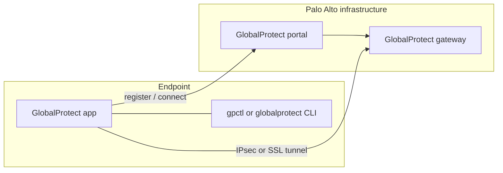
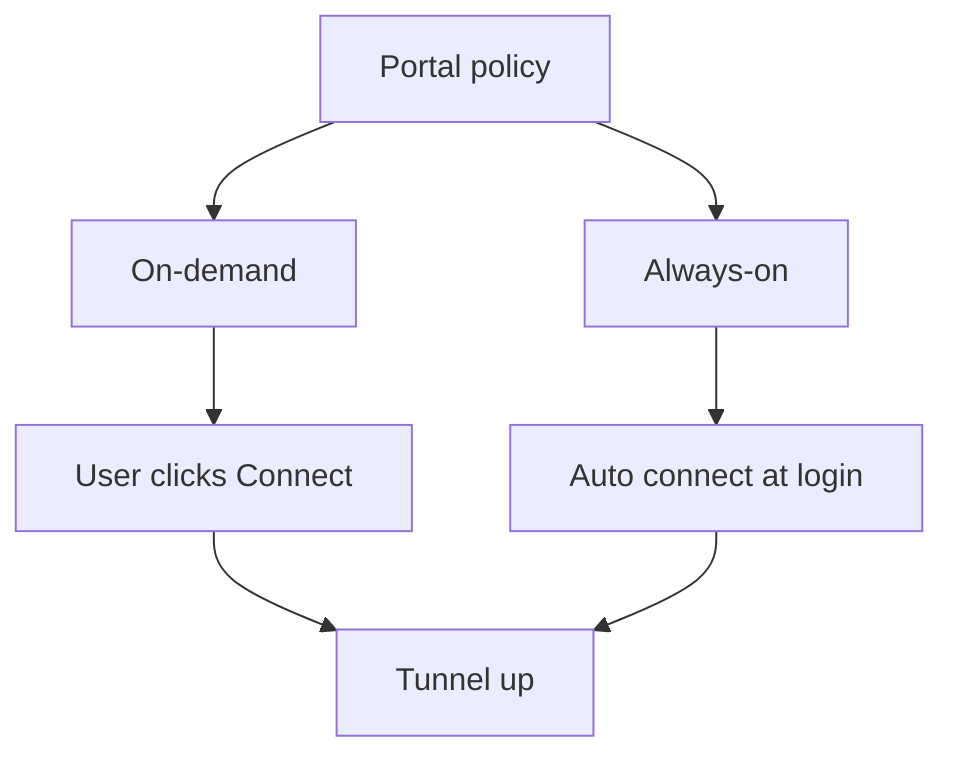
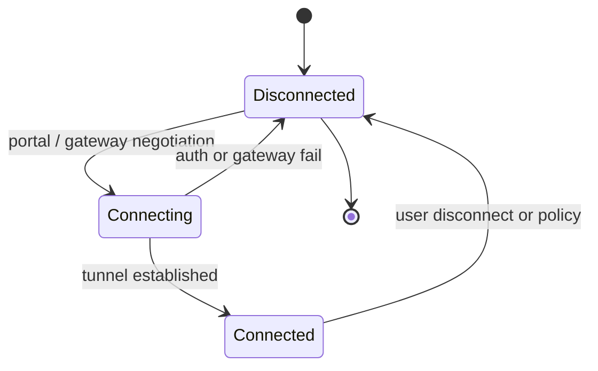
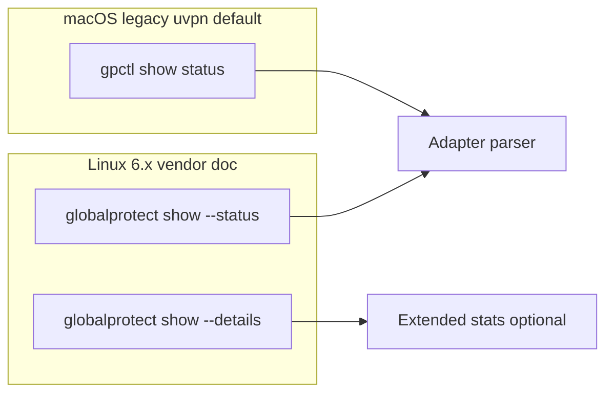
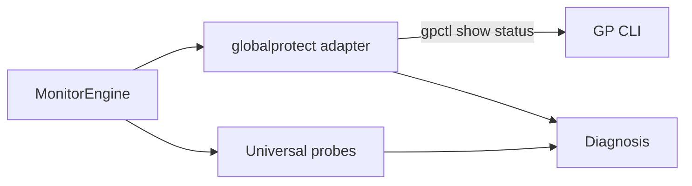

# Palo Alto GlobalProtect

**vpn_type:** `globalprotect` or `gp`

## uvpn at a glance

Parses **`gpctl show status`** (macOS app bundle / legacy CLI) with fixture-validated output. Newer Linux clients may use **`globalprotect show --status`** — set `globalprotect_binary` accordingly; matrix documents gpctl path for v1.0.0.

---

## Vendor documentation index

| Vendor section | Official document | URL |
|----------------|-------------------|-----|
| GlobalProtect home | GlobalProtect documentation | https://docs.paloaltonetworks.com/globalprotect |
| Linux app CLI | Use the GlobalProtect App for Linux | https://docs.paloaltonetworks.com/globalprotect/user-guide/6-3/globalprotect-app-for-linux/use-the-globalprotect-app-for-linux |
| Windows app | Use the GlobalProtect App for Windows | https://docs.paloaltonetworks.com/globalprotect/5-2/globalprotect-app-user-guide/globalprotect-app-for-windows/use-the-globalprotect-app-for-windows |
| macOS app | GlobalProtect app for macOS user guide | https://docs.paloaltonetworks.com/globalprotect/user-guide/6-0/globalprotect-app-for-mac/ |
| Administration | GlobalProtect administration | https://docs.paloaltonetworks.com/globalprotect/administration |

Internal: [adapter-version-matrix.md](../architecture/adapter-version-matrix.md)

---

## Diagrams (vendor + uvpn)

### Portal and gateway architecture (vendor)



### On-demand vs always-on (vendor policy)



### Connection lifecycle (vendor)



### Status CLI paths (vendor)



### uvpn monitoring flow



---

## 1. Product overview

GlobalProtect connects endpoints to Palo Alto Networks firewalls via portal/gateway. Status available via GUI tray, **`globalprotect` CLI** (Linux 6.x), or **`gpctl`** (macOS bundle tool).

**uvpn default:** `gpctl show status` when binary present.

---

## 2. Installation and deployment

Deploy GlobalProtect app via MDM or installer. Typical paths:

| OS | Binary |
|----|--------|
| macOS | `/Applications/GlobalProtect.app/Contents/Resources/gpctl` |
| Linux (6.x) | `globalprotect` in PATH |
| Linux (legacy) | `gpctl` if shipped with package |

---

## 3. CLI and management interface

**Linux 6.3+** ([user guide](https://docs.paloaltonetworks.com/globalprotect/user-guide/6-3/globalprotect-app-for-linux/use-the-globalprotect-app-for-linux)):

```bash
globalprotect show --status
globalprotect show --details
```

Example:

```text
GlobalProtect status: Connected
Assigned IP address: 192.168.1.132
Gateway IP address: 192.168.1.180
```

**uvpn adapter (v1.0 fixtures):** `gpctl show status` — output parsed for Connected/Disconnected/Connecting states.

Override with `globalprotect_binary` if using `globalprotect` CLI instead.

---

## 4. Connection lifecycle

| State | Meaning |
|-------|---------|
| Connected | Portal + gateway session active |
| Disconnected | No tunnel |
| Connecting | Portal or gateway negotiation |

On-demand vs always-on controlled by portal policy.

---

## 5. Status and monitoring

| Layer | Method |
|-------|--------|
| Control plane | gpctl / globalprotect status |
| Data plane | Universal probes |
| Split tunnel | May show connected while LAN unreachable — uvpn uses combined diagnosis |

---

## 6. Authentication and certificates

Portal auth: SAML, LDAP, cert, MFA per firewall config. uvpn does not authenticate.

---

## 7. Logging and diagnostics

App **Collect Logs** / Strata Logging Service (admin-enabled). Linux/macOS report-an-issue flows in user guides.

---

## 8. Exit codes and return values

CLI returns non-zero when app not running — adapter may report daemon down.

---

## 9. Vendor troubleshooting

| Issue | Action |
|-------|--------|
| gpctl missing on Linux | Use `globalprotect show --status` and set binary override |
| Portal unreachable | Check DNS, cert trust, portal URL |

---

## uvpn configuration

```json
{
  "vpn_type": "globalprotect",
  "globalprotect_binary": "/Applications/GlobalProtect.app/Contents/Resources/gpctl",
  "remote_lan_ip": "172.16.0.1",
  "remote_wan_ip": "198.51.100.20"
}
```

---

## uvpn monitoring

```bash
gpctl show status
uvpn check
```

Fixture sets: `tests/fixtures/adapters/globalprotect/` (macOS + Linux samples).

---

## Supported versions

GlobalProtect app **6.x** with documented CLI; see [adapter-version-matrix.md](../architecture/adapter-version-matrix.md).

---

## uvpn troubleshooting

- gpctl not found → set `globalprotect_binary` or `generic`.
- Connected + LAN fail → `TUNNEL_DOWN` (common with split tunnel).

---

## Related

- [research-vpn-platforms.md](../architecture/research-vpn-platforms.md)
