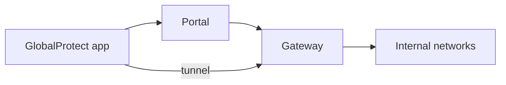
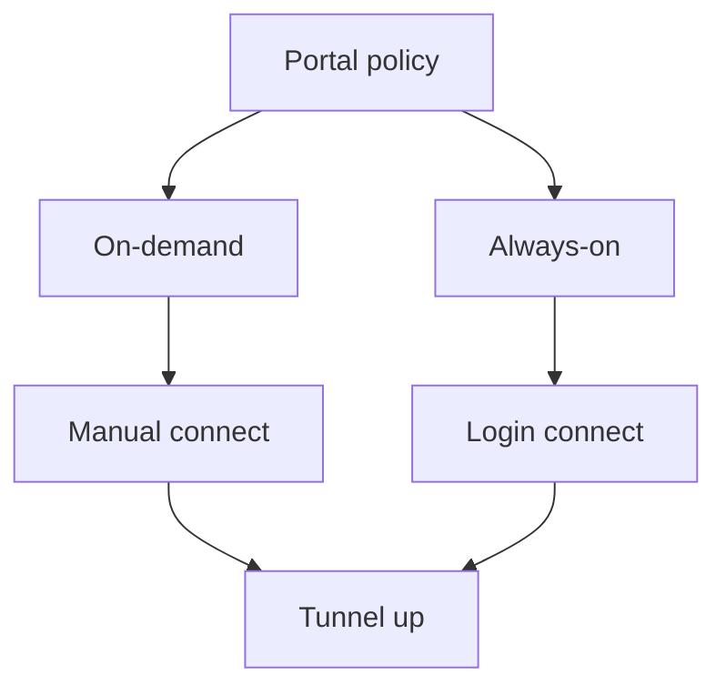
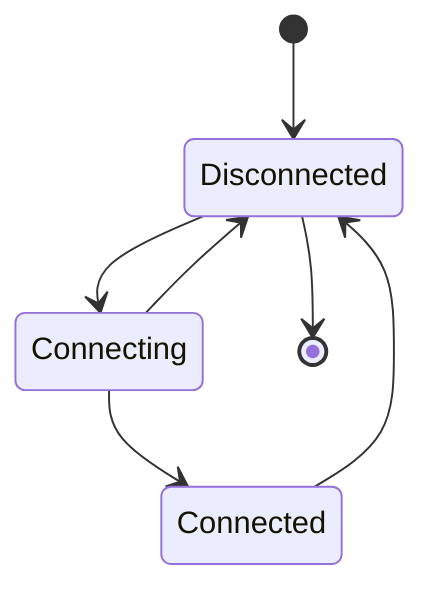
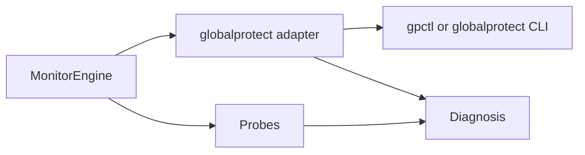

# Palo Alto GlobalProtect

**vpn_type:** `globalprotect` or `gp`  
**Pinned app line:** GlobalProtect app 6.x (Linux user guide 6.3+ CLI semantics)

## uvpn at a glance

Default probe: **`gpctl show status`**. Linux 6.x packages may expose **`globalprotect show --status`** instead—override with `globalprotect_binary`. Parser uses fixture-validated Connected / Disconnected / Connecting strings.

---

## Incorporated reference map

| Topic | Source material (maintainer record) | Sections |
|-------|--------------------------------------|----------|
| Linux app CLI | GlobalProtect 6.3 Linux user guide | §3 |
| Portal / gateway model | GlobalProtect administration | §1, §4 |
| Windows / macOS app behavior | GlobalProtect user guides (tray, settings) | §5, §7 |
| On-demand vs always-on | Portal agent configuration | §4 |

---

## Diagrams









---

## 1. Product overview

GlobalProtect is Palo Alto Networks’ remote access stack: endpoints register with a **portal**, receive policy, and build tunnels to one or more **gateways** on firewalls or cloud edges. Transports include SSL and IPsec depending on portal policy.

The endpoint agent exposes GUI status and command-line tools for automation. uvpn reads CLI status only—it does not manage portal configuration.

---

## 2. Installation and deployment

Deploy via enterprise installer or MDM. Typical CLI locations:

| OS | Binary |
|----|--------|
| macOS | `GlobalProtect.app/Contents/Resources/gpctl` |
| Linux 6.x | `globalprotect` command in PATH |
| Older Linux / macOS bundles | `gpctl` where shipped |

Register `globalprotect_binary` when both tools exist.

---

## 3. CLI and management interface

### Linux 6.3+ command set

The Linux user material documents:

```bash
globalprotect show --status
globalprotect show --details
```

**Status example**

```text
GlobalProtect status: Connected
```

**Details example (extended telemetry)**

```text
Assigned IP address: 192.168.1.132
Gateway IP address: 192.168.1.180
Protocol: IPSec
Uptime(sec): 231
```

### gpctl (uvpn default on many macOS installs)

```bash
gpctl show status
```

Fixture output uses phrases such as `Connected`, `Disconnected`, and transitional connecting states—see `tests/fixtures/adapters/globalprotect/`.

When only `globalprotect` exists on Linux, point `globalprotect_binary` at that executable; uvpn does not auto-translate subcommand syntax between tools.

---

## 4. Connection lifecycle

| State | Description |
|-------|-------------|
| Disconnected | No active tunnel |
| Connecting | Portal or gateway negotiation, certificate checks, MFA |
| Connected | Tunnel carrying traffic per policy |

**Portal connect methods**

- **On-demand:** User initiates from tray or CLI.
- **Always-on:** Agent connects at login or network change per portal agent configuration.

Split-tunnel policies may mark the session Connected while specific remote subnets remain unreachable—uvpn LAN probes detect this.

---

## 5. Status and monitoring

| Layer | Method |
|-------|--------|
| Control plane | Parsed CLI status |
| Data plane | ICMP / DDNS probes |
| Gateway list (GUI) | Informational only—not parsed by uvpn |

---

## 6. Authentication and certificates

Portals enforce SAML, LDAP, RADIUS, client certificates, and MFA stacks configured on the firewall. uvpn does not participate in authentication—it reads post-auth session state.

---

## 7. Logging and diagnostics

Agents can upload troubleshooting bundles when administrators enable log collection on the portal. Linux GUI supports “report an issue” workflows; CLI monitoring does not replace log upload for root-cause analysis.

---

## 8. Exit codes and return values

Non-zero CLI exit commonly indicates the agent is not running or the portal is unreachable. uvpn maps missing binary to `supported=False`.

---

## 9. Product troubleshooting

| Observation | Action |
|-------------|--------------|
| gpctl not found on Linux | Switch to `globalprotect show --status` binary override |
| Connected but internal IP missing in details | Portal split tunnel or incomplete session |
| Frequent reconnects | Inspect portal gateway selection and certificate trust |

---

## uvpn configuration

```json
{
  "vpn_type": "globalprotect",
  "globalprotect_binary": "/Applications/GlobalProtect.app/Contents/Resources/gpctl",
  "remote_lan_ip": "172.16.0.1",
  "remote_wan_ip": "198.51.100.20"
}
```

---

## uvpn monitoring

```bash
gpctl show status
uvpn check
```

---

## Supported versions

[adapter-version-matrix.md](../architecture/adapter-version-matrix.md) — GlobalProtect **6.x** with documented CLI.

---

## uvpn troubleshooting

- Binary missing → override path or `generic`.
- CLI connected + probe failure → `TUNNEL_DOWN` (often split tunnel).

---

## Related

- [adapter-version-matrix.md](../architecture/adapter-version-matrix.md)
