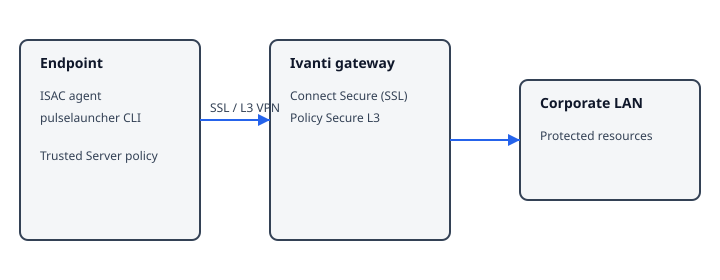
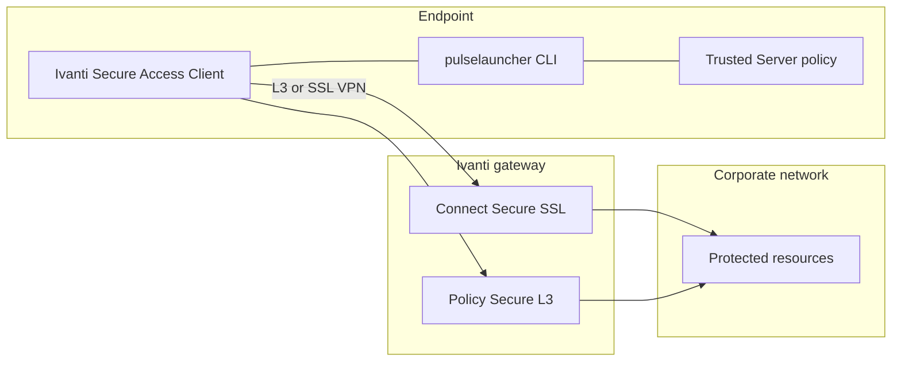
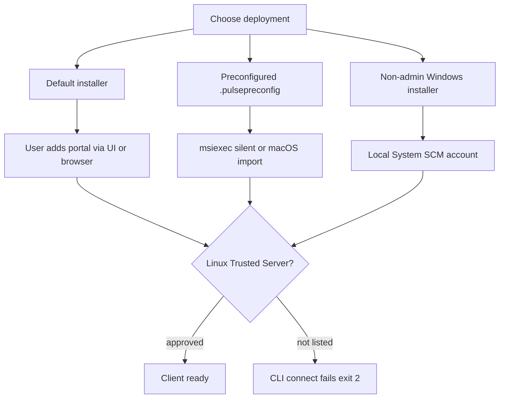
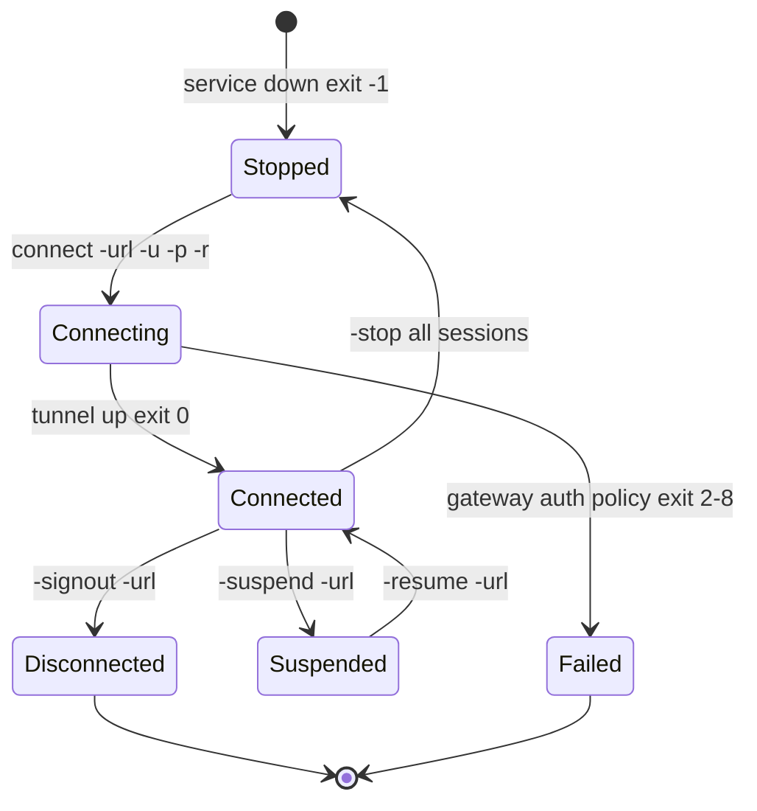
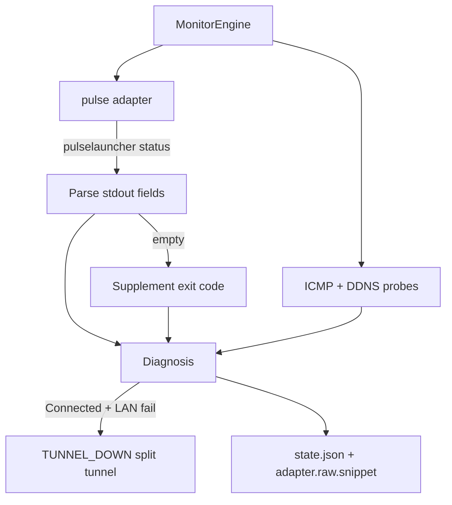

# Pulse Secure / Ivanti Secure Access Client

**vpn_type:** `pulse` or `ivanti`  
**Pinned client line:** Ivanti Secure Access Client (ISAC) 22.x  
**Legacy product names:** Pulse Secure desktop client, Pulse Connect Secure (gateway)

## uvpn at a glance

The `pulse` adapter executes `pulselauncher status` (or `pulse_binary`), parses session stdout using fixture-validated rules, and merges results with universal ICMP and DDNS probes. When ISAC is installed, use this adapter—not `generic`—so control-plane state is evaluated.

---

## Incorporated reference map

| Topic | Source material (maintainer record) | Reflected in sections |
|-------|--------------------------------------|------------------------|
| Client deployment | ISAC administration — installation overview | §2 |
| Command-line launcher | ISAC administration — CLI launcher (22.x) | §3, §6, §8 |
| Linux terminal usage | ISAC Linux quick start — command line | §3.2 |
| Session / gateway model | ISAC administration — product overview | §1, §4 |
| uvpn status contract | Internal pulse-cli-contract + fixtures | §3.3, uvpn monitoring |

---

## Visual reference

Original topology illustration (uvpn-authored; inspired by Ivanti administration material):



## Diagrams

### Product architecture



### Deployment paths



### Connection lifecycle



### uvpn monitoring flow



---

## 1. Product overview

The Ivanti Secure Access Client is the endpoint agent for remote access into enterprise networks through Ivanti Connect Secure or Policy Secure (Layer-3) gateways. The product line succeeded Pulse Secure branding; installs may still use Pulse-branded paths on Windows.

The desktop agent provides a graphical interface and a **`pulselauncher`** helper for scripted connect and disconnect without opening the UI. Layer-3 VPN sessions are in scope for the launcher; 802.1X-only Policy Secure profiles are not driven by this CLI.

**Monitoring relevance:** Session presence and gateway identity appear in launcher status output; reachability of protected subnets still requires independent probes.

---

## 2. Installation and deployment

Three common enterprise rollout patterns:

| Pattern | Behavior |
|---------|----------|
| **Default package** | Installs all components with no predefined connections. Users add portals through the client UI or by signing in through a browser portal that pushes a connection profile. |
| **Pre-staged profile** | Administrator exports a `.pulsepreconfig` settings file with required portals. Windows deployments combine the MSI with `msiexec` and the settings file; macOS installs the base package then imports the profile. |
| **Restricted desktop** | A dedicated installer runs under the Windows Local System account so standard users can launch VPN without local admin rights; the installer registers with the Service Control Manager. |

**Typical launcher locations**

| OS | Path |
|----|------|
| Windows | `Program Files\Common Files\Ivanti\Integration\pulselauncher.exe` (legacy trees may read `Pulse Secure\Integration`) |
| Linux | `/opt/pulsesecure/bin/pulselauncher` |
| macOS | `pulselauncher` on PATH when the ISAC application bundle is installed |

Alternate wrapper: `/usr/local/pulse/PulseClient.sh` on some Linux builds.

Set `pulse_binary` in uvpn when the binary is outside PATH. Confirm with `uvpn preflight`.

---

## 3. CLI and management interface

### 3.1 Launcher overview (Windows and macOS)

`pulselauncher` is a small executable shipped with the client. It starts or stops the agent and establishes VPN sessions from scripts without displaying the main window. It operates in both per-user and machine contexts where the product supports it.

**General syntax**

```text
pulselauncher [global options] [connection block] [session control block]
```

**Global options**

| Option | Effect |
|--------|--------|
| `-version` | Prints launcher build information and exits. |
| `-help` | Lists supported switches. |
| `-stop` | Shuts down the client and drops all active tunnels. |
| `-sessionselection` | When concurrent session limits are hit, terminates the oldest session so automation can proceed without a UI prompt. |
| `-L loglevel` | **Linux only.** Sets verbosity: level 3 (default) logs critical through info; level 5 logs all messages. |

**Connection block (sign-in)**

| Option | Effect |
|--------|--------|
| `-url` | Gateway or portal URL for the target server. |
| `-u` | Username. |
| `-p` | Password. |
| `-r` | Authentication realm on the server. |
| `-d cookie -url` | Supplies an existing session cookie instead of password auth; URL is still required. |
| `-cert name -url -r` | Selects a client certificate by its issued-to name; server must allow certificate login and trust the issuing CA. |
| `-t seconds` | Maximum time to complete connect (45–600; default 45). |

**Session control (requires `-url` when multiple profiles exist)**

| Option | Effect |
|--------|--------|
| `-signout` | Disconnects and clears server session state. |
| `-suspend` | Pauses tunnel while retaining session metadata on the server. |
| `-resume` | Restores a suspended tunnel. |

**Documented constraints**

- Launcher drives Connect Secure and Policy Secure **L3** profiles only—not 802.1X wired/wireless control channels.
- Secondary authentication prompts are not supported headlessly; flows that require them fail from scripts.
- If a realm maps users to multiple roles and the server requires an interactive role pick, the launcher exits with code **2** unless the realm merges roles automatically.

### 3.2 Linux terminal client

The Linux package exposes the same launcher under `/opt/pulsesecure/bin/`. Run `--help` for the exact switch list shipped with your package.

**Trusted Server requirement:** The Linux CLI only connects to gateways pre-approved as trusted in client policy. Attempts against untrusted portals fail before tunnel establishment—relevant when reproducing connection issues outside uvpn.

### 3.3 uvpn monitoring command

uvpn does **not** invoke connect switches. It runs:

```bash
pulselauncher status
```

**Expected stdout shape (fixture-validated)**

```text
Connection Status: Connected
Server: <hostname>
Session ID: <identifier>
```

Disconnected and error samples are in `tests/fixtures/adapters/pulse/`. Parsing rules: [pulse-cli-contract.md](../architecture/pulse-cli-contract.md).

The connect syntax above is incorporated for operator context; the status subcommand format is validated internally because public launcher chapters emphasize connect/disconnect rather than monitoring output.

---

## 4. Connection lifecycle

| Phase | Operator / launcher action | uvpn interpretation |
|-------|---------------------------|---------------------|
| Agent stopped | No process / exit -1 on connect | `supported=True`, daemon likely down |
| Negotiating | Connect switches in flight | `connecting` if status text ambiguous |
| Established | Active L3 session | `Connection Status: Connected` |
| Suspended | `-suspend` | May read as non-connected or transitional |
| Signed out | `-signout` | Disconnected |
| Agent halt | `-stop` | Disconnected; probes may still run |

---

## 5. Status and monitoring

| Layer | Mechanism |
|-------|-----------|
| Control plane | Parsed `pulselauncher status` |
| Data plane | ICMP to `remote_lan_ip`, `remote_wan_ip`; optional DDNS check |
| Combined | Engine emits `TUNNEL_DOWN` when CLI reports connected but LAN probe fails (split tunnel or routing) |

---

## 6. Authentication and certificates

Password login supplies `-u`, `-p`, `-r`, and `-url` together. Certificate login uses `-cert` with the certificate’s issued-to string plus `-url` and `-r`; invalid or expired certificates produce CLI errors and log entries—certificate verification for browser launches differs from launcher-launched sessions on some platforms.

Cookie-based login passes `-d` with a cookie value and `-url` for the target server.

uvpn never stores or transmits credentials.

---

## 7. Logging and diagnostics

On Linux, `-L` adjusts launcher log detail. Windows and macOS diagnostics are primarily through the client UI or centralized logging policies configured by administrators.

uvpn retains a truncated CLI transcript under `adapter.raw.snippet` in `state.json` and a longer status blob in statistics when available.

---

## 8. Exit codes and return values

Launcher process return codes (connect/disconnect operations):

| Code | Meaning |
|------|---------|
| -1 | Client service not running |
| 0 | Operation succeeded |
| 1 | Invalid argument |
| 2 | Tunnel could not be established or gateway unreachable |
| 3 | Tunnel up but reported error state |
| 4 | Requested session does not exist (e.g., sign-out when not connected) |
| 5 | User cancelled |
| 6 | Client certificate problem |
| 7 | Timed out waiting for connection |
| 8 | Policy blocks UI-less connection |
| 9 | Policy blocks override |
| 25 | Action incompatible with current state (resume while disconnected, etc.) |
| 100 | Unspecified failure |

On Windows, inspect `%ERRORLEVEL%`; on Unix shells, inspect `$?`.

uvpn evaluates status **stdout** first; exit code supplements diagnosis when output is empty.

---

## 9. Product troubleshooting

| Observation | Likely cause |
|-------------|--------------|
| Exit 2 after script connect | Bad URL, unreachable gateway, or realm requires role selection in UI |
| Exit -1 | Start ISAC service before calling launcher |
| Linux script fails immediately | Target server not in Trusted Server list |
| Certificate connect fails | Issued-to name mismatch or untrusted CA |
| Exit 7 | Increase `-t` or check network path |

---

## uvpn configuration

```json
{
  "vpn_type": "pulse",
  "pulse_binary": "pulselauncher",
  "remote_lan_ip": "10.0.0.1",
  "remote_wan_ip": "203.0.113.1",
  "remote_ddns": "vpn.example.com",
  "failure_threshold": 3,
  "check_interval_sec": 300
}
```

---

## uvpn monitoring

```bash
uvpn preflight
uvpn check
uvpn statistics
uvpn explain
```

| Metric | Origin |
|--------|--------|
| Session state | Status subcommand |
| Server / session id | Parsed stdout fields |
| Path health | Universal probes |

---

## Supported versions

[adapter-version-matrix.md](../architecture/adapter-version-matrix.md) — ISAC **22.x**. Other builds may return `supported=False`.

---

## uvpn troubleshooting

| Issue | Action |
|-------|--------|
| CLI not found | Install client; set `pulse_binary` to Linux path above |
| Connected + LAN down | Expect `TUNNEL_DOWN`; verify routes and split tunnel |
| Unrecognized status text | Align client with matrix version; capture redacted stdout for maintainers |

---

## Citations

| Topic | Authoritative source |
|-------|---------------------|
| Installation overview | [Deploying Ivanti Secure Access Client](https://help.ivanti.com/ps/help/en_US/ISAC/22.X/ag-22.X/installation_overview.htm) |
| CLI launcher switches and exit codes | [ISAC Command-line Launcher](https://help.ivanti.com/ps/help/en_US/ISAC/22.X/ag-22.X/cli_launcher.htm) |
| Linux terminal client | [Using ISAC Command Line (Linux QSG)](https://help.ivanti.com/ps/help/en_US/ISAC/vNow/linux-qsg/using-linux-client-command-line.htm) |
| Preconfigured Windows install | [Installing with preconfiguration file](https://help.ivanti.com/ps/help/en_US/ISAC/22.X/ag-22.X/installing_pdc_on_Windows.htm) |
| uvpn status contract | [pulse-cli-contract.md](../architecture/pulse-cli-contract.md) (internal) |

Manifest: [manifests/pulse-ivanti.yaml](manifests/pulse-ivanti.yaml)

---

## Related

- [pulse-cli-contract.md](../architecture/pulse-cli-contract.md)
- [adapter-version-matrix.md](../architecture/adapter-version-matrix.md)
