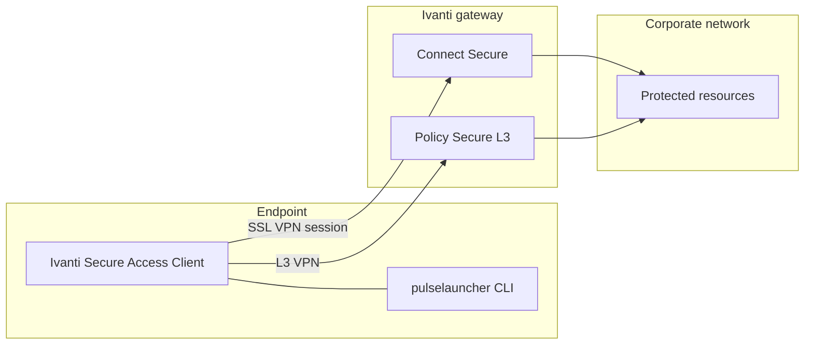
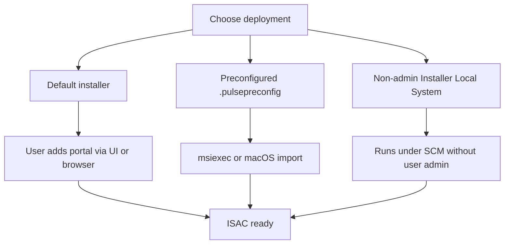
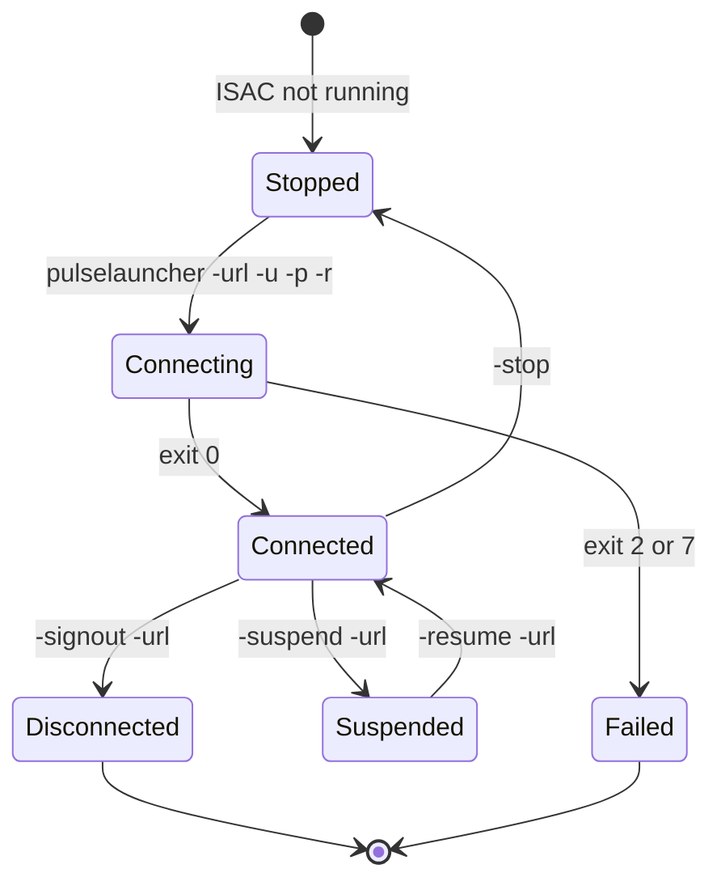
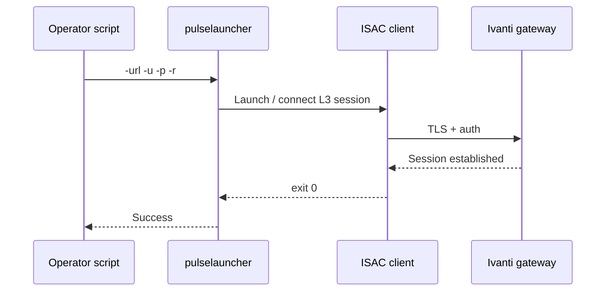
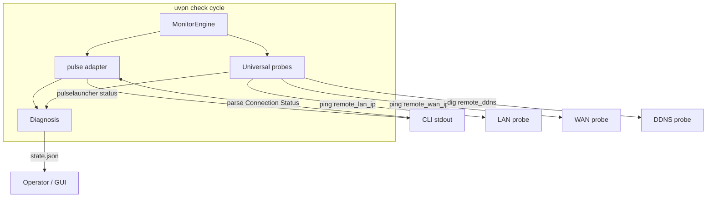
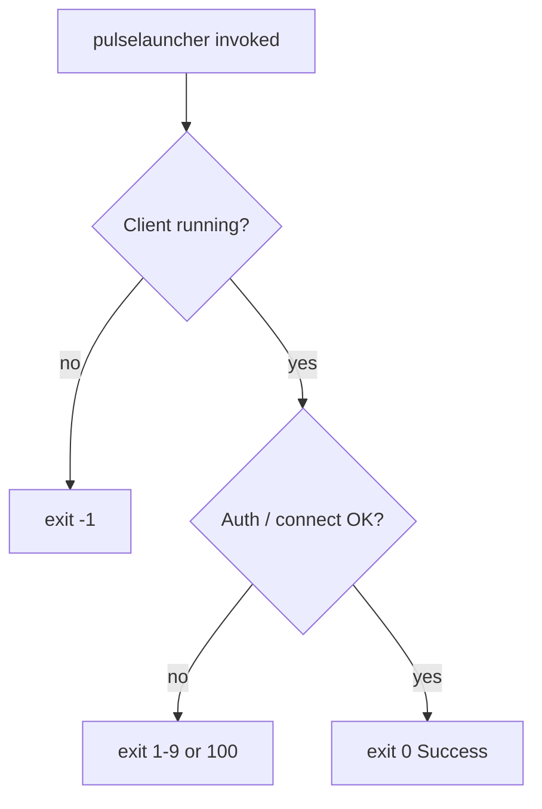

# Pulse Secure / Ivanti Secure Access Client

**vpn_type:** `pulse` or `ivanti`

> **Documentation portal:** Pulse Secure docs at `docs.pulsesecure.net` are retired. Use **Ivanti Product Help** below. Do not link to `docs.pulsesecure.net` — GitHub and browsers report “Not a file” / 404.

## uvpn at a glance

The `pulse` adapter runs `pulselauncher status` (or `pulse_binary` override), parses stdout with fixture-validated rules, and combines the result with universal ICMP/DDNS probes. Production status requires CLI validation — `generic` reachability alone is insufficient when the Ivanti client is installed.

---

## Vendor documentation index

| Vendor section | Official document | URL |
|----------------|-------------------|-----|
| Product help home | Ivanti Product Help (Pulse Secure) | https://help.ivanti.com/ps/ |
| Administration guide (22.x) | ISAC Administration Guide | https://help.ivanti.com/ps/help/en_US/ISAC/22.X/ag-22.X/ |
| Installation | Deploying Ivanti Secure Access Client | https://help.ivanti.com/ps/help/en_US/ISAC/22.X/ag-22.X/installation_overview.htm |
| CLI launcher (Windows/macOS) | Ivanti Secure Access Client Command-line Launcher | https://help.ivanti.com/ps/help/en_US/ISAC/22.X/ag-22.X/cli_launcher.htm |
| Linux CLI | Using Ivanti Secure Access Client Command Line | https://help.ivanti.com/ps/help/en_US/ISAC/vNow/linux-qsg/using-linux-client-command-line.htm |
| Linux quick start | ISAC Linux Quick Start Guide | https://help.ivanti.com/ps/help/en_US/ISAC/vNow/linux-qsg/ |

Internal references: [pulse-cli-contract.md](../architecture/pulse-cli-contract.md), [adapter-version-matrix.md](../architecture/adapter-version-matrix.md).

---

## Diagrams (vendor + uvpn)

### Product architecture (vendor)



### Deployment paths (vendor)



### Connection lifecycle (vendor CLI)



### pulselauncher connect sequence (vendor)



### uvpn monitoring flow



### Exit code decision (vendor launcher)



---

## 1. Product overview

**Vendor:** Ivanti Secure Access Client (ISAC), formerly Pulse Secure desktop client.

- Connects endpoints to **Ivanti Connect Secure** or **Ivanti Policy Secure** gateways.
- Rebranded from Pulse Secure (acquired 2020); registry paths and binary names may still contain `Pulse` on some platforms.
- CLI automation uses **`pulselauncher`** (Windows/macOS) or **`/opt/pulsesecure/bin/pulselauncher`** (Linux package layout per Linux QSG).

**uvpn relevance:** Control-plane status via CLI stdout; data-plane via `remote_lan_ip` / `remote_wan_ip` probes.

---

## 2. Installation and deployment

**Vendor summary** ([installation overview](https://help.ivanti.com/ps/help/en_US/ISAC/22.X/ag-22.X/installation_overview.htm)):

| Method | Description |
|--------|-------------|
| Default installer | Full client, no pre-defined connections; users add portals via UI or browser |
| Preconfigured installer | `.pulsepreconfig` + msiexec (Windows) or import after install (macOS) |
| Non-admin Windows | Ivanti Secure Access Client Installer (Local System) for locked-down endpoints |

**Typical paths:**

| OS | Binary / integration |
|----|----------------------|
| Windows | `pulselauncher.exe` under `Program Files\Common Files\Ivanti\Integration` or legacy `Pulse Secure\Integration` |
| Linux | `/opt/pulsesecure/bin/pulselauncher` |
| macOS | `pulselauncher` on PATH when ISAC app installed |

**uvpn:** Set `pulse_binary` if not on PATH. Run `uvpn preflight` to verify the binary exists.

---

## 3. CLI and management interface

### 3.1 Command-line launcher (Windows / macOS)

**Source:** [cli_launcher.htm](https://help.ivanti.com/ps/help/en_US/ISAC/22.X/ag-22.X/cli_launcher.htm)

`pulselauncher` is a standalone program to connect/disconnect without the GUI.

**Syntax (vendor):**

```text
pulselauncher [-version|-help|-stop|-loglevel] [-sessionselection]
  [-url -u -p -r ] [-d -url ] [-cert -url -r ]
  [-signout|-suspend|-resume -url ] [-t timeout]
```

**Key arguments:**

| Argument | Action |
|----------|--------|
| `-version` | Display launcher version and exit |
| `-help` | Show argument help |
| `-stop` | Stop client; disconnect all connections |
| `-url`, `-u`, `-p`, `-r` | Server URL, user, password, realm |
| `-signout` / `-suspend` / `-resume` | Session control (requires `-url`) |
| `-t` | Connection timeout (45–600 s, default 45) |
| `-L loglevel` | Linux only: log verbosity (3 normal, 5 detailed) |

**Limitations (vendor):**

- L3 (Connect Secure / Policy Secure) only — not 802.1X Policy Secure.
- No secondary authentication via launcher.
- Role selection in UI can cause exit code `2` if realm requires pick-list.

### 3.2 Linux command line

**Source:** [using-linux-client-command-line.htm](https://help.ivanti.com/ps/help/en_US/ISAC/vNow/linux-qsg/using-linux-client-command-line.htm)

```bash
/opt/pulsesecure/bin/pulselauncher --help
```

CLI connects only to **Trusted Server** (vendor constraint).

### 3.3 uvpn monitoring command

uvpn invokes:

```bash
pulselauncher status
```

(or configured `pulse_binary`). Expected stdout lines (fixture-validated):

```text
Connection Status: Connected
Server: <hostname>
Session ID: <id>
```

See [pulse-cli-contract.md](../architecture/pulse-cli-contract.md). The `status` subcommand output format is validated via fixtures; connect/disconnect syntax is documented in vendor launcher pages above.

---

## 4. Connection lifecycle

| Phase | Vendor mechanism | uvpn signal |
|-------|------------------|-------------|
| Connect | `pulselauncher -url … -u … -p … -r …` | N/A (uvpn does not connect) |
| Connected | Active session on gateway | `Connection Status: Connected` in status output |
| Suspend / resume | `-suspend` / `-resume` | Parser state `connecting` / ambiguous |
| Sign out | `-signout -url …` | `disconnected` |
| Stop client | `-stop` | Daemon down → adapter + `VPN_DAEMON_DOWN` |

---

## 5. Status and monitoring

| Layer | Method | Owner |
|-------|--------|-------|
| Control plane | `pulselauncher status` (uvpn) | `pulse` adapter |
| Data plane | Ping `remote_lan_ip`, `remote_wan_ip`, DDNS | Universal probes |
| Combined diagnosis | Engine rules | `TUNNEL_DOWN` if adapter says up but LAN fails |

**Do not** use `vpn_type: generic` when ISAC is installed — you lose CLI session state.

---

## 6. Authentication and certificates

**Vendor** ([cli_launcher.htm](https://help.ivanti.com/ps/help/en_US/ISAC/22.X/ag-22.X/cli_launcher.htm)):

- Password auth: `-u`, `-p`, `-r`, `-url`
- Certificate auth: `-cert` (Issued To name) + `-url` + `-r`; server must allow cert auth
- Cookie pass-through: `-d` + `-url`

uvpn does not handle credentials — monitoring only.

---

## 7. Logging and diagnostics

| Platform | Vendor guidance |
|----------|-----------------|
| Linux | `-L loglevel` on pulselauncher (3 or 5) |
| Windows / macOS | Client logs via ISAC UI / admin policy |

uvpn stores last CLI snippet in `state.json` → `adapter.raw.snippet` (max 500 chars). Full status text in statistics when connected.

---

## 8. Exit codes and return values

**pulselauncher return codes** ([cli_launcher.htm](https://help.ivanti.com/ps/help/en_US/ISAC/22.X/ag-22.X/cli_launcher.htm)):

| Code | Description |
|------|-------------|
| -1 | ISAC not running |
| 0 | Success |
| 1 | Invalid parameter |
| 2 | Connection failed / cannot reach gateway |
| 3 | Connected with error |
| 4 | Connection does not exist |
| 5 | User cancelled |
| 6 | Client certificate error |
| 7 | Timeout |
| 8 | UI connection not allowed |
| 9 | Policy override not allowed |
| 25 | Invalid action for state (e.g. resume when disconnected) |
| 100 | General error |

uvpn maps stdout **Connection Status** lines to connected/disconnected; non-zero exit with parseable stdout still evaluated.

---

## 9. Vendor troubleshooting

| Symptom | Vendor direction |
|---------|------------------|
| Launcher exit 2 | Gateway unreachable, bad URL, or role-mapping requires UI |
| Exit -1 | Start ISAC service / app before launcher |
| Linux CLI fails | Server must be Trusted Server |
| Cert auth fails | Verify `-cert` name and server CA trust |

---

## uvpn configuration

```json
{
  "vpn_type": "pulse",
  "pulse_binary": "pulselauncher",
  "remote_lan_ip": "10.0.0.1",
  "remote_wan_ip": "203.0.113.1",
  "remote_ddns": "vpn.example.com",
  "failure_threshold": 3,
  "check_interval_sec": 300
}
```

| Key | Description |
|-----|-------------|
| `pulse_binary` | Override path (`pulselauncher`, `PulseClient.sh`, or full path) |

---

## uvpn monitoring

| Metric | Source | Validation |
|--------|--------|------------|
| Session state | `pulselauncher status` | Fixture-validated + documented-at |
| Server / session id | status stdout | Parsed when present |
| Tunnel reachability | ICMP probes | Always on |

```bash
uvpn preflight
uvpn check
uvpn statistics
uvpn explain
```

---

## Supported versions

See [adapter-version-matrix.md](../architecture/adapter-version-matrix.md) — **ISAC 22.x** pinned for v1.0.0. Unsupported builds → `supported=False`.

---

## uvpn troubleshooting

| Issue | Action |
|-------|--------|
| `CLI not found` | Install ISAC; set `pulse_binary` to `/opt/pulsesecure/bin/pulselauncher` on Linux |
| Adapter connected, LAN down | `TUNNEL_DOWN` — routing/split tunnel; trust probes |
| Unrecognized status text | Upgrade/downgrade client to matrix version or open issue with redacted stdout |
| Old docs link 404 | Use https://help.ivanti.com/ps/ not `docs.pulsesecure.net` |

---

## Related

- [pulse-cli-contract.md](../architecture/pulse-cli-contract.md)
- [adapter-version-matrix.md](../architecture/adapter-version-matrix.md)
- [research-vpn-platforms.md](../architecture/research-vpn-platforms.md)
