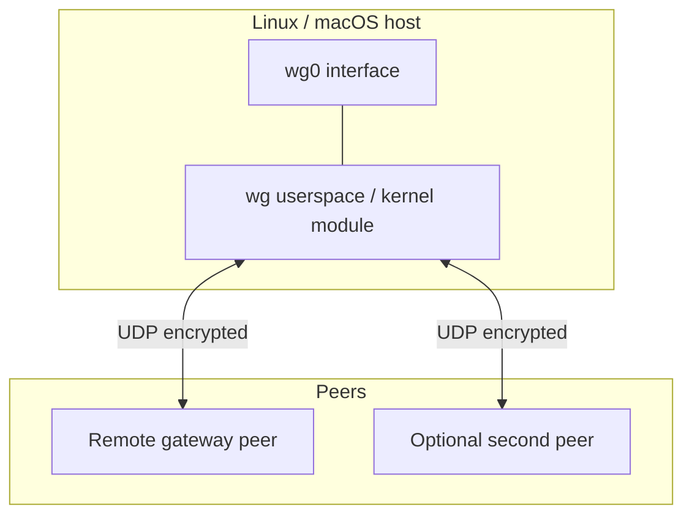
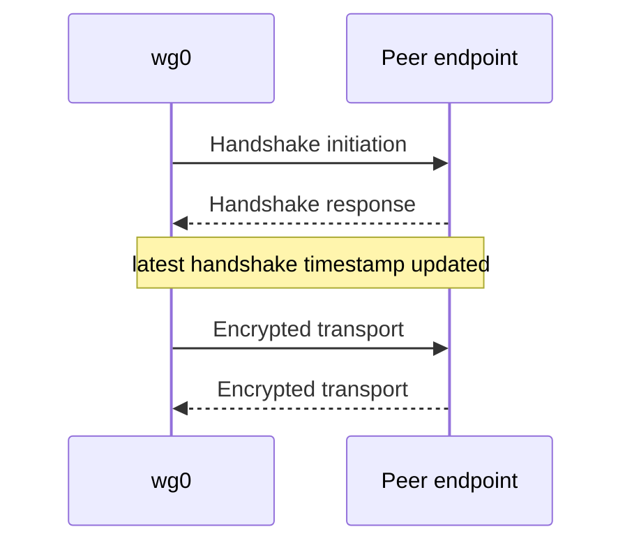
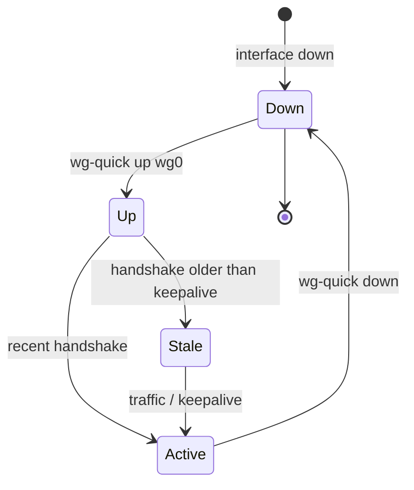
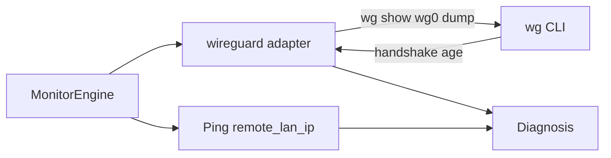

# WireGuard

**vpn_type:** `wireguard`

## uvpn at a glance

Parses `wg show <interface> dump` for latest handshake and transfer stats. Handshake age &lt; 180s ⇒ connected (heuristic); always confirm with `remote_lan_ip` ping.

---

## Vendor documentation index

| Vendor section | Official document | URL |
|----------------|-------------------|-----|
| Protocol | WireGuard protocol | https://www.wireguard.com/protocol/ |
| Quick start | WireGuard installation | https://www.wireguard.com/install/ |
| wg(8) man page | wireguard-tools wg | https://manpages.debian.org/bookworm/wireguard-tools/wg.8.en.html |
| wg-quick(8) | Interface bring-up | https://manpages.debian.org/bookworm/wireguard-tools/wg-quick.8.en.html |

---

## Diagrams (vendor + uvpn)

### Interface model (vendor)



### Handshake and data (vendor)



### Connection lifecycle (vendor)



### uvpn monitoring flow



---

## 1. Product overview

WireGuard is a modern VPN protocol using UDP and cryptokey routing. User-space tools **`wg`** and **`wg-quick`** manage interfaces (e.g. `wg0`).

**uvpn relevance:** Peer handshake timestamp and rx/tx from `wg show dump`.

---

## 2. Installation and deployment

Install `wireguard-tools` package on Linux; WireGuard app or tools on macOS. Bring interface up:

```bash
wg-quick up wg0
```

Set `wireguard_interface` in uvpn config to match.

---

## 3. CLI and management interface

**wg show dump columns** ([wg(8)](https://manpages.debian.org/bookworm/wireguard-tools/wg.8.en.html)):

| Field | Meaning |
|-------|---------|
| interface | Private key, public key, listen port, fwmark |
| peer | Public key, preshared key, endpoint, allowed IPs, latest handshake, transfer, persistent keepalive |

uvpn command: `wg show <interface> dump`

---

## 4. Connection lifecycle

| Condition | Interpretation |
|-----------|----------------|
| Recent handshake | Tunnel active |
| No handshake / stale | Disconnected or idle peer |
| Interface down | Not running |

---

## 5. Status and monitoring

| Layer | Method |
|-------|--------|
| Control plane | Handshake age from `wg show` |
| Data plane | ICMP to remote LAN/WAN |
| Statistics | rx/tx bytes per peer |

---

## 6. Authentication and certificates

WireGuard uses Curve25519 key pairs — pre-shared keys optional. uvpn does not manage keys.

---

## 7. Logging and diagnostics

WireGuard kernel module logs via `dmesg` / `journalctl`; uvpn adapter does not tail kernel logs by default.

---

## 8. Exit codes and return values

`wg` returns non-zero if interface missing — uvpn reports `supported=False` or daemon down.

---

## 9. Vendor troubleshooting

| Issue | Action |
|-------|--------|
| `wg: interface wg0 not found` | Start interface or fix `wireguard_interface` |
| Handshake stale | Peer down, NAT, or wrong endpoint |

---

## uvpn configuration

```json
{
  "vpn_type": "wireguard",
  "wireguard_interface": "wg0",
  "remote_lan_ip": "10.8.0.1",
  "remote_wan_ip": "203.0.113.5"
}
```

---

## uvpn monitoring

```bash
wg show wg0 dump
uvpn check
```

---

## Supported versions

wireguard-tools 1.0+ on Linux/macOS with `wg` in PATH.

---

## uvpn troubleshooting

- Wrong interface name → fix config.
- Handshake OK but LAN down → routing / AllowedIPs — diagnosis `TUNNEL_DOWN`.

---

## Related

- [RFC note](../architecture/research-vpn-platforms.md) — WireGuard is not RFC 7539
