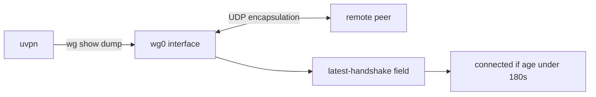
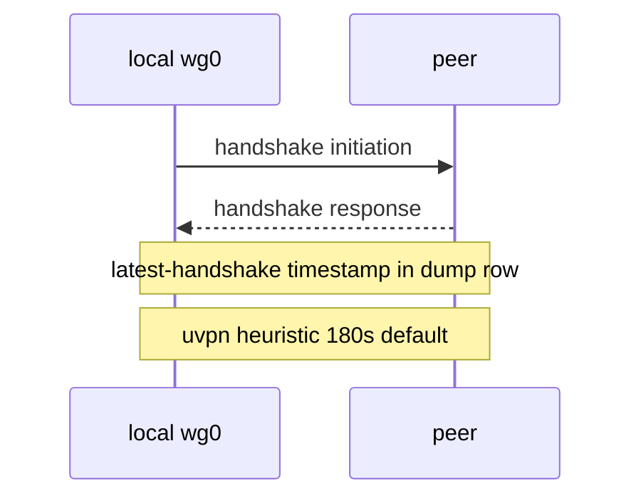
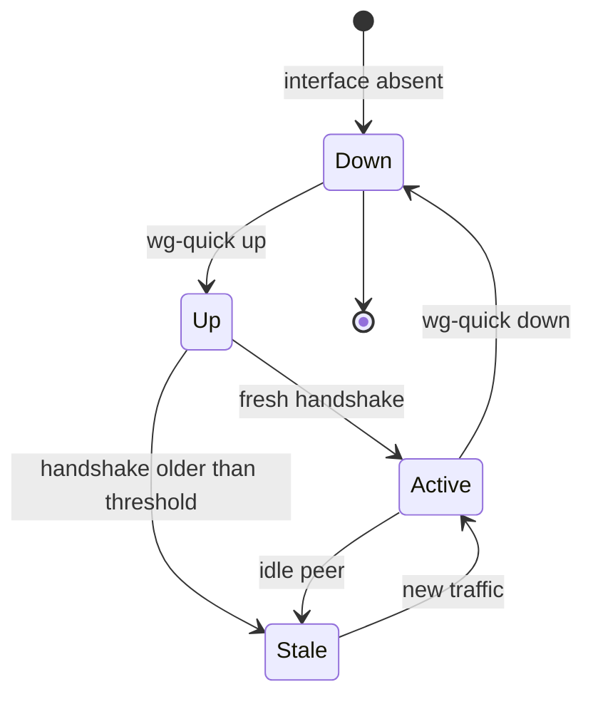
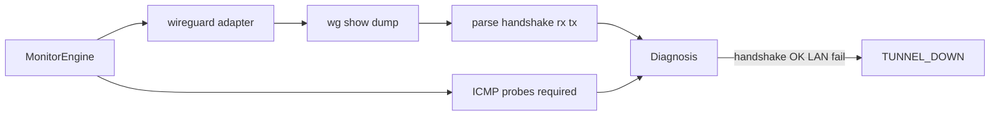

# WireGuard

**vpn_type:** `wireguard`  
**Reference:** WireGuard protocol specification; wireguard-tools `wg(8)` / `wg-quick(8)`

## uvpn at a glance

Runs `wg show <interface> dump` and treats recent peer handshake as connected (default heuristic: handshake age under 180 seconds). Always confirm with LAN probes.

---

## Incorporated reference map

| Topic | Source material (maintainer record) | Sections |
|-------|--------------------------------------|----------|
| Protocol cryptography | WireGuard protocol document | §1 |
| `wg` dump format | wireguard-tools man page wg(8) | §3 |
| Interface bring-up | wg-quick(8) | §2 |

---

## Visual reference


## Diagrams









---

## 1. Product overview

WireGuard is a UDP-based VPN using modern Curve25519 key agreement and ChaCha20-Poly1305 encapsulation. Interfaces are managed with **`wg`** (configuration) and **`wg-quick`** (bootstrapping from config files).

There is no separate “session connected” string—liveness is inferred from crypto handshakes and traffic counters.

---

## 2. Installation and deployment

Install `wireguard-tools` (or platform equivalent). Create interface config under `/etc/wireguard/wg0.conf` (typical). Bring up:

```bash
wg-quick up wg0
```

Set `wireguard_interface` in uvpn to the interface name (without path).

---

## 3. CLI and management interface

`wg show <iface> dump` emits tab-separated rows:

| Row type | Fields (conceptual) |
|----------|---------------------|
| interface | private-key, public-key, listen-port, fwmark |
| peer | public-key, preshared-key, endpoint, allowed-ips, latest-handshake, rx-bytes, tx-bytes, persistent-keepalive |

**latest-handshake** is Unix epoch seconds of last successful handshake—uvpn converts to age.

`wg show` without `dump` provides human-readable summaries; uvpn uses `dump` for parsing stability.

### 3.1 Example `wg show wg0 dump` (illustrative)

```text
private-key\tpublic-key\tlisten-port\tfwmark
h1...\th2...\t51820\toff
public-key\tpreshared-key\tendpoint\tallowed-ips\tlatest-handshake\trx-bytes\ttx-bytes\tpersistent-keepalive
p3...\t(none)\t203.0.113.9:51820\t10.8.0.0/24\t1717171717\t1234567\t890123\t25
```

When **latest-handshake** is `0` or absent, treat the peer as never established. uvpn computes age as `now - latest-handshake` and marks connected when age is below **180 seconds** (adapter default).

### 3.2 `wg-quick` lifecycle commands

| Command | Effect |
|---------|--------|
| `wg-quick up wg0` | Creates interface, applies `PostUp` routes |
| `wg-quick down wg0` | Removes interface and routes |
| `wg set wg0 peer …` | Runtime peer changes without full restart |

Monitoring hosts should run `uvpn check` under the same privileges that can execute `wg` (often root for interface visibility).

---

## 4. Connection lifecycle

| Condition | Interpretation |
|-----------|----------------|
| Interface absent | Not running |
| No handshake timestamp | Never connected or peer down |
| Handshake within keepalive window | Active |
| Stale handshake | Possibly idle peer or UDP path issue |

Persistent keepalive values in config affect how quickly stale is detected.

---

## 5. Status and monitoring

| Layer | Method |
|-------|--------|
| Control plane | Handshake age heuristic (**uvpn-extended** threshold) |
| Statistics | rx/tx bytes per peer |
| Data plane | ICMP to remote LAN |

---

## 6. Authentication and certificates

WireGuard uses pre-shared public keys in config—no username/password phase. uvpn does not manage keys.

---

## 7. Logging and diagnostics

Kernel and module messages appear in system logs; `wg` itself is quiet. Use `tcpdump` on UDP listen port for path debugging outside uvpn.

---

## 8. Exit codes and return values

`wg` exits non-zero when interface missing—uvpn reports unsupported or daemon down.

---

## 9. Product troubleshooting

| Observation | Action |
|-------------|--------|
| Interface not found | Start `wg-quick up` or fix interface name |
| Handshake never updates | Check endpoint IP, firewall UDP, peer keys |
| Handshake fresh but LAN fails | AllowedIPs / routing |

---

## uvpn configuration

```json
{
  "vpn_type": "wireguard",
  "wireguard_interface": "wg0",
  "remote_lan_ip": "10.8.0.1",
  "remote_wan_ip": "203.0.113.5"
}
```

---

## uvpn monitoring

```bash
wg show wg0 dump
uvpn check
```

---

## Supported versions

wireguard-tools 1.0+ with `wg` in PATH.

---

## uvpn troubleshooting

- Wrong interface → fix config key.
- Stale handshake + LAN OK → may still be HEALTHY if traffic flows; tune threshold only in adapter code with care.

---

## Citations

| Topic | Authoritative source |
|-------|---------------------|
| Protocol cryptography | [WireGuard Protocol](https://www.wireguard.com/protocol/) |
| `wg` command reference | [wg(8) — wireguard-tools](https://manpages.debian.org/testing/wireguard-tools/wg.8.en.html) |
| Interface bring-up | [wg-quick(8) — wireguard-tools](https://manpages.debian.org/testing/wireguard-tools/wg-quick.8.en.html) |

Manifest: [manifests/wireguard.yaml](manifests/wireguard.yaml)

---

## Related

- [research-vpn-platforms.md](../architecture/research-vpn-platforms.md)
