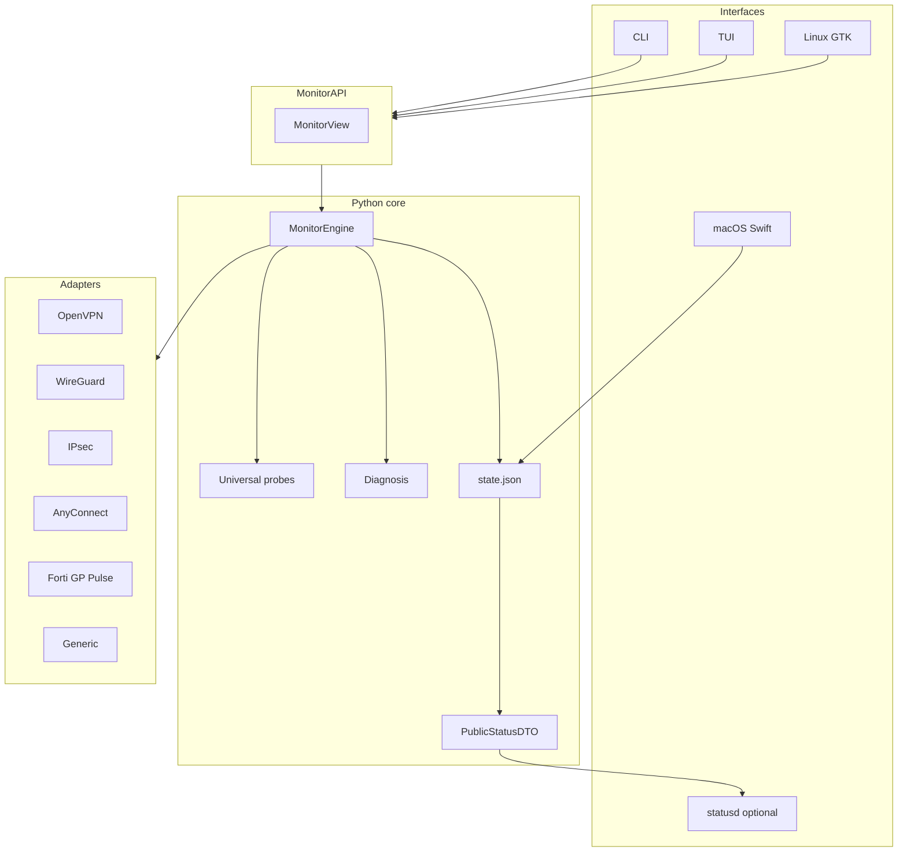
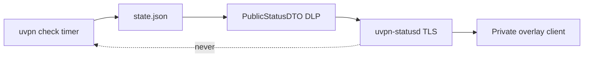

# Architecture

uvpn uses a **layered, adapter-based** design. All interfaces share one Python `MonitorEngine` via **MonitorAPI**.

Full documentation with Mermaid diagrams:

**[system-design.md](https://github.com/roto31/Tunnel-Monitor---Universal/blob/main/docs/architecture/system-design.md)** · **[VPN platform diagrams](VPN-Platform-Diagrams)**

## Layers

## Status portal (optional, v1.1)

NIST-aligned design: [Security-NIST-Architecture](Security-NIST-Architecture) · Install: [Status-Portal](Status-Portal)

## Rules

1. **GUIs invoke MonitorAPI or read `state.json`** — no embedded probe logic in Swift/GTK.
2. **Adapters never raise** — they return `AdapterStatus`; the engine always completes a cycle.
3. **Universal probes always run** — ICMP to remote LAN/WAN, DDNS drift, local internet check.
4. **Status portal is read-only** — Bearer auth, DLP redaction, no remote `check`. See [Security](Security) and [Status Portal](Status-Portal).

## Repository layout

| Path | Role |
|------|------|
| `src/uvpn/` | Python package (core, security, statusd) |
| `src/deploy/` | systemd, LaunchAgent, `uvpn-statusd` unit |
| `docs/security/` | NIST portal architecture, threat model, verification |
| `docs/architecture/` | System design, platform diagrams |
| `legacy/` | Archived bash monitor |

## Extensibility

Register new adapters in `uvpn/adapters/registry.py`. See [Plugin Development Guide](Plugin-Development-Guide) and [Adapter Version Matrix](Adapter-Version-Matrix).
